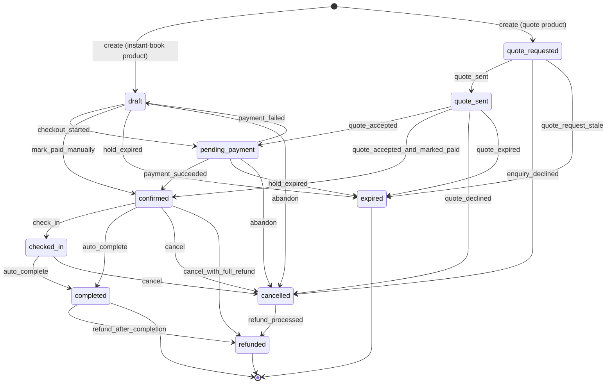
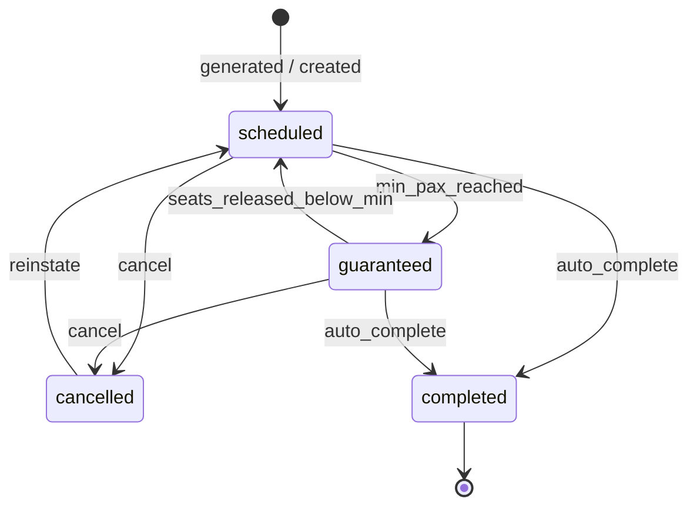
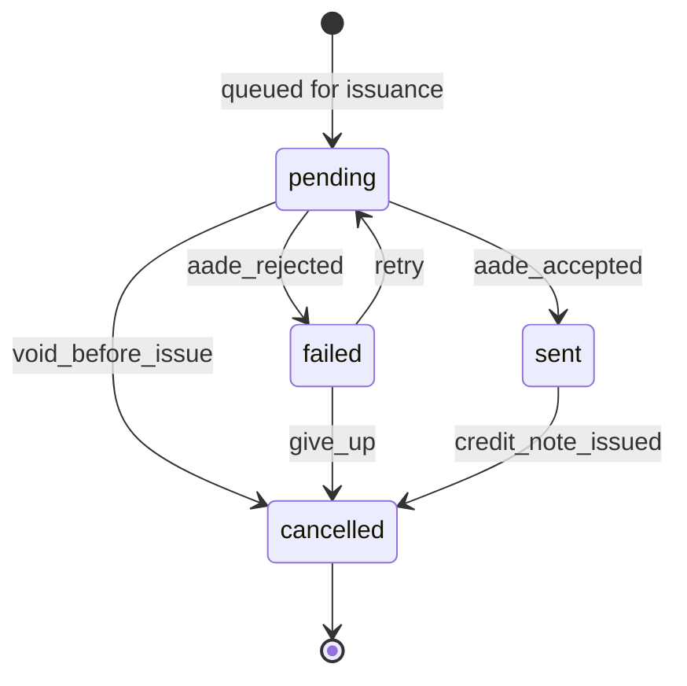
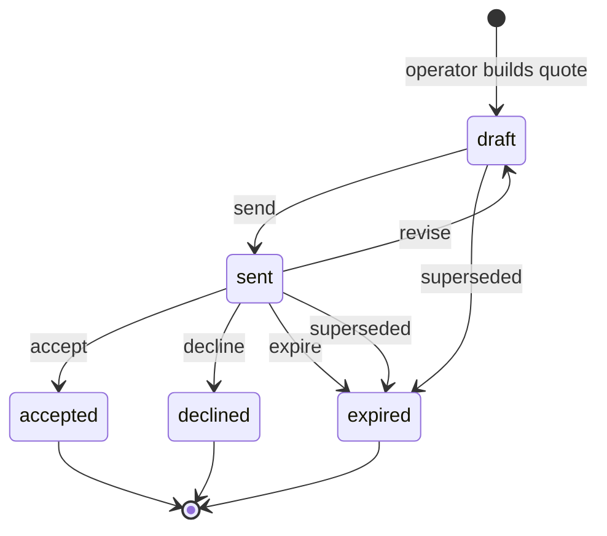
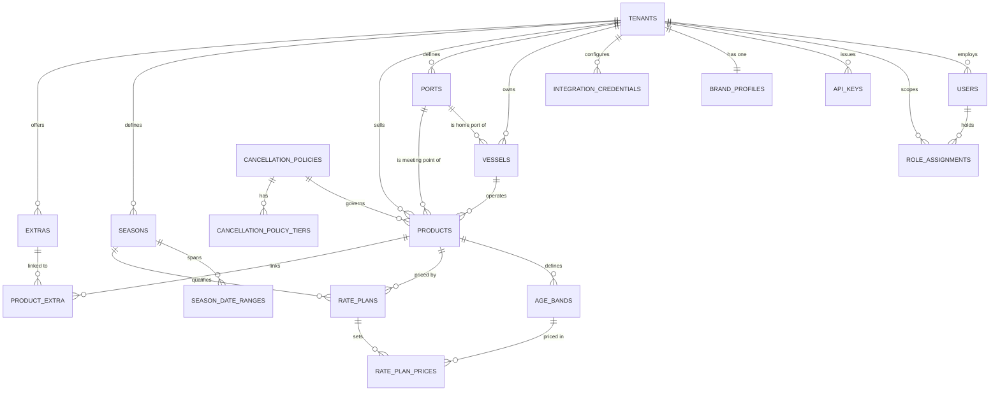
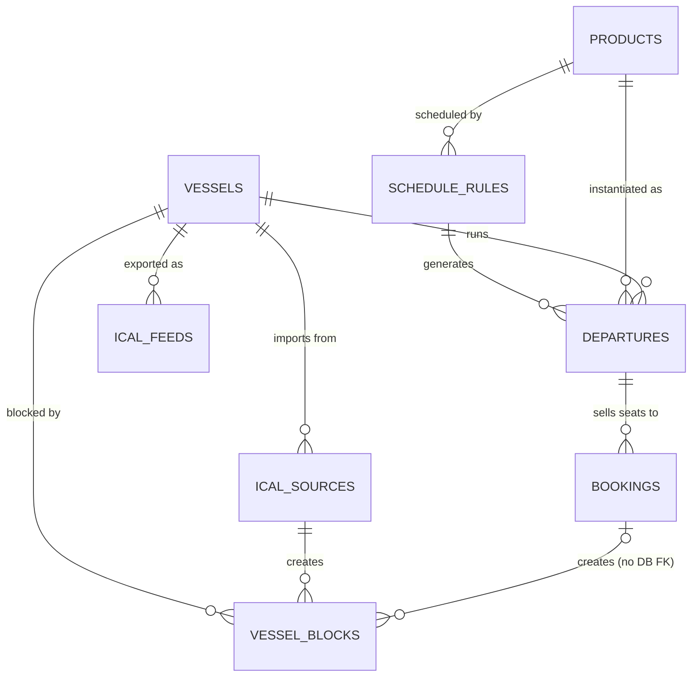
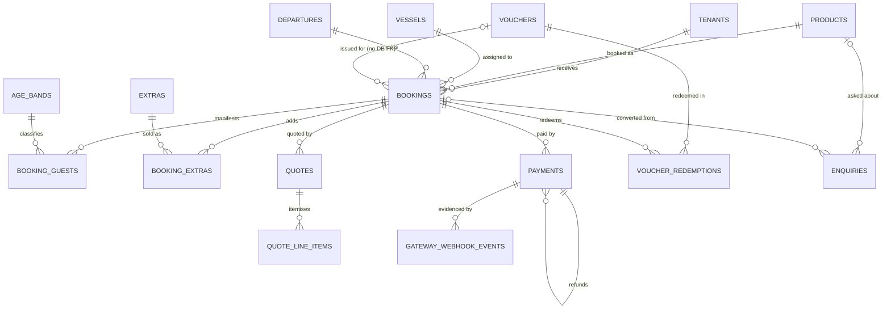
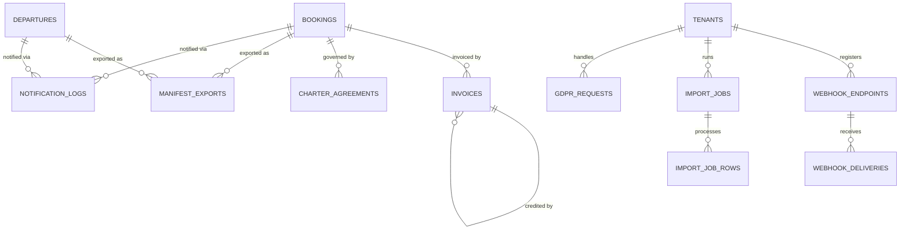

# Kaiki — Data Model

> Status: **draft v1** · Owner: `architect` · Source of truth: `docs/BRIEF.md` §4, §5, §6, §10, §14.
> This document is the contract the Laravel 12 migrations are written from. If a migration disagrees with this file, the migration is wrong — or this file is amended in the same PR.

**Scope:** every entity in §4 of the brief, plus the small number of support tables the design genuinely needs (each justified inline). No migration PHP appears here; this is design.

**Contents**

1. [Conventions](#1-conventions)
2. [Tables](#2-tables) — Tenancy & users · Branding · Catalog · Availability · Bookings & guests · Compliance · Ops & integrations
3. [JSON column shapes](#3-json-column-shapes)
4. [State machines](#4-state-machines)
5. [Referential map](#5-referential-map)
6. [Migration ordering](#6-migration-ordering)
7. [Indexing & query notes for the availability engine](#7-indexing--query-notes-for-the-availability-engine)
8. [Schema decisions — all settled](#8-schema-decisions--all-settled)

---

## 0. Environment constraints that shape everything below

These **override** anything in the brief that assumes MySQL-only.

| Constraint | Consequence for the schema |
|---|---|
| **Local dev = SQLite** (`database/database.sqlite`), **CI + production = MySQL 8** | Every migration must run on both. No MySQL-only DDL anywhere. |
| No `ENUM` / `SET` columns | All enumerations are `string` columns backed by a PHP backed enum in `app/Enums`. See §1.8. |
| No generated / virtual columns | Anything you would compute in the DB (`balance_cents`, "is at risk") is written by the application on save or computed in PHP. See §1.9. |
| No `FULLTEXT`, no JSON functional indexes | Search over translatable JSON is `LIKE`-based and unindexed. Acceptable at per-tenant catalog sizes (tens of products). If it stops being acceptable that is a new ADR (Scout/Meilisearch), not a schema hack. |
| SQLite `ALTER TABLE` is limited | Laravel 12 rebuilds the table for drops/renames, and **cannot add a foreign key after the fact**. Consequence: **no "create table now, add the FK later" migrations.** Circular references are broken by making the later side a plain indexed `unsignedBigInteger` with no DB-level FK (each one documented below), never by a follow-up `ALTER`. Get the columns right the first time; §6 flags where a later change would hurt. |
| `SELECT … FOR UPDATE` is a no-op on SQLite | Every place the code depends on row locks is flagged **[LOCK]** below. The overselling concurrency test (brief §5.5) is a **MySQL-only CI test**; it must skip on SQLite with an explicit skip message, never silently pass. |
| MySQL index key limit 3072 bytes with `utf8mb4` (4 bytes/char); index **name** limit 64 chars | Indexed string columns are short and their lengths are stated in every table below. Index names follow `{table}_{cols}_{type}`; where the natural name exceeds 64 chars the short name is given explicitly. |
| Money | `unsigned integer` cents, `brick/money` for arithmetic. EUR only; `currency` char(3) exists on `tenants` alone and is not repeated per row. |
| Timezone | Per tenant, default `Europe/Athens`. All `timestamp` columns are UTC. |
| i18n | Greek **and** English exist from the first commit. Every translatable column ships with both keys populated (EN may start as a copy of EL on import, never null). |

---

## 1. Conventions

Applied to **every** table unless that table's section says otherwise.

### 1.1 Primary keys and public identifiers

- `id` — `bigIncrements` (bigint unsigned auto-increment). Internal only; never in a URL, an API payload or the widget.
- `uuid` — `char(36)`, `unique`, assigned on `creating`. Present on **every tenant-owned entity exposed through the API or a shareable link**: `tenants`, `vessels`, `ports`, `products`, `age_bands`, `extras`, `departures`, `bookings`, `booking_guests`, `quotes`, `enquiries`, `vouchers`, `payments`, `invoices`, `charter_agreements`, `webhook_endpoints`, `import_jobs`.
- Tables **without** `uuid` (internal joins, never addressed directly): `role_assignments`, `api_keys`, `brand_profiles`, `season_date_ranges`, `rate_plan_prices`, `product_extra`, `cancellation_policy_tiers`, `schedule_rules`, `vessel_blocks`, `booking_extras`, `quote_line_items`, `voucher_redemptions`, `notification_logs`, `ical_feeds`, `ical_sources`, `webhook_deliveries`, `manifest_exports`, `import_job_rows`, `gateway_webhook_events`, `integration_credentials`, `gdpr_requests`. (`export_jobs` **does** carry one — its download link addresses the row.)
  - `seasons`, `rate_plans`, `cancellation_policies`, `vessel_blocks` and `schedule_rules` are operator-only objects edited inside a tenant-scoped Filament resource, so an integer id is safe there. They gain a `uuid` the day they appear in the public API — a cheap additive change on both engines.
- Canonical hyphenated UUID v4. 36 ASCII chars = 144 bytes as `utf8mb4`, comfortably inside the index limit.

### 1.2 Tenancy

- Every tenant-owned table carries `tenant_id` — `unsignedBigInteger`, FK → `tenants.id`, **`cascadeOnDelete`**.
  - Why cascade: `stancl/tenancy` single-database mode plus a hard "delete tenant" action in super-admin must leave zero orphans, and GDPR erasure of an operator must be one statement. Artefacts that must outlive the tenant (invoices for platform accounting) are exported before deletion, not retained in-DB.
- `tenant_id` is indexed on every tenant-owned table and is **always the first column of every composite index** on that table. This is load-bearing, not cosmetic: the `BelongsToTenant` global scope appends `where tenant_id = ?` to every query, so an index that does not lead with `tenant_id` will not be used.
- Tables that are **not** tenant-owned: `tenants`; `users` (nullable `tenant_id`, `null` = platform super-admin); `gateway_webhook_events` (arrives before tenancy is resolved — `tenant_id` nullable, backfilled once matched); framework/package tables (`jobs`, `job_batches`, `failed_jobs`, `cache`, `sessions`, `personal_access_tokens`, Pennant `features`, Pulse tables). *(Cashier's `subscriptions`/`subscription_items` were listed here; ADR-0028 removed the provider.)*

### 1.3 Timestamps and soft deletes

- `created_at` / `updated_at` (`timestamp` nullable, UTC) on every table, pivots included.
- `deleted_at` (`timestamp` nullable) — soft deletes on **exactly** these tables:

| Table | Why it is soft-deleted |
|---|---|
| `tenants` | Cancelled operators must be restorable during dunning / win-back and their data kept for billing disputes. |
| `users` | Removing a colleague must not orphan `created_by` references on bookings, manifests and exports. |
| `vessels` | A retired vessel is still referenced by historical departures, bookings, manifests and ναυλοσύμφωνα. |
| `ports` | A closed meeting point still appears on last season's tickets and manifests. |
| `products` | Historical bookings and invoices reference it; operators must remove a trip from the catalog without breaking reporting. |
| `age_bands` | Referenced by `rate_plan_prices`, `booking_guests` and `pax_breakdown` snapshots. |
| `extras` | Referenced by `booking_extras` and `extras_snapshot`. |
| `seasons`, `rate_plans` | Referenced as price provenance; operators rework pricing every season and expect undo. |
| `cancellation_policies` | Referenced by products and as policy provenance. |
| `bookings` | Cancellation is a *status*; deletion is an operator mistake. Soft delete gives a recovery window before the GDPR purge hard-deletes. |
| `vouchers` | Money-adjacent; must stay auditable after an operator "deletes" one. |
| `webhook_endpoints` | Deliveries reference them; keeps the delivery log readable. |

- Everything else is hard-deleted or never deleted: `departures` (cancellation is a status; generation is idempotent), `vessel_blocks`, `schedule_rules`, all pivots, all logs. `api_keys` are revoked (`revoked_at`), not deleted. `payments`, `invoices`, `charter_agreements` and `voucher_redemptions` are **never** deleted by any code path — they are financial/legal records; correction is a new row or a status change.
- **Soft deletes vs unique indexes.** A soft-deleted row still occupies its unique slot. Rule: on soft delete the model's `deleting` hook suffixes the unique column inside the same transaction — `products.slug` → `{slug}--del{id}`, `vouchers.code` → `{code}--DEL{id}`. `bookings.reference` is **never** rewritten and never reused.

### 1.4 Money

- Every amount is `unsignedInteger` cents (ceiling €21,474,836.47), named `*_cents`. Never `decimal`, never `float`, never a bare `price`.
- Amounts that could be negative (refunds, discounts) are stored **positive**; the sign lives in a `kind`/`type` column. Keeps every money column `unsigned` and makes sign bugs impossible to represent.
- Percentages: `unsignedTinyInteger` 0–100 (`refund_percent`, `deposit_percent`, `weather_refund_percent`).
- VAT: **never a column on the sellable thing and never a literal.** The rate lives in the platform-owned `vat_rates` reference table (§2.3); `products.vat_rate_id` and `extras.vat_rate_id` point at it, and the resolved `vat_rate_bp` (`unsignedSmallInteger` **basis points**, `1300` = 13.00%) plus `vat_category` are **snapshotted** onto the booking, the booking line, the price snapshot and the invoice at pricing time. Snapshot columns are the only place a number appears, and they are immutable. (per [ADR-0002](adr/0002-vat-rate-resolution.md), Option A; see §8.)
- Age-band multipliers: `unsignedSmallInteger` basis points of the adult price — `price_multiplier_bp`, `10000` = 100%, `5000` = 50%. Exactly representable, no decimals.
- Rounding: `brick/money` in EUR, `RoundingMode::HALF_UP`, applied **once per line item** and never to intermediates. Deposit is `HALF_UP` on the final total. Documented in `app/Domain/Pricing`.

### 1.5 Datetimes

All `timestamp` columns are **UTC**; `config('app.timezone')` stays `UTC`; conversion to `tenants.timezone` happens in the presentation layer only.

Departures **and** per-vessel bookings store four columns:

| Column | Type | Meaning |
|---|---|---|
| `local_date` | `date` | The calendar date **in the tenant's timezone** — what the operator, the guest and the widget calendar mean by "the date". |
| `local_time` | `time` | Start time of day in the tenant's timezone. |
| `starts_at_utc` | `timestamp` | The same instant in UTC. |
| `ends_at_utc` | `timestamp` | `starts_at_utc` + duration (product duration, or the explicit end for `per_vessel`). |

**The invariant**

```
starts_at_utc == CarbonImmutable::parse("{local_date} {local_time}", tenant.timezone)->utc()
ends_at_utc   >  starts_at_utc
```

**Who maintains it:** one Action — `App\Domain\Availability\Actions\SetDepartureWindow`, and its sibling `App\Domain\Booking\Actions\SetBookingWindow` — is the *only* code permitted to write these four columns. Models expose no public setters for them, Filament forms edit `local_date`/`local_time` and call the Action, the generation job calls the Action, the importer calls the Action. A Pest invariant test re-derives `starts_at_utc` for every row produced by every factory, seeder and job and fails on mismatch.

**Why store both:** UTC alone cannot answer "which departures run on 2026-03-29?" without a timezone conversion inside SQL — unportable between SQLite and MySQL and unindexable. Local alone cannot answer "do these two vessel windows overlap?" correctly across a DST boundary at all. So we store both, redundantly, with a single writer.

**DST (Europe/Athens):** clocks jump on the last Sunday of March (02:00 → 03:00) and back on the last Sunday of October (04:00 → 03:00).
- A `local_time` inside the missing March hour **does not exist** — `SetDepartureWindow` rejects it with a validation error shown in the panel and skips it (with a logged warning) during bulk generation.
- A `local_time` inside the repeated October hour exists twice — the Action resolves to the **first (DST) occurrence** and sets `dst_ambiguous = true` on the row so the panel shows a warning badge.
- Table-driven tests for both days are owned by the `availability-engine` agent.

Plain event timestamps (`sent_at`, `issued_at`, `checked_in_at`, `last_used_at`, `expires_at`, `hold_expires_at`) are UTC `timestamp`, nullable, with no local twin.

### 1.6 Translatable columns

`spatie/laravel-translatable` (approved in §3). Storage is a **`json` column** with the shape `{"el": "…", "en": "…"}`. Both keys are required on write; a model observer rejects a translation set missing `el` or `en`.

| Table | Translatable columns |
|---|---|
| `products` | `title`, `summary`, `description`, `includes`, `excludes`, `what_to_bring`, `itinerary_stops`, `meta_title`, `meta_description` |
| `vessels` | `description` (the vessel **name** is a proper noun and is *not* translatable) |
| `ports` | `name`, `instructions` |
| `extras` | `name`, `description` |
| `age_bands` | `label` |
| `cancellation_policies` | `name`, `summary` |
| `seasons` | `name` |
| `brand_profiles` | `email_footer_text` |
| `quote_line_items` | `label` |
| `enquiries` | *(none — free guest text, stored as written, with `locale`)* |

Shape notes: `includes` / `excludes` / `what_to_bring` are **translatable arrays** — `{"el": ["…"], "en": ["…"]}`. `itinerary_stops` is a translatable array of objects; exact shape in §3.6.

Rules:
- Translatable columns are **never indexed** and never appear in a `WHERE` that must be fast. Product listing filters on `status`, `category`, `sort_order`.
- `LIKE '%…%'` over `title` is allowed inside Filament (tenant-scoped, tens of rows) and **forbidden** in the public API.
- Slugs are **not** translatable in MVP: one `slug` per product, unique per tenant. Per-locale slugs are a post-MVP change and are flagged as painful in §6.

### 1.7 Encrypted columns

Laravel `encrypted` / `encrypted:array` cast, stored as **`text`** (the ciphertext envelope is base64 JSON, well over 255 bytes). Encrypted columns **can never be indexed, searched, sorted, `LIKE`-matched, or made unique.** If you need to find a row by it, you need a different column.

| Table | Column | Cast | Why |
|---|---|---|---|
| `booking_guests` | `document_number` | `encrypted` | Passport / ID number — brief §10. |
| `integration_credentials` | `credentials` | `encrypted:array` | Viva, myDATA (AADE user id + subscription key), Apifon, Twilio, Postmark secrets. |
| `ical_sources` | `url` | `encrypted` | External calendar URLs are unguessable-URL bearer secrets (Airbnb/Google). |
| `payments` | `raw_payload` | `encrypted:array` | Gateway payloads carry cardholder name, email, sometimes address. |
| `gateway_webhook_events` | `payload` | `encrypted:array` | Same. |
| `webhook_endpoints` | `signing_secret` | `encrypted` | Outbound HMAC secret; shown once, then write-only. |
| `charter_agreements` | `fields_snapshot` | `encrypted:array` | Contains lead-guest identity data and the vessel/charter terms. |

Deliberate **non**-encryptions, with reasons:
- `booking_guests.document_type` — an enum (`passport` / `id_card` / `other`), not identifying on its own and needed for manifest grouping. This is a conscious deviation from a literal reading of §4 ("document type + number (encrypted)").
- `booking_guests.date_of_birth` — plain `date`: needed for age-band validation, manifest sorting and the harbour print layout; encrypting would force decrypting every row to sort. Protected by the retention purge instead.
- `bookings.guest_email` / `guest_phone` — plain: operator support search, GDPR data-subject lookup by email, and dedupe all depend on querying them.
- `api_keys` are **hashed, not encrypted** — `secret_hash` `char(64)` (SHA-256 hex). The raw `pk_…`/`sk_…` is displayed exactly once. `prefix` `varchar(20)` is plaintext and indexed so the middleware can narrow to one row before hashing, and so the panel can show `sk_live_a1b2c3…`.

### 1.8 Enum columns

Every enumeration is a **`string` column with an explicit length**, backed by a PHP backed enum in `app/Enums` (`App\Enums\BookingStatus: string`, etc.) and cast on the model.

**Why not MySQL `ENUM`:** SQLite has no `ENUM`, so local dev and CI/production would enforce different constraints — exactly the class of bug where a bad value passes locally and fails on deploy. Adding a value to a MySQL `ENUM` is an `ALTER TABLE` on a hot table, and any column alteration is a full table rebuild on SQLite. String + PHP enum gives one definition, portable DDL, `Rule::enum()` validation at the boundary, and a cast that throws on unknown values read back.

**No DB `CHECK` constraints either** — supported on both engines but awkward to change on either, and duplicative of `Rule::enum()`.

Enum columns are `varchar(32)` unless stated otherwise (utf8mb4 → 128 bytes, safe inside composite indexes).

### 1.9 Denormalised / derived columns

We have no generated columns, so these are written by the application and **must** have a reconciliation command (`php artisan kaiki:reconcile-counters [--tenant=]`) that recomputes, reports drift and optionally fixes it. It runs nightly in production and is asserted in tests.

| Column | Derived from | Written by |
|---|---|---|
| `departures.seats_sold` | Σ capacity-counting pax across **committed** bookings (`pending_payment`, `confirmed`, `checked_in`, `completed`) | Booking checkout / confirm / cancel Actions, inside the transaction **[LOCK]** |
| `departures.seats_held` | Σ capacity-counting pax across `draft` bookings with `hold_expires_at > now()` | Draft create / checkout / expire Actions, inside the transaction **[LOCK]** |
| `departures.capacity` | `schedule_rules.capacity_override ?? products.max_pax` at generation time | departure generation job (snapshot) |
| `departures.min_pax` | `products.min_pax` at generation time | departure generation job (snapshot — a later product edit must not silently re-guarantee past departures) |
| `bookings.paid_cents` | Σ succeeded payments of kind full/deposit/balance − Σ succeeded refunds | payment Actions |
| `bookings.balance_cents` | `total_cents − paid_cents` | payment Actions |
| `vouchers.remaining_cents` | `amount_cents − Σ voucher_redemptions.amount_cents` | redemption Action **[LOCK]** |
| `products.price_from_cents` | cheapest capacity-counting adult price across active rate plans | recomputed on rate-plan / age-band save; lets the `list` widget mount render "from €X" without fanning out |

### 1.10 Naming

- Tables `snake_case` plural. Pure pivots are singular-singular alphabetical (`product_extra`); pivots carrying data are real plural tables (`booking_extras`, `voucher_redemptions`).
- FKs `{singular}_id`. Booleans `is_*` / `has_*` / `*_enabled` — never nullable, always defaulted. Timestamps `*_at`. Durations `*_minutes` / `*_hours` / `*_days`. Money `*_cents`. Percent `*_percent`. Basis points `*_bp`.
- Token columns are `char(N)` of URL-safe random hex/base62 and are named `*_token`.
---

## 2. Tables

Grouped exactly as brief §4. Every table implicitly has the §1 conventions (`id`, `tenant_id`, timestamps); they are repeated in the column tables only where there is something to say about them.

Legend: **[LOCK]** = a code path depends on `SELECT … FOR UPDATE`, MySQL-only. **[SNAP]** = immutable snapshot, never updated after write.

---

### 2.1 Tenancy & users

#### `tenants`

The operator. Not tenant-owned (it *is* the tenant). It was also the Cashier billable model until ADR-0028 removed the billing provider; whatever replaces it will be billable here.

| column | type | null | default | notes |
|---|---|---|---|---|
| `id` | bigint unsigned AI | no | — | |
| `uuid` | char(36) | no | — | unique |
| `name` | varchar(120) | no | — | trading name, shown to guests |
| `slug` | varchar(64) | no | — | unique, ASCII lowercase; hosted page `book.{domain}/{slug}` |
| `legal_name` | varchar(180) | yes | null | for invoices / ναυλοσύμφωνο |
| `vat_number` | varchar(20) | yes | null | ΑΦΜ. Indexed for super-admin search. Not encrypted — it is public company data. |
| `tax_office` | varchar(60) | yes | null | ΔΟΥ |
| `gemi_number` | varchar(30) | yes | null | ΓΕΜΗ, appears on some invoices |
| `address_line1` | varchar(180) | yes | null | |
| `address_line2` | varchar(180) | yes | null | |
| `city` | varchar(80) | yes | null | |
| `postcode` | varchar(16) | yes | null | |
| `country` | char(2) | no | `GR` | ISO 3166-1 alpha-2 |
| `phone` | varchar(32) | yes | null | |
| `email` | varchar(190) | no | — | operator contact / reply-to default |
| `timezone` | varchar(64) | no | `Europe/Athens` | IANA identifier; validated against `DateTimeZone::listIdentifiers()` |
| `default_locale` | char(2) | no | `el` | `el` \| `en` |
| `supported_locales` | json | no | `["el","en"]` | ordered; drives widget language switcher |
| `currency` | char(3) | no | `EUR` | EUR only in MVP; column exists so multi-currency is additive |
| `plan` | varchar(32) | no | `trial` | `trial` \| `solo` \| `fleet` \| `pro` — PHP enum `Plan` |
| `status` | varchar(32) | no | `trialing` | `trialing` \| `active` \| `past_due` \| `read_only` \| `suspended` — PHP enum `TenantStatus` |
| `trial_ends_at` | timestamp | yes | null | |
| `custom_domain` | varchar(190) | yes | null | unique; Caddy on-demand TLS looks this up |
| `custom_domain_verified_at` | timestamp | yes | null | |
| `hosted_page_enabled` | boolean | no | `true` | |
| `is_sandbox` | boolean | no | `false` | sandbox tenants' bookings are `is_test` and purged nightly |
| `turnaround_buffer_minutes` | smallint unsigned | no | `60` | tenant default; a vessel may override |
| `guest_document_retention_days` | smallint unsigned | no | `90` | GDPR purge horizon for `booking_guests.document_number` |
| `auto_issue_invoice` | boolean | no | `false` | issue myDATA doc on confirmation |
| `weather_choice_default` | varchar(16) | yes | `refund` | **added by #84** — CXL-7's operator default, applied when a guest never answers the weather-choice email. `refund` is the platform fallback because it is the only one of the three that cannot leave a guest holding credit they never asked for |
| `settings` | json | no | `{}` | see §3.11 — low-traffic, never-queried operator preferences only |
| `trial_ends_at` | timestamp | yes | null | when the trial ends. The Cashier columns beside it — `stripe_id`, `pm_type`, `pm_last_four` — were **removed by ADR-0028** along with the provider. Whichever provider replaces it, its columns are an edit to the M0 migration and a `migrate:fresh`, never an `ALTER` (§0). |
| timestamps, `deleted_at` | | | | soft deletes |

**Indexes**

| name | columns | rationale |
|---|---|---|
| `tenants_uuid_unique` | `uuid` | public id |
| `tenants_slug_unique` | `slug` | hosted-page resolution on every request to `book.{domain}/{slug}`; 64 chars = 256 bytes |
| `tenants_custom_domain_unique` | `custom_domain` | Caddy on-demand TLS ask endpoint + host-based tenant resolution; nullable unique (MySQL and SQLite both allow multiple NULLs) |
| `tenants_status_index` | `status` | super-admin dunning lists, read-only-mode middleware |
| `tenants_vat_number_index` | `vat_number` | super-admin support search |

**FKs** — none.
**Uniques** — `uuid`, `slug`, `custom_domain`.

**Notes.** `slug` is immutable once a hosted page has been published (changing it breaks operator links and SEO); the panel makes it read-only after first publish rather than the DB enforcing it. `settings` holds only preferences that are never filtered on — anything the system queries gets a real column, because adding one later is a table rebuild on SQLite (§0). `turnaround_buffer_minutes` lives here *and* on `vessels` (nullable override) because the availability engine reads it on every conflict check and must not join to `tenants` for it in a tight loop.

---

#### `users`

Operator staff and platform super-admins in one table. `tenant_id` is **nullable**: `null` = platform super-admin (`/admin` panel), non-null = operator staff (`/app` panel).

| column | type | null | default | notes |
|---|---|---|---|---|
| `id` | bigint unsigned AI | no | — | |
| `uuid` | char(36) | no | — | unique |
| `tenant_id` | bigint unsigned | **yes** | null | FK → `tenants.id` `cascadeOnDelete`; null = super-admin |
| `name` | varchar(120) | no | — | |
| `email` | varchar(190) | no | — | 190 chars keeps the unique index at 760 bytes under utf8mb4 |
| `email_verified_at` | timestamp | yes | null | |
| `password` | varchar(255) | no | — | bcrypt/argon hash |
| `phone` | varchar(32) | yes | null | crew SMS for departure changes |
| `locale` | char(2) | yes | null | panel language; **null = no preference chosen**, so the I18N-5 chain falls through to `Accept-Language` then the tenant's `default_locale` |
| `is_super_admin` | boolean | no | `false` | true only when `tenant_id` is null |
| `last_login_at` | timestamp | yes | null | |
| `two_factor_secret`, `two_factor_recovery_codes`, `two_factor_confirmed_at` | text/timestamp | yes | null | Fortify/Filament 2FA; encrypted casts |
| `remember_token` | varchar(100) | yes | null | |
| timestamps, `deleted_at` | | | | soft deletes |

**Indexes**

| name | columns | rationale |
|---|---|---|
| `users_email_unique` | `email` | global unique — see note |
| `users_uuid_unique` | `uuid` | |
| `users_tenant_id_index` | `tenant_id` | panel user lists |
| `users_tenant_role_idx` | `tenant_id`, `is_super_admin` | super-admin filtering |

**FKs** — `tenant_id` → `tenants.id` `cascadeOnDelete` (deleting an operator removes its staff accounts).

**Notes.** Email is **globally unique**, which means one human cannot hold accounts at two operators with the same address. That is fine for MVP (a captain works for one operator) but it is a real constraint. **Settled: a user belongs to exactly one tenant in MVP.** `users.tenant_id` (non-null for operator users, null for super-admins) with a globally unique email, plus `role_assignments (tenant_id, user_id, role)` as a separate table from M0 so that a future many-to-many is a data migration rather than a redesign. Panel tenant resolution reads `auth()->user()->tenant_id`; there is **no tenant-switcher UI in M0–M7**. The agency and multi-operator-skipper cases are speculative, and paying for them here — in tenant resolution — is paying in the exact place where a mistake leaks one operator's bookings to another. A future ADR covers the pivot migration if a real customer needs it. (per [ADR-0020](adr/0020-multi-tenant-user-membership.md), Option C)

---

#### `role_assignments`

The §4 "Role assignment" entity. A user may hold more than one role in a tenant (`manager` + `crew`).

| column | type | null | default | notes |
|---|---|---|---|---|
| `id` | bigint unsigned AI | no | — | |
| `tenant_id` | bigint unsigned | no | — | FK, cascade |
| `user_id` | bigint unsigned | no | — | FK, cascade |
| `role` | varchar(32) | no | — | `owner` \| `manager` \| `crew` — PHP enum `Role` |
| `granted_by_user_id` | bigint unsigned | yes | null | FK → `users.id` `nullOnDelete`, audit |
| timestamps | | | | no soft deletes — revoking a role is a delete |

**Indexes / uniques**

| name | columns | rationale |
|---|---|---|
| `role_assign_tenant_user_role_uq` | `tenant_id`, `user_id`, `role` **unique** | idempotent grants; prevents duplicate rows |
| `role_assign_tenant_role_idx` | `tenant_id`, `role` | "list all crew" for the departure-day SMS |

**FKs** — `tenant_id` cascade; `user_id` cascade (removing the user removes their roles); `granted_by_user_id` `nullOnDelete`.

**Notes.** Roles are **not** `spatie/laravel-permission`. Three fixed roles with hardcoded abilities in Laravel policies is less machinery than a permission package and stays inside §3's package list. **Settled: three hardcoded roles plus Laravel policies.** `spatie/laravel-permission` is **conditionally approved** — installable only if the three fixed roles prove insufficient, with the pull request stating which capability they could not express. It is not to be installed pre-emptively in M0. (per [ADR-0019](adr/0019-packages-beyond-section-3.md), Option A; spec ARC-21a) Every tenant must have **at least one `owner`**; enforced in the application (a `deleting` guard on the last owner), not in the DB.

`crew` semantics (brief §4): read-only access to today's departures and the check-in screen. Enforced by policy, not by schema.

---

#### `api_keys`

| column | type | null | default | notes |
|---|---|---|---|---|
| `id` | bigint unsigned AI | no | — | |
| `tenant_id` | bigint unsigned | no | — | FK, cascade |
| `name` | varchar(80) | no | — | operator label ("Website", "WP plugin") |
| `type` | varchar(16) | no | — | `publishable` \| `secret` — PHP enum `ApiKeyType` |
| `environment` | varchar(8) | no | `live` | `live` \| `test` |
| `prefix` | varchar(20) | no | — | plaintext `pk_live_a1b2c3` — unique, indexed; the lookup handle |
| `secret_hash` | char(64) | no | — | SHA-256 hex of the full key; unique |
| `last_four` | char(4) | no | — | display only |
| `scopes` | json | no | `[]` | array of scope strings, see §3.12 |
| `allowed_origins` | json | no | `[]` | CORS allow-list for publishable keys; empty = any origin (with a panel warning) |
| `last_used_at` | timestamp | yes | null | written at most once/minute per key (throttled) to avoid a write on every API call |
| `expires_at` | timestamp | yes | null | optional rotation deadline |
| `revoked_at` | timestamp | yes | null | revocation is a column, never a delete |
| `created_by_user_id` | bigint unsigned | yes | null | FK `nullOnDelete` |
| timestamps | | | | no soft deletes |

**Indexes**

| name | columns | rationale |
|---|---|---|
| `api_keys_prefix_unique` | `prefix` | every public API request: one indexed lookup by prefix, then `hash_equals` on the hash. 20 chars = 80 bytes. |
| `api_keys_secret_hash_unique` | `secret_hash` | defence in depth; also lets us verify by hash alone |
| `api_keys_tenant_type_idx` | `tenant_id`, `type`, `revoked_at` | panel listing, "does this tenant have a live publishable key?" onboarding check |

**Notes.** Never store the raw key. `last_used_at` writes are throttled through a Redis key (`apikey:{id}:touched`) so a busy widget does not turn every read into a write. Publishable keys must be rejected by every write endpoint at the middleware layer — schema cannot enforce it, `security-reviewer` checks it.

---

#### Framework & package tables (created by their own migrations, listed for completeness)

`personal_access_tokens` (Sanctum — used for panel sessions and future first-party clients), `jobs`, `job_batches`, `failed_jobs`, `cache`, `cache_locks`, `sessions`, `password_reset_tokens`, `features` (Pennant, scoped to tenant), Pulse tables. *(Cashier's subscription tables were listed here; ADR-0028.)* None of these are tenant-scoped by our global scope; Pennant's scope column carries the tenant reference.

---

### 2.2 Branding

#### `brand_profiles`

Exactly one per tenant.

| column | type | null | default | notes |
|---|---|---|---|---|
| `id` | bigint unsigned AI | no | — | |
| `tenant_id` | bigint unsigned | no | — | FK cascade, **unique** (1:1) |
| `logo_light_path` | varchar(255) | yes | null | storage disk path |
| `logo_dark_path` | varchar(255) | yes | null | |
| `favicon_path` | varchar(255) | yes | null | |
| `email_header_image_path` | varchar(255) | yes | null | |
| `color_primary` | char(7) | no | `#0B4F4A` | `#RRGGBB`, validated by regex |
| `color_secondary` | char(7) | no | `#063733` | |
| `color_accent` | char(7) | no | `#B5511F` | |
| `color_background` | char(7) | no | `#FFFFFF` | |
| `color_text` | char(7) | no | `#16211F` | |
| `font_family` | varchar(80) | no | `Inter` | curated list or a Google Fonts family name |
| `font_source` | varchar(16) | no | `system` | `system` \| `google` — controls whether the widget loads a Google Fonts URL at all |
| `button_radius_px` | tinyint unsigned | no | `8` | 0–32 |
| `widget_theme` | varchar(8) | no | `auto` | `light` \| `dark` \| `auto` |
| `email_footer_text` | json | yes | null | **translatable** |
| `social_links` | json | no | `{}` | see §3.10 |
| `custom_css` | text | yes | null | sanitised server-side; **hosted page only**, never injected into the widget on a third-party site |
| `contrast_warnings` | json | no | `{}` | last computed WCAG contrast results, so the panel can show the badge without recomputing |
| timestamps | | | | no soft deletes — reset-to-defaults overwrites |

**Indexes** — `brand_profiles_tenant_id_unique` on `tenant_id` (enforces 1:1 and serves `GET /api/v1/branding`, which is the widget's first call on every page load and must be a single indexed row read; it is also cached).

**FKs** — `tenant_id` → `tenants.id` cascade.

**Notes.** Colours are stored as hex strings rather than parsed components because the only consumers are CSS custom properties and the email templates. `custom_css` is stored raw and sanitised on **read** as well as write, so tightening the sanitiser later does not require a data migration. **Settled: plain path columns, no polymorphic media table.** Modelled here and on `vessels` / `products` / `ports` / `extras`. `spatie/laravel-medialibrary` is rejected — a new package, a new table and a new tenancy-scoping problem for the sake of a handful of upload fields, and tenancy scoping is the one risk this product cannot afford. One `App\Domain\Media\Actions\StoreUploadedImage` validates, resizes with `intervention/image` and writes to disk; conversions are synchronous at fixed documented sizes, with a `media:rebuild` Artisan command for a size change. Galleries are ordered JSON arrays and the Filament form owns reordering. Revisit only if gallery management becomes an operator complaint. (per [ADR-0021](adr/0021-image-and-file-storage.md), Option A)


#### `home_page_blocks`

The operator's landing page, as an ordered list of typed blocks (#102). Added by the design review of 2026-09-04, after this document was written — recorded here because it is schema.

| column | type | null | default | notes |
|---|---|---|---|---|
| `id` | bigint unsigned AI | no | — | |
| `uuid` | char(36) | no | — | unique |
| `tenant_id` | bigint unsigned | no | — | FK cascade |
| `type` | varchar(32) | no | — | `App\Enums\HomeBlockType`: `hero` \| `trips` \| `story` \| `gallery` \| `contact` \| `faq` |
| `sort_order` | int unsigned | no | `0` | the operator's own order |
| `is_visible` | boolean | no | `true` | hidden, not deleted — a gallery taken down for the winter is not retyped in the spring |
| `heading` | json | yes | null | **translatable**, nullable: a gallery has no heading |
| `body` | json | yes | null | **translatable**, **plain text, never markup** — rendered only through `BlockText` |
| `image_path` | varchar(255) | yes | null | ADR-0021 Option A: a path, not a media row |
| `images` | json | yes | null | the gallery: a list of `{path, alt: {el, en}}` |
| `settings` | json | yes | null | the per-type knobs, none of them translated; whitelisted by `BlockSettings` |
| timestamps | | | | |

**Indexes** — `home_page_blocks_render_index` on (`tenant_id`, `is_visible`, `sort_order`): the page is read on every hosted-page request and written almost never.

#### `faqs`

The operator's frequently asked questions (#103), tenant-wide by default with an optional product.

| column | type | null | default | notes |
|---|---|---|---|---|
| `id` | bigint unsigned AI | no | — | |
| `uuid` | char(36) | no | — | unique |
| `tenant_id` | bigint unsigned | no | — | FK cascade |
| `product_id` | bigint unsigned | **yes** | null | FK cascade. **Null means the entry is about the operator**, which is the common case |
| `question` | json | no | — | **translatable** |
| `answer` | json | no | — | **translatable**, **plain text** — rendered through `BlockText`, like every other piece of operator prose |
| `sort_order` | int unsigned | no | `0` | the operator's own order; the most-asked question is rarely the first one written |
| `is_published` | boolean | no | `true` | unpublished entries stay editable in the panel and reach no guest surface |
| timestamps | | | | |

**Indexes** — `faqs_render_index` on (`tenant_id`, `is_published`, `product_id`, `sort_order`). Every guest-facing query is a tenant, a published flag and a `product_id` that is either null or one value.

**FKs** — `tenant_id` → `tenants.id` cascade; `product_id` → `products.id` cascade (an answer about a trip that no longer exists is an answer nobody can ask about; the tenant-wide entries have a null `product_id` and are untouched).

**Notes.** **Nullable `product_id`, not a `faq_product` pivot.** A pivot sounds more flexible and makes the common case the awkward one: every general answer would have to be attached to every trip the operator owns, and would be wrong again the day they add another. **No ADR-0008 companion columns** — nothing sorts or filters these; the panel orders by `sort_order`, which is a plain integer column, and the realistic list is eight rows. The both-locales rule is applied at the form by `TranslatableRequired` rather than by `SearchIndexObserver`, which only watches `TranslatableSearchable` models.

---

### 2.3 Catalog

#### `vessels`

| column | type | null | default | notes |
|---|---|---|---|---|
| `id` | bigint unsigned AI | no | — | |
| `uuid` | char(36) | no | — | unique |
| `tenant_id` | bigint unsigned | no | — | FK cascade |
| `name` | varchar(120) | no | — | proper noun, not translatable |
| `type` | varchar(32) | no | — | `catamaran` \| `sailing_yacht` \| `motor` \| `rib` \| `traditional_kaiki` — PHP enum `VesselType` |
| `registration_number` | varchar(40) | yes | null | ΑΛΣ registration; appears on the manifest and ναυλοσύμφωνο |
| `length_cm` | smallint unsigned | yes | null | centimetres — integer, no decimals (13.5 m = 1350) |
| `capacity_max` | smallint unsigned | no | — | **legal** maximum passengers; every product's `max_pax` must be ≤ this |
| `crew_count` | tinyint unsigned | no | `1` | |
| `captain_name` | varchar(120) | yes | null | manifest column |
| `home_port_id` | bigint unsigned | yes | null | FK → `ports.id` `nullOnDelete` |
| `turnaround_buffer_minutes` | smallint unsigned | yes | null | **null = inherit `tenants.turnaround_buffer_minutes`**; the availability engine resolves with `COALESCE` |
| `description` | json | yes | null | **translatable** |
| `specs` | json | no | `{}` | see §3.9 |
| `images` | json | no | `[]` | ordered array of `{path, alt: {el,en}}` |
| `status` | varchar(16) | no | `active` | `active` \| `inactive` \| `maintenance` — PHP enum `VesselStatus` |
| `sort_order` | smallint unsigned | no | `0` | |
| `search_index` | text | yes | null | ADR-0008 companion — folded `name` **and** `description`, all locales, written by `SearchIndexObserver` |
| `name_sort` | varchar(191) | yes | null | ADR-0008 companion — folded `name`. **One column, not per locale:** `name` is not translatable, so a per-locale pair would always hold identical bytes |
| timestamps, `deleted_at` | | | | soft deletes |

**Indexes**

| name | columns | rationale |
|---|---|---|
| `vessels_uuid_unique` | `uuid` | |
| `vessels_tenant_status_idx` | `tenant_id`, `status`, `sort_order` | vessel pickers, calendar timeline column order |
| `vessels_tenant_home_port_idx` | `tenant_id`, `home_port_id` | port deletion guard |
| `vessels_tenant_name_sort_idx` | `tenant_id`, `name_sort` | fleet list ordering, portably (§1.6) |
| `vessels_tenant_name_unique` | `tenant_id`, `name` **unique** | **spec TEN-6**, which names `vessels.name` among the per-tenant uniques. Added in #16; this table previously omitted it. |

**FKs** — `tenant_id` cascade; `home_port_id` → `ports.id` `nullOnDelete` (a deleted port must not delete boats).

**On `vessels_tenant_name_unique` and soft deletes.** `deleted_at` is deliberately **not** part of the key. Adding it looks like it would free a retired boat's name for reuse; it does the opposite. `NULL` is distinct from `NULL` in a unique index on both MySQL and SQLite, so every *live* row — all of which have a null `deleted_at` — would stop colliding too and the constraint would enforce nothing at all. A soft-deleted vessel therefore keeps its name reserved, exactly as `products_tenant_slug_unique` reserves a soft-deleted product's slug. That is also the safer half of the trade: a soft-deleted vessel can be restored, and restoring one into a name collision is a worse failure than refusing the duplicate up front. Freeing the name is a force-delete, which is the owner's call. The same rule must be applied in the *application* layer by hand: Laravel's `unique` validation rule runs through the `DatabasePresenceVerifier`, which builds a raw query, so `BelongsToTenant`'s global scope does not apply and an unscoped rule would check every operator on the platform.

**Why `name` gets a folded companion at all,** despite not being translatable: the divergence ADR-0008 exists to prevent is a property of *Greek text*, not of JSON. MySQL's `utf8mb4_unicode_ci` folds tonos when comparing and SQLite's `BINARY` folds nothing, so a plain `where name like '%οδυσσευσ%'` finds `Οδυσσεύς` in production and misses it locally — different rows on the two engines, which is exactly what CAT-6 forbids. `HasTranslatableSearch` therefore accepts `$foldedSearch` / `$foldedSort` lists for plain columns alongside the translatable ones.

**Notes.** `capacity_max` is the legal ceiling and is validated against every product's `max_pax` and every departure's `capacity` at write time — the DB cannot express it. Lowering `capacity_max` below a live departure's `capacity` is blocked by the application with a list of offending departures. `turnaround_buffer_minutes` is deliberately nullable-with-inheritance rather than defaulted per vessel, so changing the tenant default actually changes behaviour.

---

#### `ports`

Serves both "meeting point" (products) and "home port" (vessels). One table, because the data is identical and operators reuse the same marina for both.

| column | type | null | default | notes |
|---|---|---|---|---|
| `id` | bigint unsigned AI | no | — | |
| `uuid` | char(36) | no | — | unique |
| `tenant_id` | bigint unsigned | no | — | FK cascade |
| `name` | json | no | — | **translatable** |
| `address` | varchar(255) | yes | null | single free-text line — this is what goes into the maps link |
| `lat` | decimal(10,7) | yes | null | see note |
| `lng` | decimal(10,7) | yes | null | |
| `instructions` | json | yes | null | **translatable** — "meet at the blue kiosk" |
| `photo_path` | varchar(255) | yes | null | |
| `maps_url` | varchar(255) | yes | null | operator-supplied override for the "open in maps" link |
| `is_active` | boolean | no | `true` | |
| `sort_order` | smallint unsigned | no | `0` | |
| `search_index` | text | yes | null | ADR-0008 companion — folded `name` **and** `instructions`, all locales |
| `name_sort_{locale}` | varchar(191) | yes | null | ADR-0008 companion, one per installed locale (`name_sort_el`, `name_sort_en`). Per locale, because ordering *is* a per-language question. |
| timestamps, `deleted_at` | | | | soft deletes |

**Indexes** — `ports_uuid_unique`; `ports_tenant_active_idx` (`tenant_id`, `is_active`, `sort_order`); `ports_tenant_name_sort_el_idx` and `ports_tenant_name_sort_en_idx` (`tenant_id`, `name_sort_{locale}`).

`search_index` is **not** indexed on either table, deliberately: MySQL 8 refuses an index on `TEXT` without a key length, SQLite has no prefix index, and `LIKE '%term%'` cannot use a B-tree either way. The argument is recorded in full on #15.

**FKs** — `tenant_id` cascade.

**Notes.** `lat`/`lng` are the **only** `decimal` columns in the schema. They are not money, they need ~1 cm precision, and both engines store `decimal(10,7)` faithfully; floats would introduce drift in the maps link. We never do geo queries (no radius search in MVP), so no spatial types — which is fortunate, because SQLite has none. Named `ports` (model `Port`); `products.meeting_point_id` and `vessels.home_port_id` both point here, which keeps §4's "Port / MeetingPoint" as a single concept.

---

#### `vat_rates` — *platform-owned reference table*

**Not tenant-owned.** It carries **no `tenant_id`**, is not covered by `BelongsToTenant`, and MUST be listed in the platform-owned allow-list in `config/tenancy.php` (spec TEN-5). Super-admin maintains the rows; operators only *select* one per product or extra. (per [ADR-0002](adr/0002-vat-rate-resolution.md), Option A)

**Migration ordering: this table is created before `products` and before `extras`,** because both hold an FK to it and SQLite cannot add a foreign key to an existing table (§6).

| column | type | null | default | notes |
|---|---|---|---|---|
| `id` | bigint unsigned AI | no | — | |
| `code` | varchar(32) | no | — | stable machine key, e.g. `gr_reduced_transport`. Unique with `valid_from`. |
| `rate_bp` | smallint unsigned | no | — | basis points, `1300` = 13.00%. **No default** — every row is entered deliberately. |
| `vat_category` | varchar(16) | no | — | the AADE myDATA `vatCategory` id. Lives here, next to the percent, so the percent→category mapping is never PHP. |
| `description` | json | no | — | **translatable** (el/en), shown in the product form and on the invoice |
| `valid_from` | date | no | — | a statutory change is a **new row**, never an edit |
| `valid_to` | date | yes | null | null = currently in force |
| `is_selectable` | boolean | no | `true` | false hides a superseded row from the product form without breaking existing references |
| timestamps | | | | no soft deletes — rows are superseded, never removed |

Indexes / uniques: `vat_rates_code_from_unique` (`code`, `valid_from`) **unique**; `vat_rates_validity_idx` (`valid_from`, `valid_to`).

**Notes.** The **rates themselves are an accountant question and are deliberately not seeded with authoritative values** — brief §10 says passenger transport is *typically* 13% and other tourist services *typically* 24% and explicitly refuses to fix them. No seeder, no factory default and no test fixture may present a percentage as authoritative (spec CAT-11b, MYD-6a). Reduced island-rate regimes are ordinary rows. Because `products.vat_rate_id` is `restrictOnDelete` and the pricing engine snapshots `rate_bp` and `vat_category` onto every line, changing what an operator sells today can never rewrite an invoice issued last year.

---

#### `products`

The catalog item. Mode drives everything downstream.

| column | type | null | default | notes |
|---|---|---|---|---|
| `id` | bigint unsigned AI | no | — | |
| `uuid` | char(36) | no | — | unique — this is the id in `[kaiki_booking product="uuid"]` |
| `tenant_id` | bigint unsigned | no | — | FK cascade |
| `vessel_id` | bigint unsigned | yes | null | FK → `vessels.id` `restrictOnDelete`; nullable only for `quote` products with no fixed boat |
| `slug` | varchar(120) | no | — | unique per tenant; hosted page + WP CPT permalink. 120 chars = 480 bytes |
| `category` | varchar(32) | no | — | `shared_full_day` \| `shared_half_day` \| `private_full_day` \| `private_half_day` \| `sunset` \| `custom` — PHP enum `ProductCategory` |
| `mode` | varchar(16) | no | — | `per_seat` \| `per_vessel` \| `quote` — PHP enum `BookingMode`. **Immutable after the first booking exists** (application guard) |
| `title` | json | no | — | **translatable** |
| `summary` | json | yes | null | **translatable** — one line for the list mount |
| `description` | json | yes | null | **translatable** — rich text (sanitised HTML) |
| `duration_minutes` | smallint unsigned | no | — | ≤ 1440; multi-day is out of scope |
| `default_start_time` | time | yes | null | tenant-local; required unless `flexible_start` |
| `flexible_start` | boolean | no | `false` | **`per_vessel` only** — guest proposes the window |
| `earliest_start_time` | time | yes | null | only meaningful when `flexible_start` |
| `latest_start_time` | time | yes | null | only meaningful when `flexible_start` |
| `check_in_offset_minutes` | smallint unsigned | no | `30` | check-in = start − offset |
| `meeting_point_id` | bigint unsigned | yes | null | FK → `ports.id` `nullOnDelete` |
| `includes` | json | yes | null | **translatable array** |
| `excludes` | json | yes | null | **translatable array** |
| `what_to_bring` | json | yes | null | **translatable array** |
| `itinerary_stops` | json | yes | null | **translatable array of objects** — §3.6 |
| `route_map_image_path` | varchar(255) | yes | null | |
| `images` | json | no | `[]` | ordered `{path, alt:{el,en}}` |
| `min_pax` | smallint unsigned | no | `0` | guaranteed-departure threshold; `per_seat` only. `0` = always guaranteed |
| `max_pax` | smallint unsigned | no | — | ≤ `vessels.capacity_max` (application-validated) |
| `min_booking_pax` | smallint unsigned | no | `1` | smallest sellable party |
| `cancellation_policy_id` | bigint unsigned | yes | null | FK → `cancellation_policies.id` `nullOnDelete`; null = tenant default policy |
| `guest_details_required` | boolean | no | `false` | drives the post-booking manifest flow |
| `guest_details_deadline_hours` | smallint unsigned | no | `48` | hours before departure |
| `vat_rate_id` | bigint unsigned | yes | null | FK → `vat_rates.id` `restrictOnDelete`. **Nullable in M1 so onboarding can proceed, but myDATA activation is gated on every sellable product having one** (spec MYD-16). No default, no percent column — the rate and its myDATA `vat_category` come from the referenced row. (per [ADR-0002](adr/0002-vat-rate-resolution.md), Option A) |
| `mydata_income_class` | varchar(16) | yes | null | e.g. `category1_3`; §8 |
| `price_from_cents` | int unsigned | yes | null | derived (§1.9), for the `list` mount |
| `status` | varchar(16) | no | `draft` | `draft` \| `active` \| `inactive` \| `archived` — PHP enum `ProductStatus` |
| `sort_order` | smallint unsigned | no | `0` | |
| `meta_title` | json | yes | null | **translatable** |
| `meta_description` | json | yes | null | **translatable** |
| `og_image_path` | varchar(255) | yes | null | |
| `is_featured` | boolean | no | `false` | list mount ordering |
| timestamps, `deleted_at` | | | | soft deletes |

**Indexes**

| name | columns | rationale |
|---|---|---|
| `products_uuid_unique` | `uuid` | every widget call resolves the product by uuid |
| `products_tenant_slug_unique` | `tenant_id`, `slug` | tenant-scoped uniqueness; hosted-page and WP permalink resolution. 8 + 480 bytes |
| `products_tenant_status_sort_idx` | `tenant_id`, `status`, `sort_order` | the `list` mount and `GET /products` — the hottest catalog read |
| `products_tenant_vessel_idx` | `tenant_id`, `vessel_id` | vessel calendar; "which products use this boat" on vessel delete |
| `products_tenant_cat_status_idx` | `tenant_id`, `category`, `status` | `data-category` filtered list mount |
| `products_tenant_mode_idx` | `tenant_id`, `mode` | departure generation scans `per_seat` products only |

**FKs** — `tenant_id` cascade; `vat_rate_id` **`restrictOnDelete`** (a rate row in use can never be deleted; superseding a rate means closing its `valid_to` and adding a new row); `vessel_id` **`restrictOnDelete`** (you cannot hard-delete a vessel that products point at — vessels are soft-deleted anyway, so this only bites on a force-delete, which is what we want); `meeting_point_id` `nullOnDelete`; `cancellation_policy_id` `nullOnDelete` (falling back to the tenant default is safer than deleting products).

**Notes.** `mode` is immutable once bookings exist — a `per_seat` product that becomes `per_vessel` would invalidate every departure and every price snapshot's meaning. `min_pax`/`max_pax`/`capacity` are copied onto departures at generation time (§1.9), so editing a product does **not** retroactively change open departures; that is intentional and is the single most surprising behaviour in the catalog. Products of `mode = quote` have no rate plans and never show a price. `flexible_start` is rejected for `per_seat` at validation.

---

#### `age_bands`

Per product.

| column | type | null | default | notes |
|---|---|---|---|---|
| `id` | bigint unsigned AI | no | — | |
| `uuid` | char(36) | no | — | unique — the widget posts age-band uuids in `pax` |
| `tenant_id` | bigint unsigned | no | — | FK cascade |
| `product_id` | bigint unsigned | no | — | FK cascade |
| `code` | varchar(24) | no | — | stable machine key (`adult`, `child`, `infant`) — used in `pax_breakdown` snapshots so they stay readable |
| `label` | json | no | — | **translatable** |
| `min_age` | tinyint unsigned | no | `0` | inclusive |
| `max_age` | tinyint unsigned | yes | null | inclusive; null = no upper bound |
| `counts_toward_capacity` | boolean | no | `true` | infants typically `false` — brief §5.2 |
| `pricing_mode` | varchar(16) | no | `multiplier` | `multiplier` \| `fixed` — PHP enum `AgeBandPricing` |
| `price_multiplier_bp` | smallint unsigned | yes | null | basis points of the base adult price; required when `pricing_mode = multiplier` |
| `is_base` | boolean | no | `false` | exactly one band per product is the base (adult) band that rate-plan prices anchor to |
| `requires_adult` | boolean | no | `false` | children/infants cannot travel alone |
| `sort_order` | smallint unsigned | no | `0` | |
| timestamps, `deleted_at` | | | | soft deletes |

**Indexes / uniques**

| name | columns | rationale |
|---|---|---|
| `age_bands_uuid_unique` | `uuid` | |
| `age_bands_tenant_product_code_uq` | `tenant_id`, `product_id`, `code` **unique** | one `adult` band per product; makes importer runs idempotent |
| `age_bands_tenant_product_sort_idx` | `tenant_id`, `product_id`, `sort_order` | product page rendering |

**FKs** — `tenant_id` cascade; `product_id` cascade (bands are meaningless without their product; historical bookings hold the band **snapshot**, not a live join).

**Notes.** Age ranges may not overlap within a product — validated in the application (two `BETWEEN` ranges cannot be expressed as a constraint portably). Exactly one `is_base = true` per product, also application-enforced. `pricing_mode = fixed` means the price comes from `rate_plan_prices` and the multiplier is ignored; `multiplier` means the price is derived from the base band's `rate_plan_prices` row. Both live in the same table so a rate plan can mix them.

---

#### `seasons` and `season_date_ranges`

Split into two tables rather than a JSON array of ranges, because the pricing resolver queries "which season contains this date, highest priority first" on **every price quote**, and that query must be indexed.

**`seasons`**

| column | type | null | default | notes |
|---|---|---|---|---|
| `id` | bigint unsigned AI | no | — | |
| `tenant_id` | bigint unsigned | no | — | FK cascade |
| `name` | json | no | — | **translatable** |
| `code` | varchar(32) | yes | null | operator shorthand (`HIGH26`) |
| `priority` | smallint unsigned | no | `0` | **higher wins** when ranges overlap |
| `is_active` | boolean | no | `true` | |
| timestamps, `deleted_at` | | | | soft deletes |

Indexes: `seasons_tenant_priority_idx` (`tenant_id`, `priority`, `is_active`); `seasons_tenant_code_uq` (`tenant_id`, `code`) unique (nullable).

**`season_date_ranges`**

| column | type | null | default | notes |
|---|---|---|---|---|
| `id` | bigint unsigned AI | no | — | |
| `tenant_id` | bigint unsigned | no | — | FK cascade |
| `season_id` | bigint unsigned | no | — | FK cascade |
| `starts_on` | date | no | — | tenant-local calendar date, inclusive |
| `ends_on` | date | no | — | inclusive |
| timestamps | | | | |

Indexes: `season_ranges_tenant_dates_idx` (`tenant_id`, `starts_on`, `ends_on`) — serves `where starts_on <= ? and ends_on >= ?`; `season_ranges_season_idx` (`tenant_id`, `season_id`).

**Notes.** Ranges are **local dates**, not UTC timestamps: a season is a calendar concept ("1 June to 15 September"), and converting it to UTC would move its edges by 3 hours. Ranges may overlap across seasons — that is what `priority` is for. **Ties on priority** (two seasons, same priority, both containing the date) are **prevented by validation** — saving such a season is rejected (spec PRC-4, and this note is amended in #20; it previously described only the read-time half). A tie is a configuration mistake an operator can see and fix, and resolving it silently would mean their prices are decided by a row id they never look at.

As defence in depth — for rows that arrived through an import, a direct edit, or before the validation existed — the resolver still orders deterministically: **`priority` DESC, then the narrowest matching range in days ASC, then `seasons.id` ASC**. The middle step was missing from this note and is PRC-4's: a season whose two-week August range matches beats one whose whole-summer range also matches, because the narrower statement is the more specific one. Ranges *within one season* may not overlap (application-validated).

---

#### `cancellation_policies` and `cancellation_policy_tiers`

**Decision: tiers are a table, not a JSON column.** The brief writes `tiers[]` as JSON, but tiers are edited row-by-row in a Filament repeater, sorted, validated for overlap, and — critically — **snapshotted onto the booking anyway** (`policy_snapshot`, §3.3). Keeping the live version relational gives us ordering, per-tier validation and a sane Filament form; the immutable copy on the booking is JSON. Best of both.

**`cancellation_policies`**

| column | type | null | default | notes |
|---|---|---|---|---|
| `id` | bigint unsigned AI | no | — | |
| `tenant_id` | bigint unsigned | no | — | FK cascade |
| `name` | json | no | — | **translatable** |
| `summary` | json | yes | null | **translatable** — shown to the guest before payment |
| `free_cancellation_hours` | smallint unsigned | yes | null | full refund if cancelled more than N hours before departure |
| `weather_refund_percent` | tinyint unsigned | no | `100` | applied on `cancel_reason = weather` |
| `force_majeure_voucher_months` | tinyint unsigned | no | `18` | voucher validity when a voucher is offered instead of cash |
| `no_show_refund_percent` | tinyint unsigned | no | `0` | |
| `is_default` | boolean | no | `false` | tenant fallback when a product has none |
| timestamps, `deleted_at` | | | | soft deletes |

Indexes: `cxl_policies_tenant_default_idx` (`tenant_id`, `is_default`). Exactly one default per tenant, application-enforced.

**`cancellation_policy_tiers`**

| column | type | null | default | notes |
|---|---|---|---|---|
| `id` | bigint unsigned AI | no | — | |
| `tenant_id` | bigint unsigned | no | — | FK cascade |
| `cancellation_policy_id` | bigint unsigned | no | — | FK cascade |
| `days_before` | smallint unsigned | no | — | "cancel at least N days before departure" |
| `refund_percent` | tinyint unsigned | no | — | 0–100 |
| timestamps | | | | |

Indexes / uniques: `cxl_tiers_policy_days_uq` (`tenant_id`, `cancellation_policy_id`, `days_before`) **unique** — one rule per threshold; `cxl_tiers_policy_days_idx` (`tenant_id`, `cancellation_policy_id`, `days_before` DESC) for evaluation order.

**Notes.** Evaluation: take the tier with the **largest `days_before` that is ≤ the actual days remaining**; if none matches, refund 0%. `free_cancellation_hours` is evaluated first and wins outright. Refunds are always computed from `bookings.policy_snapshot`, never from these tables (brief §5.9) — these tables only feed the snapshot at booking time and the guest-facing policy text at browse time.

---

#### `rate_plans` and `rate_plan_prices`

**`rate_plans`**

| column | type | null | default | notes |
|---|---|---|---|---|
| `id` | bigint unsigned AI | no | — | |
| `tenant_id` | bigint unsigned | no | — | FK cascade |
| `product_id` | bigint unsigned | no | — | FK cascade |
| `season_id` | bigint unsigned | yes | null | FK `cascadeOnDelete`; **null = the product's default plan** |
| `name` | varchar(80) | yes | null | operator label; not guest-facing |
| `vessel_price_cents` | int unsigned | yes | null | `per_vessel` mode: price for the whole boat |
| `extra_hour_price_cents` | int unsigned | yes | null | `per_vessel`: optional per additional hour |
| `deposit_type` | varchar(16) | no | `none` | `none` \| `percent` \| `fixed` — PHP enum `DepositType` |
| `deposit_percent` | tinyint unsigned | yes | null | required when `deposit_type = percent` |
| `deposit_fixed_cents` | int unsigned | yes | null | required when `deposit_type = fixed` |
| `min_lead_time_hours` | smallint unsigned | no | `0` | cannot book within N hours of departure |
| `max_advance_days` | smallint unsigned | yes | null | cannot book more than N days ahead |
| `min_pax_override` | smallint unsigned | yes | null | season-specific minimum party size |
| `is_active` | boolean | no | `true` | |
| timestamps, `deleted_at` | | | | soft deletes |

Indexes / uniques:

| name | columns | rationale |
|---|---|---|
| `rate_plans_tenant_prod_season_uq` | `tenant_id`, `product_id`, `season_id` **unique** | one plan per product per season; the null-season row is the default. **Caveat: MySQL and SQLite both treat NULLs as distinct in a unique index**, so this does *not* prevent two default plans. A partial/unique-on-expression index is unportable — instead the application enforces one default plan per product and a nightly integrity check reports duplicates. |
| `rate_plans_tenant_product_idx` | `tenant_id`, `product_id`, `is_active` | price resolution: fetch all active plans for the product in one query, then pick in PHP by season priority |

**`rate_plan_prices`** — one row per age band per rate plan (`per_seat` only).

| column | type | null | default | notes |
|---|---|---|---|---|
| `id` | bigint unsigned AI | no | — | |
| `tenant_id` | bigint unsigned | no | — | FK cascade |
| `rate_plan_id` | bigint unsigned | no | — | FK cascade |
| `age_band_id` | bigint unsigned | no | — | FK cascade |
| `price_cents` | int unsigned | no | — | per person |
| timestamps | | | | |

Indexes / uniques: `rate_plan_prices_plan_band_uq` (`tenant_id`, `rate_plan_id`, `age_band_id`) **unique**; `rate_plan_prices_tenant_plan_idx` (`tenant_id`, `rate_plan_id`) for the eager load.

**Notes.** Resolution order (brief §5.7): candidate plans for the product → the one whose season (highest `priority`) contains the departure's `local_date` → else the `season_id IS NULL` default → if neither exists, the product is **not bookable** and the availability endpoint omits it (it does not return a zero price). Bands with `pricing_mode = multiplier` may omit their `rate_plan_prices` row and derive from the base band; bands with `pricing_mode = fixed` must have one, validated on save.

---

#### `extras` and `product_extra`

**`extras`** — tenant-wide or product-scoped. Scoping is expressed by the pivot: an extra with **no** pivot rows and `is_tenant_wide = true` applies to every product.

| column | type | null | default | notes |
|---|---|---|---|---|
| `id` | bigint unsigned AI | no | — | |
| `uuid` | char(36) | no | — | unique — the widget posts extra uuids |
| `tenant_id` | bigint unsigned | no | — | FK cascade |
| `name` | json | no | — | **translatable** |
| `description` | json | yes | null | **translatable** |
| `pricing_type` | varchar(16) | no | — | `per_booking` \| `per_person` \| `on_request` — PHP enum `ExtraPricing` |
| `price_cents` | int unsigned | yes | null | **null and ignored when `pricing_type = on_request`** |
| `vat_rate_id` | bigint unsigned | yes | null | FK → `vat_rates.id` `restrictOnDelete`. **Overrides the product's rate for this line** — the cruise is transport at one rate, the barbecue extra is catering at another. Null = fall back to the product's rate. (per [ADR-0002](adr/0002-vat-rate-resolution.md), Option A) |
| `max_qty` | smallint unsigned | yes | null | null = unlimited |
| `is_tenant_wide` | boolean | no | `false` | true = offered on all products unless the pivot says otherwise |
| `is_required` | boolean | no | `false` | e.g. compulsory transfer |
| `counts_toward_capacity` | boolean | no | `false` | reserved for future (e.g. "extra crew seat"); always false in MVP |
| `prices_all_pax` | boolean | no | `false` | **PRC-9's per-extra flag.** `per_person` multiplies by *counted* pax by default; true multiplies by *total* persons, for an item an infant also consumes — a lifejacket, a lunch, a towel. Added in #34; the rule was in the spec and the column was missing here |
| `image_path` | varchar(255) | yes | null | |
| `is_active` | boolean | no | `true` | |
| `sort_order` | smallint unsigned | no | `0` | |
| timestamps, `deleted_at` | | | | soft deletes |

Indexes: `extras_uuid_unique`; `extras_tenant_active_idx` (`tenant_id`, `is_active`, `sort_order`); `extras_tenant_wide_idx` (`tenant_id`, `is_tenant_wide`, `is_active`).

**`product_extra`** — pivot with data (price override per product).

| column | type | null | default | notes |
|---|---|---|---|---|
| `id` | bigint unsigned AI | no | — | |
| `tenant_id` | bigint unsigned | no | — | FK cascade |
| `product_id` | bigint unsigned | no | — | FK cascade |
| `extra_id` | bigint unsigned | no | — | FK cascade |
| `price_cents_override` | int unsigned | yes | null | null = use `extras.price_cents` |
| `max_qty_override` | smallint unsigned | yes | null | |
| `is_required_override` | boolean | yes | null | tri-state: null = inherit |
| `sort_order` | smallint unsigned | no | `0` | |
| timestamps | | | | |

Indexes / uniques: `product_extra_uq` (`tenant_id`, `product_id`, `extra_id`) **unique**; `product_extra_tenant_product_idx` (`tenant_id`, `product_id`, `sort_order`).

**Notes.** `on_request` extras carry no price and never enter the total; they are recorded in `extras_snapshot` with `"on_request": true` and surfaced to the operator as a to-do on the booking. The pivot's override columns exist so a tenant-wide "transfer from hotel" can cost more on the full-day trip — without duplicating the extra.

---

#### `schedule_rules`

Generates `departures` for `per_seat` products.

| column | type | null | default | notes |
|---|---|---|---|---|
| `id` | bigint unsigned AI | no | — | |
| `tenant_id` | bigint unsigned | no | — | FK cascade |
| `product_id` | bigint unsigned | no | — | FK cascade |
| `vessel_id` | bigint unsigned | yes | null | FK `nullOnDelete`; null = inherit `products.vessel_id` |
| `weekday_mask` | tinyint unsigned | no | — | bitmask, Monday = bit 0 … Sunday = bit 6. `0b1111111` = 127 = daily |
| `start_time` | time | no | — | tenant-local |
| `valid_from` | date | no | — | local date, inclusive |
| `valid_until` | date | yes | null | local date, inclusive; null = open-ended (generation still only reaches `generate_days_ahead`) |
| `capacity_override` | smallint unsigned | yes | null | null = `products.max_pax` |
| `generate_days_ahead` | smallint unsigned | no | `180` | rolling horizon the nightly job maintains |
| `is_active` | boolean | no | `true` | |
| `last_generated_on` | date | yes | null | watermark so the job is incremental, not a full rescan |
| timestamps | | | | hard delete — deleting a rule does **not** delete generated departures |

**Indexes**

| name | columns | rationale |
|---|---|---|
| `schedule_rules_tenant_active_idx` | `tenant_id`, `is_active`, `valid_from` | the nightly generation job's driving query |
| `schedule_rules_tenant_product_idx` | `tenant_id`, `product_id` | panel listing, product deletion guard |

**FKs** — `tenant_id` cascade; `product_id` cascade; `vessel_id` `nullOnDelete`.

**Notes.** A bitmask beats a `days` JSON array because the generation job filters in PHP anyway and the mask is one small column that is trivially diffable in the panel. Deleting a rule leaves its departures alone (they may have bookings); the panel offers "also cancel future empty departures" as a separate explicit action. Generation is **idempotent** via `departures`' unique key (below) — re-running the job never duplicates. Overlapping rules on the same product/time produce one departure, not two.
---

### 2.4 Availability

#### `departures`

The `per_seat` sellable instance. The hottest table in the system.

| column | type | null | default | notes |
|---|---|---|---|---|
| `id` | bigint unsigned AI | no | — | |
| `uuid` | char(36) | no | — | unique — the widget books against this |
| `tenant_id` | bigint unsigned | no | — | FK cascade |
| `product_id` | bigint unsigned | no | — | FK `restrictOnDelete` |
| `vessel_id` | bigint unsigned | no | — | FK `restrictOnDelete` — snapshotted from the product/rule at generation, so reassigning a product's boat does not silently move open departures |
| `schedule_rule_id` | bigint unsigned | yes | null | FK `nullOnDelete`; null = manual one-off departure |
| `local_date` | date | no | — | §1.5 |
| `local_time` | time | no | — | §1.5 |
| `starts_at_utc` | timestamp | no | — | §1.5 |
| `ends_at_utc` | timestamp | no | — | §1.5 |
| `dst_ambiguous` | boolean | no | `false` | §1.5 — panel shows a warning badge |
| `capacity` | smallint unsigned | no | — | snapshot of `capacity_override ?? products.max_pax` |
| `min_pax` | smallint unsigned | no | `0` | snapshot of `products.min_pax` at generation |
| `seats_sold` | smallint unsigned | no | `0` | **derived (§1.9)** — committed pax only: bookings in `pending_payment`, `confirmed`, `checked_in`, `completed` **[LOCK]** |
| `seats_held` | smallint unsigned | no | `0` | **derived (§1.9)** — pax in `draft` bookings with an unexpired hold. **Disjoint from `seats_sold`, not a subset** — the panel shows "3 sold + 2 in checkout" by reading both **[LOCK]** |
| `status` | varchar(16) | no | `scheduled` | `scheduled` \| `guaranteed` \| `cancelled` \| `completed` — PHP enum `DepartureStatus` |
| `cancel_reason` | varchar(32) | yes | null | `weather` \| `operator` \| `min_pax` \| `vessel_booked_privately` — PHP enum `DepartureCancelReason` |
| `cancelled_at` | timestamp | yes | null | |
| `cancelled_by_user_id` | bigint unsigned | yes | null | FK `nullOnDelete`; null = system (min_pax sweep, private takeover) |
| `cancellation_note` | varchar(500) | yes | null | included in the guest email |
| `is_blocked` | boolean | no | `false` | **derived** — a `VesselBlock` currently overlaps this window (brief §5, rule 1). Recomputed whenever a block is created/edited/deleted or an iCal sync runs |
| `notes` | varchar(1000) | yes | null | operator-internal |
| `completed_at` | timestamp | yes | null | set by the nightly completion sweep |
| timestamps | | | | **no soft deletes** — cancellation is a status; generation is idempotent |

**Indexes**

| name | columns | rationale |
|---|---|---|
| `departures_uuid_unique` | `uuid` | booking creation resolves the departure by uuid |
| `departures_tenant_prod_start_uq` | `tenant_id`, `product_id`, `starts_at_utc` **unique** | **makes generation idempotent.** Re-running the nightly job or replaying a schedule rule can never create a duplicate departure. Uses `starts_at_utc` rather than `local_date + local_time` so the October DST repeat cannot collide. |
| `departures_avail_idx` | `tenant_id`, `product_id`, `local_date`, `status` | **the availability query** (§7.1). Answers `product X between date A and date B with status in (scheduled, guaranteed)` from the index alone; `capacity`/`seats_sold` are read from the row. |
| `departures_vessel_window_idx` | `tenant_id`, `vessel_id`, `starts_at_utc`, `ends_at_utc` | **vessel-window conflict detection** (§7.2) — the range scan that answers "is this boat busy between T1 and T2". |
| `departures_at_risk_idx` | `tenant_id`, `status`, `starts_at_utc` | **at-risk dashboard** (§7.3) — the next-48h window; `seats_sold < min_pax` is filtered on the (small) result set because an inequality between two columns is not sargable and generated columns are not portable. |
| `departures_tenant_date_idx` | `tenant_id`, `local_date`, `status` | "today / tomorrow" dashboard and the crew check-in screen across all products |
| `departures_schedule_rule_idx` | `tenant_id`, `schedule_rule_id` | rule edits, "cancel future empty departures" |

**FKs** — `tenant_id` cascade; `product_id` `restrictOnDelete`; `vessel_id` `restrictOnDelete`; `schedule_rule_id` `nullOnDelete`; `cancelled_by_user_id` `nullOnDelete`.

**Notes.**
- **[LOCK]** `seats_sold` is mutated only inside `DB::transaction()` after `Departure::whereKey($id)->lockForUpdate()->first()`. On SQLite the lock is a no-op and the guard is the single-writer nature of local dev; the two-parallel-confirmations test is MySQL-only in CI.
- `is_blocked` is a **cache of a range query**, not a source of truth. The availability service still re-checks `vessel_blocks` on the write path (booking confirmation); `is_blocked` exists so the read path and the panel calendar do not have to join. Drift is caught by the nightly reconciler.
- `seats_held` and `seats_sold` are **disjoint and additive**: `available = capacity − seats_sold − seats_held` (spec AVL-22.3, AVL-24). A pax moves from `seats_held` to `seats_sold` at `checkout_started`, not at the webhook — committing at redirect closes the window where a guest sits on the gateway page while another takes the last seat (spec BKG-9). Keeping holds out of `seats_sold` is what stops an unpaid draft flipping a departure to `guaranteed` (§4.2) or hiding it from the at-risk dashboard (§7.3).
- Cancelling a departure never deletes it — bookings must keep resolving `departure_id` to render the guest's history.
- A departure that a private charter takes over is cancelled with `cancel_reason = vessel_booked_privately` (brief §5.3) and only when `seats_sold = 0` **and `seats_held = 0`** — a live hold is an occupation (spec AVL-10).
- Row-count sizing: a tenant with 5 products × daily departures × 180-day horizon ≈ 900 rows/year. The p95 < 150 ms target is comfortable with the indexes above; the risk is N+1 fan-out in the API layer, not the DB.

---

#### `vessel_blocks`

Anything that occupies a boat and is not a departure.

| column | type | null | default | notes |
|---|---|---|---|---|
| `id` | bigint unsigned AI | no | — | |
| `tenant_id` | bigint unsigned | no | — | FK cascade |
| `vessel_id` | bigint unsigned | no | — | FK cascade |
| `starts_at_utc` | timestamp | no | — | authoritative for overlap maths |
| `ends_at_utc` | timestamp | no | — | |
| `local_date` | date | no | — | display + "which day is this on" filtering |
| `local_end_date` | date | no | — | equals `local_date` for same-day blocks |
| `is_all_day` | boolean | no | `false` | true = maintenance/external block with no meaningful time; the window is still stored as 00:00 → 23:59:59 local so overlap maths never special-cases |
| `reason` | varchar(32) | no | — | `private_booking` \| `maintenance` \| `external_ical` \| `manual` — PHP enum `BlockReason` |
| `booking_id` | bigint unsigned | yes | null | Plain indexed column, **no DB-level FK** — set when `reason = private_booking`. `vessel_blocks` ships in M1, `bookings` not until M2, and SQLite cannot add an FK to an existing table (see §6). Integrity is application-enforced: cancelling or deleting a booking deletes its block explicitly, and the nightly reconciler flags orphans. |
| `ical_source_id` | bigint unsigned | yes | null | FK `cascadeOnDelete` — removing a feed removes its blocks |
| `external_uid` | varchar(190) | yes | null | the iCal `UID`; makes sync idempotent |
| `title` | varchar(190) | yes | null | from the external event summary, or the operator's label |
| `notes` | varchar(500) | yes | null | |
| `created_by_user_id` | bigint unsigned | yes | null | FK `nullOnDelete` |
| timestamps | | | | hard delete |

**Indexes**

| name | columns | rationale |
|---|---|---|
| `vblocks_vessel_window_idx` | `tenant_id`, `vessel_id`, `starts_at_utc`, `ends_at_utc` | **the conflict query** (§7.2). Every availability check for both modes hits this. |
| `vblocks_source_uid_uq` | `tenant_id`, `ical_source_id`, `external_uid` **unique** | idempotent iCal sync — re-polling a feed updates rather than duplicates. `external_uid` at 190 chars = 760 bytes; with the two bigints the key is 776 bytes, inside the 3072 limit. |
| `vblocks_booking_idx` | `tenant_id`, `booking_id` | "show me the block this charter created"; cleanup on cancellation |
| `vblocks_tenant_date_idx` | `tenant_id`, `local_date` | calendar timeline rendering by day |

**FKs** — `tenant_id` cascade; `vessel_id` cascade (a force-deleted vessel's blocks are meaningless); `ical_source_id` cascade; `created_by_user_id` `nullOnDelete`. **`booking_id` has no FK** — see the column note and §6.

**Notes.**
- **Half-open intervals.** All overlap maths is `[start, end)`: two windows overlap iff `a.start < b.end AND b.start < a.end`. This is written once in `App\Domain\Availability\Support\Window` and used everywhere, so back-to-back bookings (10:00–14:00 then 14:00–18:00) never falsely conflict.
- **Turnaround buffer** is applied by *expanding the candidate window* before the overlap test — `candidate.start − buffer` to `candidate.end + buffer` — never by storing padded values. Storing padded times would corrupt the guest-facing schedule and make a buffer change require a data migration.
- Blocks created by a `per_vessel` booking are written in the **same transaction** as the booking confirmation **[LOCK]**, after a `lockForUpdate()` on the `vessels` row. The vessel row is the mutex for private charters, exactly as the departure row is for shared seats.
- A block whose window overlaps a departure sets `departures.is_blocked = true` for those departures and, if `seats_sold + seats_held > 0`, raises an operator alert (notification + dashboard item) rather than silently cancelling. Brief §5, rule 1.

---

### 2.5 Bookings & guests

#### `bookings`

The aggregate root. `per_seat` bookings point at a `departure_id`; `per_vessel` and paid `quote` bookings carry their own window.

| column | type | null | default | notes |
|---|---|---|---|---|
| `id` | bigint unsigned AI | no | — | |
| `uuid` | char(36) | no | — | unique |
| `tenant_id` | bigint unsigned | no | — | FK cascade |
| `reference` | varchar(16) | no | — | human reference, `KAI-7F3K2`. Unique **per tenant**; Crockford base32, ambiguity-free alphabet |
| `product_id` | bigint unsigned | no | — | FK `restrictOnDelete` |
| `vessel_id` | bigint unsigned | yes | null | FK `restrictOnDelete`; null only for `quote_requested` before a boat is assigned |
| `departure_id` | bigint unsigned | yes | null | FK `restrictOnDelete`; **required when `mode = per_seat`** |
| `mode` | varchar(16) | no | — | snapshot of `products.mode` at creation |
| `status` | varchar(24) | no | `draft` | see §4.1 — PHP enum `BookingStatus` |
| `source` | varchar(16) | no | — | `widget` \| `hosted` \| `wordpress` \| `manual` \| `import` — PHP enum `BookingSource` |
| `locale` | char(2) | no | `el` | drives every email, SMS, PDF and token page for this booking |
| `local_date` | date | no | — | §1.5 (copied from the departure for `per_seat`) |
| `local_time` | time | no | — | §1.5 |
| `starts_at_utc` | timestamp | no | — | §1.5 — indexed; every "upcoming" query uses this |
| `ends_at_utc` | timestamp | no | — | §1.5 |
| `guest_name` | varchar(120) | no | — | lead guest |
| `guest_email` | varchar(190) | no | — | indexed — support search and GDPR subject lookup |
| `guest_phone` | varchar(32) | yes | null | E.164 preferred; SMS requires it |
| `guest_nationality` | char(2) | yes | null | ISO 3166-1 alpha-2 |
| `guest_country` | char(2) | yes | null | billing country for myDATA |
| `guest_vat_number` | varchar(20) | yes | null | present ⇒ invoice type ΤΠΥ |
| `guest_company_name` | varchar(180) | yes | null | |
| `pax_total` | smallint unsigned | no | `0` | **derived** — Σ all bands (including non-capacity ones); for manifests and display |
| `pax_capacity_total` | smallint unsigned | no | `0` | **derived** — Σ capacity-counting bands only; this is what decrements the departure |
| `pax_breakdown` | json | no | `[]` | §3.1 **[SNAP]** |
| `extras_snapshot` | json | no | `[]` | §3.2 **[SNAP]** |
| `policy_snapshot` | json | yes | null | §3.3 **[SNAP]** — the cancellation policy as it was at booking time |
| `price_snapshot` | json | yes | null | §3.4 **[SNAP]** — the full pricing derivation |
| `subtotal_cents` | int unsigned | no | `0` | |
| `extras_cents` | int unsigned | no | `0` | |
| `discount_cents` | int unsigned | no | `0` | positive; voucher + manual discount |
| `total_cents` | int unsigned | no | `0` | |
| `deposit_cents` | int unsigned | no | `0` | 0 = pay in full |
| `paid_cents` | int unsigned | no | `0` | **derived (§1.9)** |
| `balance_cents` | int unsigned | no | `0` | **derived** = `total − paid` |
| `refunded_cents` | int unsigned | no | `0` | **derived** |
| `vat_rate_bp` | smallint unsigned | no | — | **[SNAP]** resolved from `products.vat_rate_id` → `vat_rates.rate_bp` at pricing time; frozen thereafter. The booking-level value is the dominant rate for display; the authoritative per-line values are in `price_snapshot` (§3.4) |
| `vat_category` | varchar(16) | no | — | **[SNAP]** the AADE `vatCategory` resolved alongside `vat_rate_bp`. The myDATA client reads this and never maps a percent to a category itself (spec CAT-11a) |
| `vat_cents` | int unsigned | no | `0` | computed at confirmation; feeds myDATA |
| `voucher_id` | bigint unsigned | yes | null | FK → `vouchers.id` `nullOnDelete` — the *primary* voucher; the authoritative record is `voucher_redemptions` |
| `guest_details_status` | varchar(16) | no | `not_required` | `not_required` \| `pending` \| `complete` — PHP enum `GuestDetailsStatus` |
| `guest_details_deadline_at` | timestamp | yes | null | UTC; reminder scheduler queries this |
| `guest_details_token` | char(40) | yes | null | **globally unique**, URL-safe; `/g/{token}` |
| `manage_token` | char(40) | no | — | **globally unique**; `/b/{token}` |
| `eticket_path` | varchar(255) | yes | null | BKG-13.1, **added by #88** — the generated PDF, on the **private** disk. A plain path column rather than a media table ([ADR-0021](adr/0021-image-and-file-storage.md)), like `invoices.pdf_path` |
| `eticket_hash` | char(64) | yes | null | **added by #88** — SHA-256 of the file. Proves the ticket a guest presents is the ticket we produced; the alternative, when somebody arrives with a convincing forgery, is an argument |
| `eticket_generated_at` | timestamp | yes | null | **added by #88** |
| `hold_expires_at` | timestamp | yes | null | the 15-minute hold (brief §5.4). Non-null only while `status = draft` or `pending_payment` |
| `confirmed_at` | timestamp | yes | null | |
| `cancelled_at` | timestamp | yes | null | |
| `cancelled_by` | varchar(16) | yes | null | `guest` \| `operator` \| `system` |
| `cancel_reason` | varchar(32) | yes | null | `guest_request` \| `weather` \| `operator` \| `min_pax` \| `vessel_booked_privately` \| `payment_failed` \| `hold_expired` \| `quote_declined` — the last **added by #85**, because BKG-26 names it (*"Declining transitions to `cancelled` with reason `quote_declined`"*) and this list did not have it. Folding it into `guest_request` would be invisible and would destroy the one number a quote-mode operator most wants: how many offers get turned down. That is a pricing signal; a guest cancelling a confirmed booking is not |
| `checked_in_at` | timestamp | yes | null | whole-booking check-in; per-guest lives on `booking_guests` |
| `completed_at` | timestamp | yes | null | |
| `no_show` | boolean | no | `false` | |
| `special_requests` | text | yes | null | guest-written |
| `internal_notes` | text | yes | null | operator-only, never rendered to a guest |
| `is_test` | boolean | no | `false` | sandbox bookings; purged nightly |
| `utm_source` | varchar(120) | yes | null | |
| `utm_medium` | varchar(120) | yes | null | |
| `utm_campaign` | varchar(120) | yes | null | |
| `utm_term` | varchar(120) | yes | null | |
| `utm_content` | varchar(120) | yes | null | |
| `referrer_url` | varchar(500) | yes | null | |
| `balance_due_at` | timestamp | yes | null | PRC-27.2, **added by #83** — computed and written at confirmation, never derived on read, so the reminder scheduler and the "Υπόλοιπα" dashboard bucket can index it |
| `weather_choice` | varchar(16) | yes | null | `refund` \| `voucher` \| `rebook` — PHP enum `WeatherChoice`, **added by #84** (CXL-7) |
| `weather_choice_at` | timestamp | yes | null | **added by #84** — CXL-7 records the choice *"with timestamp and IP"* |
| `weather_choice_ip` | varchar(45) | yes | null | **added by #84** — the evidence beside the fact, as `ip_address` is beside `terms_accepted_at` |
| `weather_choice_due_at` | timestamp | yes | null | **added by #84** — when the operator default gets applied instead. Stored rather than derived from `cancelled_at + 14 days`, for PRC-27.2's reason: arithmetic in a `WHERE` clause is a full scan |
| `weather_choice_reminded_at` | timestamp | yes | null | **added by #84** — CXL-7's 72-hour reminder, once. `notification_logs` (§6 item 40) is #87's, and a reminder whose idempotency waits on a table nobody has built goes out every hour |
| `terms_accepted_at` | timestamp | yes | null | GDR-9 / BKG-7 consent, **added by #80** — the *fact* of consent with its time; `ip_address` beside it is the evidence, and §2.5 previously listed only the evidence |
| `ip_address` | varchar(45) | yes | null | IPv6-safe length; also the ναυλοσύμφωνο acceptance evidence |
| `user_agent` | varchar(500) | yes | null | |
| `created_by_user_id` | bigint unsigned | yes | null | FK `nullOnDelete` — set for `source = manual` |
| timestamps, `deleted_at` | | | | soft deletes |

**Indexes**

| name | columns | rationale |
|---|---|---|
| `bookings_uuid_unique` | `uuid` | |
| `bookings_tenant_reference_uq` | `tenant_id`, `reference` **unique** | tenant-scoped human reference. 8 + 64 bytes. Operators quote it on the phone; it must never collide within a tenant. |
| `bookings_manage_token_unique` | `manage_token` | `/b/{token}` — **global** unique, no tenant prefix, because the URL carries no tenant. char(40) = 160 bytes. |
| `bookings_guest_details_token_unique` | `guest_details_token` | `/g/{token}` — same reasoning; nullable unique |
| `bookings_tenant_departure_status_idx` | `tenant_id`, `departure_id`, `status` | pax list for a departure; the `seats_sold` reconciliation query |
| `bookings_tenant_status_starts_idx` | `tenant_id`, `status`, `starts_at_utc` | dashboard "today/tomorrow", reminder scheduler, upcoming lists |
| `bookings_hold_expiry_idx` | `status`, `hold_expires_at` | **the hold-expiry sweeper runs cross-tenant** (it is a platform job), so this index deliberately does **not** lead with `tenant_id`. It was the only such index in the schema until #84 added `bookings_weather_choice_idx` for CXL-7's deadline sweeper, which is a platform job for the same reason — the rule is *"cross-tenant job, no tenant prefix"* rather than a one-off. Query: `where status in ('draft','pending_payment') and hold_expires_at < now()`. |
| `bookings_vessel_window_idx` | `tenant_id`, `vessel_id`, `starts_at_utc`, `ends_at_utc` | **per-vessel conflict detection** (§7.2) — an unexpired draft/pending private charter blocks the window just like a confirmed one |
| `bookings_tenant_email_idx` | `tenant_id`, `guest_email` | operator support search; GDPR subject access by email |
| `bookings_tenant_guest_details_idx` | `tenant_id`, `guest_details_status`, `guest_details_deadline_at` | the −48h / −24h reminder scheduler |
| `bookings_tenant_created_idx` | `tenant_id`, `created_at` | panel default sort, CSV export windows |
| `bookings_balance_due_idx` | `tenant_id`, `balance_due_at`, `status` | **added by #83** — PRC-27.5's "Υπόλοιπα / Balances due" bucket and the reminder scheduler. Tenant-first, unlike the hold sweeper's: this is an operator's own dashboard rather than a platform job |
| `bookings_weather_choice_idx` | `weather_choice_due_at`, `weather_choice` | **added by #84** — CXL-7's deadline sweeper is a **platform job** that runs cross-tenant, so this deliberately does not lead with `tenant_id`. The second such index in the schema, after `bookings_hold_expiry_idx`. Query: `where weather_choice is null and weather_choice_due_at < now()`. An operator never runs it; they look at one booking. |

**FKs** — `tenant_id` cascade; `product_id` / `vessel_id` / `departure_id` `restrictOnDelete` (a booking must never lose its subject); `voucher_id` `nullOnDelete`; `created_by_user_id` `nullOnDelete`.

**Notes.**
- **`reference` generation is a race.** Generated as `KAI-` + 5 Crockford-base32 chars (≈33 M combinations per tenant) and inserted inside a retry loop that catches the unique violation and regenerates, up to 5 attempts. Do **not** rely on `SELECT … WHERE reference = ?` first — that check-then-insert is exactly the race the unique index exists to close, and the check is a no-op under SQLite's lack of locking.
- **Holds.** The draft booking row *is* the hold (brief §5.4): `status ∈ {draft, pending_payment}` + `hold_expires_at > now()` means its `pax_capacity_total` is counted — in `departures.seats_held` while `draft`, in `departures.seats_sold` once `pending_payment` — and its vessel window blocks private charters. A `Cache::lock("kaiki:hold:departure:{id}")` serialises the *creation* of holds — the database store locally, Redis in CI and production, with **no code difference and no direct `Redis::` call** (spec AVL-37, ENV-7, per [ADR-0005](adr/0005-seat-hold-mechanism.md), Option A); the DB row is what survives a cache flush. Expiry is a queued sweeper (every minute) **and** a lazy check on read, because a sweeper that falls behind must never oversell.
- **`voucher_id` vs `voucher_redemptions`.** The column is a convenience for the common one-voucher case and for Filament; `voucher_redemptions` is the authoritative money record and is what `remaining_cents` is reconciled against. Never compute a balance from `bookings.voucher_id`.
- **Circular reference with `vouchers`.** `vouchers.issued_for_booking_id` points back here. Because SQLite cannot add an FK after the fact (§0), `vouchers` is created **before** `bookings` in the migration order and `vouchers.issued_for_booking_id` is a plain indexed `unsignedBigInteger` with **no DB-level FK**; integrity is enforced by the application and checked nightly. `bookings.voucher_id` *does* have a real FK. See §6.
- `guest_details_token` is null when `guest_details_status = not_required`; it is minted lazily when details are first requested, so an unused booking never leaks a live URL.
- `is_test` bookings are excluded from every report, every myDATA issuance and every counter reconciliation by a global scope on the reporting layer, not by a separate table.

---

#### `booking_guests`

The manifest row. Personal data lives here.

| column | type | null | default | notes |
|---|---|---|---|---|
| `id` | bigint unsigned AI | no | — | |
| `uuid` | char(36) | no | — | unique. **Not** the QR payload — see `ticket_code` below, and the note. Corrected by **#88** |
| `tenant_id` | bigint unsigned | no | — | FK cascade |
| `booking_id` | bigint unsigned | no | — | FK cascade |
| `age_band_id` | bigint unsigned | yes | null | FK `nullOnDelete` |
| `age_band_code` | varchar(24) | no | — | **snapshot** of the band code, so the manifest renders even if the band is deleted |
| `position` | tinyint unsigned | no | `1` | 1-based seat/ticket ordinal within the booking |
| `full_name` | varchar(180) | yes | null | null until the guest-details form is submitted |
| `date_of_birth` | date | yes | null | plaintext — see §1.7 |
| `nationality` | char(2) | yes | null | ISO 3166-1 alpha-2 |
| `document_type` | varchar(16) | yes | null | `passport` \| `id_card` \| `other` — plaintext enum |
| `document_number` | text | yes | null | **encrypted** |
| `document_expires_on` | date | yes | null | |
| `document_purged_at` | timestamp | yes | null | set by the GDPR retention job when `document_number` is nulled |
| `ticket_code` | char(24) | no | — | **globally unique**; the QR payload |
| `checked_in_at` | timestamp | yes | null | |
| `checked_in_by_user_id` | bigint unsigned | yes | null | FK `nullOnDelete` |
| `no_show` | boolean | no | `false` | BKG-23, **added by #88** — the *per guest* half. A family of four where one person missed the boat is three people who sailed, and `bookings.no_show` cannot say that |
| `is_lead` | boolean | no | `false` | mirrors the booking's lead guest |
| `notes` | varchar(255) | yes | null | dietary, mobility |
| timestamps | | | | hard delete (cascades with the booking) |

**Indexes**

| name | columns | rationale |
|---|---|---|
| `booking_guests_uuid_unique` | `uuid` | |
| `booking_guests_ticket_code_unique` | `ticket_code` | QR scan at check-in resolves with one indexed read and no tenant context. char(24) = 96 bytes |
| `bguests_tenant_booking_pos_uq` | `tenant_id`, `booking_id`, `position` **unique** | exactly one row per seat; makes the "create N guest rows" step idempotent |
| `bguests_tenant_booking_idx` | `tenant_id`, `booking_id` | manifest and ticket generation |
| `bguests_purge_idx` | `document_purged_at`, `created_at` | **cross-tenant** retention sweeper (like the hold sweeper, deliberately not tenant-first) |

**FKs** — `tenant_id` cascade; `booking_id` cascade; `age_band_id` `nullOnDelete`; `checked_in_by_user_id` `nullOnDelete`.

**The QR payload is `ticket_code`, and this table used to say two things about it (settled by #88).** The `uuid` row read *"encoded in the QR ticket"* while `ticket_code` read *"the QR payload"*, and issue #88 asked for the booking's `manage_token`. Three answers to one question, and only one of them works:

- **`ticket_code`** is what `booking_guests_ticket_code_unique` was built for — its own rationale in the index table says *"QR scan at check-in resolves with one indexed read and no tenant context"*, which is exactly a crew member on a pier with a phone.
- **`uuid`** is CNV-8's *public* identifier: it travels in API responses and widget payloads, so it is not a credential and must not be treated as one.
- **`manage_token`** fails twice over. It is per **booking**, so a family of four would carry four identical codes and the per-guest check-in BKG-21 and BKG-23 both require would be impossible — and it is the credential for `/b/{manage_token}`, where a guest can **cancel the booking and take a refund**. Printing it on a sheet of paper that gets handed round, photographed and left on a seat puts the cancel button in anybody's hands.

A ticket code can do exactly one thing, and only for somebody already signed into the operator's panel. The `uuid` note above is corrected accordingly.

**Notes.** Rows are created at confirmation, one per capacity-counting **and** non-capacity pax (an infant still needs a manifest line), with `full_name` null; the guest-details flow fills them in. `guest_details_status = complete` when every row has `full_name`, and — when the operator requires documents — `document_number`. `document_number` cannot be searched; the manifest export decrypts row-by-row inside the job and the plaintext never enters a log, a cache or a queue payload. The retention job nulls `document_number` and stamps `document_purged_at` at `departure + tenants.guest_document_retention_days`.

---

#### `booking_extras`

Relational truth for reporting; `bookings.extras_snapshot` is the immutable copy.

| column | type | null | default | notes |
|---|---|---|---|---|
| `id` | bigint unsigned AI | no | — | |
| `tenant_id` | bigint unsigned | no | — | FK cascade |
| `booking_id` | bigint unsigned | no | — | FK cascade |
| `extra_id` | bigint unsigned | yes | null | FK `nullOnDelete` |
| `extra_name` | json | no | — | **translatable snapshot** of the name at booking time |
| `pricing_type` | varchar(16) | no | — | snapshot |
| `qty` | smallint unsigned | no | `1` | |
| `unit_price_cents` | int unsigned | no | `0` | snapshot; 0 for `on_request` |
| `total_cents` | int unsigned | no | `0` | |
| `is_on_request` | boolean | no | `false` | true ⇒ excluded from the total, shown as an operator to-do |
| `fulfilled_at` | timestamp | yes | null | operator confirms an on-request extra |
| timestamps | | | | |

Indexes: `booking_extras_tenant_booking_idx` (`tenant_id`, `booking_id`); `booking_extras_tenant_extra_idx` (`tenant_id`, `extra_id`) for "how many times did we sell the snorkel kit"; `booking_extras_on_request_idx` (`tenant_id`, `is_on_request`, `fulfilled_at`) for the operator to-do list.

**Notes.** Both the rows **and** the JSON snapshot exist on purpose: the rows are for aggregate reporting and the on-request workflow (queryable), the JSON is the frozen record that renders the guest's confirmation email a year later even if every extra has been deleted. They are written in the same transaction and must agree; the nightly reconciler compares them.

---

#### `quotes` and `quote_line_items`

**`quotes`** — one per booking in `quote` mode; a booking may accumulate several (revisions), only one `sent`/`accepted` at a time.

| column | type | null | default | notes |
|---|---|---|---|---|
| `id` | bigint unsigned AI | no | — | |
| `uuid` | char(36) | no | — | unique |
| `tenant_id` | bigint unsigned | no | — | FK cascade |
| `booking_id` | bigint unsigned | no | — | FK cascade |
| `version` | smallint unsigned | no | `1` | increments per revision |
| `status` | varchar(16) | no | `draft` | `draft` \| `sent` \| `accepted` \| `declined` \| `expired` — PHP enum `QuoteStatus` |
| `quote_token` | char(40) | no | — | **globally unique**; `/q/{token}` |
| `subtotal_cents` | int unsigned | no | `0` | |
| `discount_cents` | int unsigned | no | `0` | |
| `total_cents` | int unsigned | no | `0` | |
| `deposit_cents` | int unsigned | no | `0` | |
| `vat_rate_bp` | smallint unsigned | no | — | |
| `valid_until` | timestamp | no | — | UTC; the expiry sweeper reads this |
| `message` | text | yes | null | operator's covering note, in the guest's `locale` |
| `terms` | text | yes | null | |
| `sent_at` | timestamp | yes | null | |
| `viewed_at` | timestamp | yes | null | first time `/q/{token}` was opened |
| `accepted_at` | timestamp | yes | null | |
| `declined_at` | timestamp | yes | null | |
| `decline_reason` | varchar(500) | yes | null | guest-written |
| `expired_at` | timestamp | yes | null | |
| `created_by_user_id` | bigint unsigned | yes | null | FK `nullOnDelete` |
| timestamps | | | | hard delete only via booking cascade |

Indexes: `quotes_uuid_unique`; `quotes_quote_token_unique` (`quote_token`); `quotes_tenant_booking_version_uq` (`tenant_id`, `booking_id`, `version`) unique; `quotes_tenant_status_valid_idx` (`tenant_id`, `status`, `valid_until`) for the expiry sweeper and the "pending quotes" dashboard card.

**`quote_line_items`**

| column | type | null | default | notes |
|---|---|---|---|---|
| `id` | bigint unsigned AI | no | — | |
| `tenant_id` | bigint unsigned | no | — | FK cascade |
| `quote_id` | bigint unsigned | no | — | FK cascade |
| `label` | json | no | — | **translatable** |
| `description` | json | yes | null | **translatable** |
| `kind` | varchar(16) | no | `charter` | `charter` \| `extra` \| `fee` \| `discount` — PHP enum `QuoteLineKind` |
| `qty` | smallint unsigned | no | `1` | |
| `unit_price_cents` | int unsigned | no | `0` | positive even for `discount` — the `kind` carries the sign (§1.4) |
| `total_cents` | int unsigned | no | `0` | |
| `sort_order` | smallint unsigned | no | `0` | |
| timestamps | | | | |

Indexes: `quote_lines_tenant_quote_sort_idx` (`tenant_id`, `quote_id`, `sort_order`).

**Notes.** On acceptance the quote's totals are copied onto the booking and frozen into `price_snapshot` with `"source": "quote"`; from that point the booking behaves exactly like `per_vessel` (brief §5.8). Superseding a quote sets the old one to `expired`, never deletes it — the guest may still have the old link open, and `/q/{token}` must be able to say "this quote was replaced".

---

#### `enquiries`

"Ask a question." Not a booking; may be converted into one.

| column | type | null | default | notes |
|---|---|---|---|---|
| `id` | bigint unsigned AI | no | — | |
| `uuid` | char(36) | no | — | unique |
| `tenant_id` | bigint unsigned | no | — | FK cascade |
| `product_id` | bigint unsigned | yes | null | FK `nullOnDelete` — a general enquiry has none |
| `name` | varchar(120) | no | — | |
| `email` | varchar(190) | no | — | |
| `phone` | varchar(32) | yes | null | |
| `preferred_date` | date | yes | null | local date |
| `pax` | smallint unsigned | yes | null | |
| `message` | text | no | — | |
| `locale` | char(2) | no | `el` | |
| `status` | varchar(16) | no | `new` | `new` \| `in_progress` \| `answered` \| `converted` \| `spam` \| `closed` — PHP enum `EnquiryStatus` |
| `converted_booking_id` | bigint unsigned | yes | null | FK `nullOnDelete` |
| `answered_at` | timestamp | yes | null | |
| `assigned_user_id` | bigint unsigned | yes | null | FK `nullOnDelete` |
| `source` | varchar(16) | no | `widget` | same enum as bookings |
| `ip_address` | varchar(45) | yes | null | rate limiting + spam review |
| `user_agent` | varchar(500) | yes | null | |
| timestamps | | | | hard delete (GDPR purge removes old enquiries) |

Indexes: `enquiries_uuid_unique`; `enquiries_tenant_status_created_idx` (`tenant_id`, `status`, `created_at`) for the inbox; `enquiries_tenant_product_idx` (`tenant_id`, `product_id`); `enquiries_tenant_email_idx` (`tenant_id`, `email`) for GDPR subject lookup.

**Notes.** The public `POST /enquiries` endpoint is the most spam-exposed in the system: rate-limited per IP and per publishable key, with a honeypot field that is never persisted. `status = spam` rows are excluded from counts and purged after 30 days.

---

#### `vouchers` and `voucher_redemptions`

**`vouchers`**

| column | type | null | default | notes |
|---|---|---|---|---|
| `id` | bigint unsigned AI | no | — | |
| `uuid` | char(36) | no | — | unique |
| `tenant_id` | bigint unsigned | no | — | FK cascade |
| `code` | varchar(24) | no | — | unique per tenant; uppercase, ambiguity-free alphabet. `/v/{code}` |
| `amount_cents` | int unsigned | no | — | face value |
| `remaining_cents` | int unsigned | no | — | **derived (§1.9) [LOCK]** |
| `currency` | char(3) | no | `EUR` | |
| `status` | varchar(16) | no | `active` | `active` \| `redeemed` \| `expired` \| `cancelled` — PHP enum `VoucherStatus` |
| `issued_at` | timestamp | no | — | |
| `expires_at` | timestamp | yes | null | null = never |
| `issued_for_booking_id` | bigint unsigned | yes | null | **no DB FK** — see the circular-reference note on `bookings`. Indexed; integrity checked by the application and the nightly reconciler |
| `reason` | varchar(32) | no | `goodwill` | `weather_cancellation` \| `operator_cancellation` \| `force_majeure` \| `goodwill` \| `manual` — PHP enum `VoucherReason` |
| `notes` | varchar(500) | yes | null | |
| `issued_by_user_id` | bigint unsigned | yes | null | FK `nullOnDelete` |
| `expiry_reminder_sent_at` | timestamp | yes | null | one reminder, 30 days before expiry |
| timestamps, `deleted_at` | | | | soft deletes |

Indexes: `vouchers_uuid_unique`; `vouchers_tenant_code_uq` (`tenant_id`, `code`) **unique** — 8 + 96 bytes; `vouchers_tenant_status_expires_idx` (`tenant_id`, `status`, `expires_at`) for the expiry sweeper and reminder job; `vouchers_issued_for_booking_idx` (`tenant_id`, `issued_for_booking_id`).

**`voucher_redemptions`**

| column | type | null | default | notes |
|---|---|---|---|---|
| `id` | bigint unsigned AI | no | — | |
| `tenant_id` | bigint unsigned | no | — | FK cascade |
| `voucher_id` | bigint unsigned | no | — | FK `restrictOnDelete` |
| `booking_id` | bigint unsigned | no | — | FK `restrictOnDelete` |
| `amount_cents` | int unsigned | no | — | positive; the amount consumed |
| `redeemed_at` | timestamp | no | — | |
| `reversed_at` | timestamp | yes | null | set when the booking is cancelled and the value is returned |
| `reversed_amount_cents` | int unsigned | no | `0` | |
| `reason` | varchar(32) | yes | null | why the movement happened (PRC-19.4), **added by #81** — nullable because an ordinary redemption at checkout has no reason worth recording |
| timestamps | | | | **never deleted** |

Indexes / uniques: `voucher_redemptions_v_b_uq` (`tenant_id`, `voucher_id`, `booking_id`) **unique** — a voucher can be applied to a booking once; `voucher_redemptions_tenant_voucher_idx` (`tenant_id`, `voucher_id`) for the `remaining_cents` recomputation.

**Notes.** **PRC-19.4's "reversal row" is a reversal *on* the row**, and the unique index above is why: one row per voucher per booking is what stops a voucher being applied twice to one booking, which is a real double-spend, so a second opposite row cannot exist. `docs/spec.md` PRC-19.4 was reconciled to this by #81. `remaining_cents` is reconstructed as `amount_cents − Σ(amount_cents − reversed_amount_cents)`, and `VoucherLedgerTest` asserts it after every shape of movement.

**[LOCK]** Redemption runs inside a transaction with `lockForUpdate()` on the voucher row, re-reads `remaining_cents`, and rejects if the requested amount exceeds it. Without the lock two concurrent checkouts could both consume the last €50 — the same class of bug as overselling, and it is covered by the same MySQL-only concurrency test file. `restrictOnDelete` on both FKs means a voucher with redemptions cannot be force-deleted; soft delete is the only route. Cancelling a booking writes a reversal on the redemption row and recomputes `remaining_cents` — it does **not** delete the row.

---

#### `payments`

Never deleted, never mutated except `status` and the derived columns.

| column | type | null | default | notes |
|---|---|---|---|---|
| `id` | bigint unsigned AI | no | — | |
| `uuid` | char(36) | no | — | unique |
| `tenant_id` | bigint unsigned | no | — | FK cascade |
| `booking_id` | bigint unsigned | no | — | FK `restrictOnDelete` |
| `gateway` | varchar(24) | no | — | `viva` \| `cash` \| `bank_transfer` — PHP enum `PaymentGatewayName` (cash/bank for manual bookings). `stripe` removed by ADR-0028; nothing had ever written it, so no data migration was needed. |
| `kind` | varchar(16) | no | — | `full` \| `deposit` \| `balance` \| `refund` — PHP enum `PaymentKind` |
| `amount_cents` | int unsigned | no | — | always positive; `kind = refund` carries the sign meaning (§1.4) |
| `currency` | char(3) | no | `EUR` | |
| `status` | varchar(16) | no | `pending` | `pending` \| `processing` \| `succeeded` \| `failed` \| `cancelled` — PHP enum `PaymentStatus` |
| `gateway_ref` | varchar(190) | yes | null | order code / payment intent id |
| `gateway_transaction_ref` | varchar(190) | yes | null | the settled transaction id, when different |
| `refunds_payment_id` | bigint unsigned | yes | null | FK → `payments.id` `nullOnDelete` — self-reference linking a refund to its original charge |
| `idempotency_key` | char(40) | no | — | unique per tenant; generated by us before the gateway call |
| `checkout_url` | varchar(1000) | yes | null | not indexed; short-lived |
| `return_url` | varchar(1000) | yes | null | where the gateway sends the guest back to; validated against the key's allowed origins before it is written (SEC-7) |
| `raw_payload` | text | yes | null | **encrypted:array** — last gateway response |
| `failure_code` | varchar(64) | yes | null | |
| `failure_message_el` | varchar(500) | yes | null | plain-Greek message for the operator panel |
| `failure_message_en` | varchar(500) | yes | null | |
| `paid_at` | timestamp | yes | null | |
| `refunded_at` | timestamp | yes | null | |
| `recorded_by_user_id` | bigint unsigned | yes | null | FK `nullOnDelete` — set for cash/bank |
| timestamps | | | | **never deleted, never soft-deleted** |

**Indexes**

| name | columns | rationale |
|---|---|---|
| `payments_uuid_unique` | `uuid` | |
| `payments_tenant_idem_uq` | `tenant_id`, `idempotency_key` **unique** | a retried job can never double-charge. 8 + 160 bytes |
| `payments_gateway_ref_idx` | `gateway`, `gateway_ref` | **deliberately not tenant-first**: an inbound webhook identifies the payment before tenancy is resolved. 96 + 760 bytes |
| `payments_tenant_booking_idx` | `tenant_id`, `booking_id`, `status` | the `paid_cents` recomputation |
| `payments_tenant_status_created_idx` | `tenant_id`, `status`, `created_at` | reconciliation reports, stuck-payment alerts |

**FKs** — `tenant_id` cascade; `booking_id` `restrictOnDelete`; `refunds_payment_id` self-FK `nullOnDelete`; `recorded_by_user_id` `nullOnDelete`.

**Notes.** Kaiki never touches guest money (brief §1) — these rows mirror the operator's own gateway. `idempotency_key` is minted by us and passed to the gateway where supported, and used as our own dedupe key where not — Viva is the latter. Webhook processing looks up by `(gateway, gateway_ref)` **and** records the raw event in `gateway_webhook_events` first, so a duplicate delivery is a no-op before any money logic runs.
---

### 2.6 Compliance

#### `invoices`

myDATA (AADE) document. One booking may have several (an ΑΛΠ plus a later cancellation invoice).

| column | type | null | default | notes |
|---|---|---|---|---|
| `id` | bigint unsigned AI | no | — | |
| `uuid` | char(36) | no | — | unique |
| `tenant_id` | bigint unsigned | no | — | FK cascade |
| `booking_id` | bigint unsigned | no | — | FK `restrictOnDelete` |
| `type` | varchar(16) | no | — | `alp` (ΑΛΠ, retail receipt) \| `tpy` (ΤΠΥ, services invoice — requires the guest's ΑΦΜ) \| `credit` (cancellation/credit note) — PHP enum `InvoiceType`. **Latin keys, Greek labels in lang files** — a Greek enum value in a `varchar` is a portability and tooling hazard. |
| `cancels_invoice_id` | bigint unsigned | yes | null | FK → `invoices.id` `nullOnDelete` — set on credit notes |
| `series` | varchar(16) | no | — | operator's series (`A`) |
| `number` | int unsigned | no | — | sequential within `(tenant, series, year)` |
| `year` | smallint unsigned | no | — | fiscal year; part of the uniqueness key |
| `issued_at` | timestamp | yes | null | set when AADE accepts |
| `mark` | varchar(40) | yes | null | myDATA MARK |
| `uid` | varchar(64) | yes | null | myDATA UID (hash) |
| `authentication_code` | varchar(120) | yes | null | |
| `qr_url` | varchar(500) | yes | null | goes on the PDF |
| `net_cents` | int unsigned | no | — | |
| `vat_cents` | int unsigned | no | — | |
| `total_cents` | int unsigned | no | — | |
| `vat_rate_bp` | smallint unsigned | no | — | snapshot |
| `vat_category` | varchar(16) | yes | null | myDATA code |
| `income_classification` | varchar(16) | yes | null | myDATA code |
| `counterparty_vat` | varchar(20) | yes | null | ΑΦΜ for ΤΠΥ |
| `counterparty_name` | varchar(180) | yes | null | |
| `counterparty_country` | char(2) | yes | null | ISO 3166-1 alpha-2 — foreign customers |
| `status` | varchar(16) | no | `pending` | `pending` \| `sent` \| `failed` \| `cancelled` — PHP enum `InvoiceStatus` |
| `last_error_code` | varchar(16) | yes | null | AADE error code (`243`, …) |
| `last_error_message` | text | yes | null | raw AADE message |
| `last_error_message_el` | varchar(500) | yes | null | plain-Greek explanation from `docs/compliance/mydata-errors.md` |
| `retries` | tinyint unsigned | no | `0` | |
| `next_retry_at` | timestamp | yes | null | exponential backoff; the retry sweeper reads this |
| `request_payload` | text | yes | null | the XML/JSON we sent — kept for support (no card data, so not encrypted) |
| `response_payload` | text | yes | null | |
| `pdf_path` | varchar(255) | yes | null | |
| `environment` | varchar(8) | no | `live` | `live` \| `dev` — AADE dev vs prod endpoints per environment |
| `issued_by_user_id` | bigint unsigned | yes | null | FK `nullOnDelete`; null = auto-issued |
| timestamps | | | | **never deleted** |

**Indexes**

| name | columns | rationale |
|---|---|---|
| `invoices_uuid_unique` | `uuid` | |
| `invoices_tenant_series_num_uq` | `tenant_id`, `series`, `year`, `number` **unique** | legal sequence integrity — the DB, not the app, guarantees no duplicate invoice number |
| `invoices_tenant_booking_idx` | `tenant_id`, `booking_id` | booking detail page |
| `invoices_retry_idx` | `status`, `next_retry_at` | **cross-tenant retry sweeper** — deliberately not tenant-first |
| `invoices_tenant_status_idx` | `tenant_id`, `status`, `created_at` | the operator's "failed invoices" feed and the super-admin error feed |
| `invoices_mark_idx` | `tenant_id`, `mark` | accountant lookups |

**FKs** — `tenant_id` cascade; `booking_id` `restrictOnDelete`; `cancels_invoice_id` self-FK `nullOnDelete`; `issued_by_user_id` `nullOnDelete`.

**Notes.** **[LOCK]** Numbering is scoped per **(`tenant_id`, `series`, `year`)** and resets each calendar year; `number` is nullable until allocated. Allocation takes `lockForUpdate()` on the `series_counters` row for that triple inside the transaction, following the portable pattern in [ADR-0006](adr/0006-overselling-concurrency-strategy.md); the unique index is the real guarantee and the allocator retries on violation. Numbers are allocated **only when the document is actually sent to AADE** — a `pending` row that never succeeds must not burn a number, so `number` is assigned at the `pending → sent` attempt, not at row creation. **Gaps are permitted and MUST be logged**: a hard failure after allocation writes an `invoice_number_gaps` audit row (number, reason, timestamp), surfaced in the operator panel in Greek. A per-tenant `tenants.invoicing_mode` (`kaiki` | `external`) disables issuance entirely and exposes a "record external invoice" form instead. (per [ADR-0022](adr/0022-invoice-numbering-scope.md), Options A + C.) **⚠ The gap policy still needs an accountant's sign-off before M6** — if gaps are ruled out, only the allocation instant moves (allocate after AADE returns a `mark`); the schema above is unaffected. See spec §16.3 and MYD-4. VAT rates and `income_classification` values are configuration, never hardcoded (§8).

---

#### `charter_agreements`

Ναυλοσύμφωνο. One per `per_vessel` booking, versioned by template.

| column | type | null | default | notes |
|---|---|---|---|---|
| `id` | bigint unsigned AI | no | — | |
| `uuid` | char(36) | no | — | unique |
| `tenant_id` | bigint unsigned | no | — | FK cascade |
| `booking_id` | bigint unsigned | no | — | FK `restrictOnDelete` |
| `template_key` | varchar(48) | no | `default` | which Blade template |
| `template_version` | varchar(16) | no | — | e.g. `2026.1` — the exact version rendered |
| `fields_snapshot` | text | no | — | **encrypted:array** — §3.8; everything merged into the template |
| `pdf_path` | varchar(255) | yes | null | |
| `pdf_hash` | char(64) | yes | null | SHA-256 of the file; proves the PDF was not swapped |
| `generated_at` | timestamp | yes | null | |
| `sent_at` | timestamp | yes | null | emailed to both parties |
| `guest_accepted_at` | timestamp | yes | null | checkbox acceptance in the guest-details flow |
| `guest_accepted_ip` | varchar(45) | yes | null | evidence |
| `guest_accepted_user_agent` | varchar(500) | yes | null | evidence |
| `guest_accepted_name` | varchar(180) | yes | null | typed name at acceptance |
| `operator_signed_at` | timestamp | yes | null | |
| `operator_signed_by_user_id` | bigint unsigned | yes | null | FK `nullOnDelete` |
| `status` | varchar(16) | no | `draft` | `draft` \| `generated` \| `sent` \| `accepted` \| `void` — PHP enum `AgreementStatus` |
| timestamps | | | | **never deleted** |

Indexes: `charter_agreements_uuid_unique`; `charter_agr_tenant_booking_uq` (`tenant_id`, `booking_id`, `template_version`) **unique** — one agreement per booking per template version, so regeneration under a new version is a new row and the old evidence survives; `charter_agr_tenant_status_idx` (`tenant_id`, `status`) for the "awaiting acceptance" list.

**The table lands in M2, the document in M6 (#88).** §0 forbids adding a foreign key to an existing table on SQLite and this one has three, so the columns are created once with all three or the table is rebuilt later — and a rebuild of a table holding legal evidence is not something anybody should have to do. The same move #29 made for the iCal tables and #47 made for `vat_rates`. Nothing generates an agreement yet; what shipped with the table is the write guard on `CharterAgreement`, because a rule stated only in prose here is the rule the first M6 implementation breaks.

**Notes.** Acceptance evidence (timestamp + IP + user agent + typed name) is the legally interesting part and is never overwritten. Regenerating after the guest accepted is forbidden by the application — you create a new version instead, and the old one goes `void` only by explicit operator action. Operator-uploaded PDF templates are flagged off (brief §10) and add no columns now beyond `template_key`.

---

#### `manifest_exports`

Audit trail of who exported passenger data, when. This table exists as much for GDPR as for convenience.

| column | type | null | default | notes |
|---|---|---|---|---|
| `id` | bigint unsigned AI | no | — | |
| `tenant_id` | bigint unsigned | no | — | FK cascade |
| `departure_id` | bigint unsigned | yes | null | FK `cascadeOnDelete` — exactly one of departure/booking is set |
| `booking_id` | bigint unsigned | yes | null | FK `cascadeOnDelete` |
| `format` | varchar(16) | no | — | `csv` \| `pdf` \| `harbour_pdf` — PHP enum `ManifestFormat` |
| `columns` | json | no | `[]` | the column set used, so a re-export can be reproduced |
| `row_count` | smallint unsigned | no | `0` | |
| `included_documents` | boolean | no | `false` | whether document numbers were decrypted into the file — the GDPR-relevant flag |
| `file_path` | varchar(255) | yes | null | |
| `file_hash` | char(64) | yes | null | |
| `expires_at` | timestamp | yes | null | generated files are purged after N days |
| `generated_at` | timestamp | no | — | |
| `generated_by_user_id` | bigint unsigned | yes | null | FK `nullOnDelete` |
| timestamps | | | | |

Indexes: `manifest_exp_tenant_dep_idx` (`tenant_id`, `departure_id`); `manifest_exp_tenant_booking_idx` (`tenant_id`, `booking_id`); `manifest_exp_expiry_idx` (`expires_at`) — cross-tenant file purge sweeper.

**Notes.** Exactly one of `departure_id` / `booking_id` is non-null — application-validated (no portable way to express an XOR check). `included_documents = true` rows are the ones a DPO will ask about; they are never purged from this log even when the file is deleted.

---

#### `export_jobs`

**Added in #123, and not in the original model.** OPS-18 asks for four properties — exports *"run as queued jobs, are streamed to avoid memory pressure, are delivered as a download link that expires after 24 hours, and are logged"* — and three of them need a row: a queued job needs somewhere to report to, a link that expires needs a recorded expiry, and *logged* is this table. The alternative (a signed URL over a file on disk with nothing in the database) can neither answer *"what happened to the export I asked for"* nor find the file again in order to delete it.

Named to mirror `import_jobs`: the same shape of thing — a long-running file operation an operator starts and comes back to.

| column | type | null | default | notes |
|---|---|---|---|---|
| `id` | bigint unsigned AI | no | — | |
| `uuid` | char(36) | no | — | unique; the download link addresses it |
| `tenant_id` | bigint unsigned | no | — | FK cascade |
| `user_id` | bigint unsigned | yes | null | FK `nullOnDelete` — the row outlives the person |
| `type` | varchar(16) | no | — | `bookings` \| `guests` — PHP enum `ExportType` |
| `date_basis` | varchar(16) | no | — | `booked` \| `departure` \| `paid` — PHP enum `ExportDateBasis` |
| `from_date` | date | yes | null | inclusive |
| `to_date` | date | yes | null | inclusive; applied as `< to_date + 1 day` on timestamp columns |
| `filters` | json | no | `[]` | statuses, product and vessel uuids — so a run can be reproduced |
| `status` | varchar(16) | no | `queued` | `queued` \| `processing` \| `ready` \| `failed` \| `expired` — PHP enum `ExportStatus` |
| `disk` | varchar(32) | yes | null | nulled when the file is swept |
| `path` | varchar(255) | yes | null | nulled when the file is swept |
| `filename` | varchar(160) | yes | null | what the browser saves it as |
| `row_count` | int unsigned | no | `0` | data rows, excluding the header |
| `byte_size` | bigint unsigned | no | `0` | |
| `error` | text | yes | null | **already translated** when written (NFR-8) |
| `started_at` | timestamp | yes | null | |
| `completed_at` | timestamp | yes | null | |
| `expires_at` | timestamp | yes | null | stamped on **completion**, not on request |
| `downloaded_at` | timestamp | yes | null | |
| `download_count` | int unsigned | no | `0` | |
| timestamps | | | | |

Indexes: `export_jobs_uuid_unique`; `export_jobs_tenant_created_idx` (`tenant_id`, `created_at`) — the panel's list; `export_jobs_purge_idx` (`status`, `expires_at`) — **cross-tenant** purge sweeper, the same shape as `wh_deliveries_retry_idx`.

**Notes.** `expires_at` is set when the job finishes, because twenty-four hours measured from the request would become twenty-one for an export that waited behind a catalogue import. Expiry is answered by the row (`ExportJob::isDownloadable()`), so the link closes on time with the scheduler stopped — the sweeper only deletes the bytes, and an `expired` row keeps its counts and its window so the panel can say *"it expired on Tuesday"* rather than showing nothing. **Neither export carries `booking_guests.document_number`** (OPS-10): the rows are built from an allow-list of columns that has no case for one.

---

### 2.7 Ops & integrations

#### `notification_logs`

Every email and SMS we attempted. Named plural for consistency; §4 calls it "Notification log".

| column | type | null | default | notes |
|---|---|---|---|---|
| `id` | bigint unsigned AI | no | — | |
| `tenant_id` | bigint unsigned | no | — | FK cascade |
| `booking_id` | bigint unsigned | yes | null | FK `cascadeOnDelete` — null for tenant-level mail (dunning, alerts) |
| `departure_id` | bigint unsigned | yes | null | FK `cascadeOnDelete` — weather-cancellation batches |
| `notifiable_type` | varchar(64) | yes | null | for non-booking recipients (user, enquiry) |
| `notifiable_id` | bigint unsigned | yes | null | |
| `channel` | varchar(16) | no | — | `mail` \| `sms` \| `webhook` — PHP enum `NotificationChannel` |
| `template` | varchar(64) | no | — | `booking_confirmed`, `guest_details_reminder_48h`, … |
| `locale` | char(2) | no | — | proves we sent in the guest's language |
| `to` | varchar(190) | no | — | email or E.164 number |
| `subject` | varchar(255) | yes | null | |
| `status` | varchar(16) | no | `queued` | `queued` \| `sent` \| `delivered` \| `bounced` \| `failed` — PHP enum `NotificationStatus` |
| `provider` | varchar(24) | yes | null | `postmark` \| `apifon` \| `twilio` \| `null_gateway` |
| `provider_ref` | varchar(190) | yes | null | message id; used to match delivery webhooks |
| `error_message` | varchar(500) | yes | null | |
| `cost_cents` | int unsigned | yes | null | SMS cost, for the operator's own reporting |
| `sent_at` | timestamp | yes | null | |
| `delivered_at` | timestamp | yes | null | |
| timestamps | | | | pruned after 12 months by a scheduled `model:prune` |

Indexes: `notif_logs_tenant_booking_idx` (`tenant_id`, `booking_id`, `created_at`) — the booking timeline; `notif_logs_provider_ref_idx` (`provider`, `provider_ref`) — **not tenant-first**, delivery webhooks arrive without tenant context; `notif_logs_tenant_status_idx` (`tenant_id`, `status`, `created_at`) — the failure feed; `notif_logs_tenant_tmpl_idx` (`tenant_id`, `template`, `booking_id`) — **dedupe**: "have we already sent the 48h reminder for this booking?".

**Notes.** The dedupe index is what stops a re-run of the reminder scheduler from double-mailing every guest; the reminder Action checks for an existing row before dispatching, inside the same job. `to` is personal data and is included in the GDPR export/erase paths.

---

#### `ical_feeds` (export) and `ical_sources` (import)

**`ical_feeds`** — one per vessel, the token-authenticated export URL.

| column | type | null | default | notes |
|---|---|---|---|---|
| `id` | bigint unsigned AI | no | — | |
| `tenant_id` | bigint unsigned | no | — | FK cascade |
| `vessel_id` | bigint unsigned | no | — | FK cascade |
| `token` | char(40) | no | — | **globally unique**; the URL is the credential |
| `include_departures` | boolean | no | `true` | departures with `seats_sold > 0` |
| `include_blocks` | boolean | no | `true` | |
| `include_guest_names` | boolean | no | `false` | off by default — an iCal feed is an unauthenticated URL and must not leak guest names unless the operator opts in |
| `is_active` | boolean | no | `true` | |
| `last_accessed_at` | timestamp | yes | null | throttled write |
| `access_count` | int unsigned | no | `0` | |
| timestamps | | | | |

Indexes: `ical_feeds_token_unique` (`token`); `ical_feeds_tenant_vessel_uq` (`tenant_id`, `vessel_id`) **unique** — one feed per vessel; rotation replaces the token in place.

**`ical_sources`** — external calendars polled every 15 minutes.

| column | type | null | default | notes |
|---|---|---|---|---|
| `id` | bigint unsigned AI | no | — | |
| `tenant_id` | bigint unsigned | no | — | FK cascade |
| `vessel_id` | bigint unsigned | no | — | FK cascade |
| `name` | varchar(80) | no | — | operator label |
| `url` | text | no | — | **encrypted** (§1.7) |
| `url_hash` | char(64) | no | — | SHA-256 of the URL — because the encrypted column cannot be unique, this is what prevents adding the same feed twice |
| `is_active` | boolean | no | `true` | |
| `sync_interval_minutes` | smallint unsigned | no | `15` | |
| `last_synced_at` | timestamp | yes | null | |
| `last_success_at` | timestamp | yes | null | |
| `last_error` | varchar(500) | yes | null | |
| `consecutive_failures` | tinyint unsigned | no | `0` | auto-deactivates at 10 with an operator notification |
| `etag` | varchar(190) | yes | null | conditional GET |
| `events_imported` | int unsigned | no | `0` | |
| timestamps | | | | |

Indexes: `ical_sources_tenant_vessel_idx` (`tenant_id`, `vessel_id`); `ical_sources_url_hash_uq` (`tenant_id`, `url_hash`) **unique**; `ical_sources_sync_idx` (`is_active`, `last_synced_at`) — **cross-tenant** poller.

**Notes.** `url_hash` is the canonical example of the §1.7 rule: an encrypted column cannot be indexed, so if you need uniqueness or lookup you add a deterministic hash column beside it. Sync writes `vessel_blocks` with `reason = external_ical` keyed by `(ical_source_id, external_uid)`, so re-polling updates rather than duplicates, and events that disappear from the feed have their blocks deleted.

---

#### `webhook_endpoints` and `webhook_deliveries`

**`webhook_endpoints`**

| column | type | null | default | notes |
|---|---|---|---|---|
| `id` | bigint unsigned AI | no | — | |
| `uuid` | char(36) | no | — | unique |
| `tenant_id` | bigint unsigned | no | — | FK cascade |
| `name` | varchar(80) | no | — | |
| `url` | varchar(500) | no | — | https only, validated; SSRF-guarded against private ranges |
| `signing_secret` | text | no | — | **encrypted** — HMAC-SHA256 secret, shown once |
| `events` | json | no | `[]` | subscribed event names — §3.13 |
| `is_active` | boolean | no | `true` | |
| `consecutive_failures` | smallint unsigned | no | `0` | auto-disable at 20 with a notification |
| `disabled_at` | timestamp | yes | null | |
| `last_delivery_at` | timestamp | yes | null | |
| timestamps, `deleted_at` | | | | soft deletes |

Indexes: `webhook_endpoints_uuid_unique`; `wh_endpoints_tenant_active_idx` (`tenant_id`, `is_active`).

**`webhook_deliveries`**

| column | type | null | default | notes |
|---|---|---|---|---|
| `id` | bigint unsigned AI | no | — | |
| `tenant_id` | bigint unsigned | no | — | FK cascade |
| `webhook_endpoint_id` | bigint unsigned | no | — | FK cascade |
| `event` | varchar(48) | no | — | `booking.confirmed`, `booking.cancelled`, `departure.cancelled`, `guest_details.completed` |
| `event_id` | char(36) | no | — | uuid of the event instance; **the receiver's idempotency key** |
| `payload` | json | no | — | exactly what we sent |
| `status` | varchar(16) | no | `pending` | `pending` \| `delivered` \| `failed` \| `abandoned` — PHP enum `DeliveryStatus` |
| `attempts` | tinyint unsigned | no | `0` | |
| `next_attempt_at` | timestamp | yes | null | exponential backoff, max 8 attempts over ~24h |
| `response_status` | smallint unsigned | yes | null | |
| `response_body` | varchar(2000) | yes | null | truncated |
| `duration_ms` | int unsigned | yes | null | |
| `delivered_at` | timestamp | yes | null | |
| timestamps | | | | pruned after 90 days |

Indexes: `wh_deliveries_endpoint_created_idx` (`tenant_id`, `webhook_endpoint_id`, `created_at`); `wh_deliveries_retry_idx` (`status`, `next_attempt_at`) — **cross-tenant** retry sweeper; `wh_deliveries_event_id_uq` (`webhook_endpoint_id`, `event_id`) **unique** — one delivery row per event per endpoint, so a replayed job cannot double-fire.

---

#### `import_jobs` and `import_job_rows`

**`import_jobs`**

| column | type | null | default | notes |
|---|---|---|---|---|
| `id` | bigint unsigned AI | no | — | |
| `uuid` | char(36) | no | — | unique |
| `tenant_id` | bigint unsigned | no | — | FK cascade |
| `source` | varchar(32) | no | — | `woocommerce_yith` \| `csv` \| `wxr` — PHP enum `ImportSource` |
| `status` | varchar(16) | no | `pending` | `pending` \| `analysing` \| `mapping_review` \| `running` \| `completed` \| `failed` \| `cancelled` — PHP enum `ImportStatus` |
| `is_dry_run` | boolean | no | `true` | the mapping-review pass |
| `connection` | text | yes | null | **encrypted:array** — Woo consumer key/secret or upload metadata |
| `mapping` | json | no | `{}` | §3.7 — the operator-reviewed mapping |
| `stats` | json | no | `{}` | counts per entity type |
| `log` | text | yes | null | human-readable run log, truncated to the last 64 KB |
| `error_message` | varchar(1000) | yes | null | |
| `started_at` | timestamp | yes | null | |
| `finished_at` | timestamp | yes | null | |
| `created_by_user_id` | bigint unsigned | yes | null | FK `nullOnDelete` |
| timestamps | | | | |

Indexes: `import_jobs_uuid_unique`; `import_jobs_tenant_status_idx` (`tenant_id`, `status`, `created_at`).

**`import_job_rows`** — *support table, genuinely needed.* The dry-run mapping-review screen (brief §11) must show the operator every source record and what it will become, and the committed run must be resumable and idempotent. That is per-row state, and it does not fit in a JSON blob.

| column | type | null | default | notes |
|---|---|---|---|---|
| `id` | bigint unsigned AI | no | — | |
| `tenant_id` | bigint unsigned | no | — | FK cascade |
| `import_job_id` | bigint unsigned | no | — | FK cascade |
| `source_type` | varchar(32) | no | — | `product` \| `booking` \| `customer` \| `category` \| `people_type` |
| `source_id` | varchar(64) | no | — | the Woo/YITH id |
| `source_payload` | json | no | — | raw record |
| `target_type` | varchar(48) | yes | null | model class short name |
| `target_id` | bigint unsigned | yes | null | filled on commit |
| `status` | varchar(16) | no | `pending` | `pending` \| `mapped` \| `skipped` \| `imported` \| `failed` |
| `messages` | json | no | `[]` | per-row warnings shown in the review screen |
| timestamps | | | | |

Indexes: `import_rows_job_src_uq` (`import_job_id`, `source_type`, `source_id`) **unique** — re-running an import never duplicates; `import_rows_tenant_job_status_idx` (`tenant_id`, `import_job_id`, `status`) — the review screen's paginated query.

---

#### `integration_credentials` — *support table, genuinely needed*

The brief scatters operator credentials across §3 (payment gateways), §10 (myDATA) and §2 (SMS/email). They share one shape: per-tenant, per-provider, encrypted, live/test, verifiable. One table beats four sets of columns on `tenants` — and adding columns to `tenants` later is a table rebuild on SQLite (§0).

| column | type | null | default | notes |
|---|---|---|---|---|
| `id` | bigint unsigned AI | no | — | |
| `tenant_id` | bigint unsigned | no | — | FK cascade |
| `provider` | varchar(24) | no | — | `viva` \| `mydata` \| `apifon` \| `yuboto` \| `twilio` \| `postmark` — PHP enum `IntegrationProvider` |
| `environment` | varchar(8) | no | `live` | `live` \| `test` |
| `credentials` | text | no | — | **encrypted:array** — provider-specific keys, shape documented per provider in `docs/api.md` |
| `public_config` | json | no | `{}` | non-secret settings (Viva source code, sender name, from-address) — queryable, not encrypted |
| `is_default` | boolean | no | `false` | the gateway the checkout uses when a tenant has more than one. With a single gateway (ADR-0028) nothing competes for it, and the column is kept as the seam a second gateway plugs into. |
| `is_active` | boolean | no | `true` | |
| `verified_at` | timestamp | yes | null | last successful test call |
| `last_error` | varchar(500) | yes | null | |
| `webhook_secret` | text | yes | null | **encrypted** — inbound signature secret where the provider issues one |
| `external_account_id` | varchar(190) | yes | null | the provider's own account identifier (Viva source code) — **not a secret**; added by #79 |
| timestamps | | | | |

Indexes / uniques: `integr_creds_tenant_prov_env_uq` (`tenant_id`, `provider`, `environment`) **unique** — one credential set per provider per environment; `integr_creds_tenant_active_idx` (`tenant_id`, `is_active`, `is_default`); `integr_creds_provider_account_idx` (`provider`, `external_account_id`) — **not tenant-first**, the webhook resolver has no tenant yet.

**Notes.** Exactly one `is_default = true` payment provider per tenant per environment, application-enforced — a partial unique index would be the database's job to do it, and partial indexes are not portable to MySQL 8. Credentials are read through a cached repository so the encrypted column is not decrypted on every request; the cache is a **per-request memo on a singleton**, deliberately not the shared cache — Redis in production (ENV-1) — because putting a decrypted gateway secret there would move it out of a column needing `APP_KEY` and into a store needing only a connection, undoing PAY-3 to save one `SELECT`.

`external_account_id` exists because `gateway_webhook_events.tenant_id` is nullable: a webhook arrives before the tenant is resolved, and *this* table is what resolves it, by provider plus the provider's own account id. That is a filter, and **ENV-8 forbids filtering on a JSON path**, so it cannot live inside `public_config`. Same reasoning as `ical_sources.url_hash` — a value you must look rows up by is a plain indexed column, whatever else it travels with. It is written from the matching key in `public_config` on save, so the operator edits one field and both stay in step.

**This table is ADR-0004's `payment_gateway_accounts`.** The ADR named it that with a `gateway` discriminator and a `mode` of `live` | `sandbox`; #79 reconciled `docs/spec.md` PAY-4 to the name and vocabulary here, with the reason in `CHANGELOG.md` (`docs/api.md` §10 item 5). The ADR's decision — encrypted cast columns, no external secret store, no per-tenant key separation, one row per tenant per provider per environment — is honoured in full.

---

#### `gateway_webhook_events` — *support table, genuinely needed*

Inbound webhook idempotency. A `payments` row is **not** enough: a webhook can arrive for an unknown reference, arrive twice, arrive before we finished creating the payment, or arrive for a tenant we have not resolved yet. This table is written **first**, in its own transaction, before any money logic.

| column | type | null | default | notes |
|---|---|---|---|---|
| `id` | bigint unsigned AI | no | — | |
| `tenant_id` | bigint unsigned | **yes** | null | backfilled once the payment is matched — **not tenant-owned at write time** |
| `provider` | varchar(24) | no | — | `viva` \| `postmark` \| `apifon` \| `twilio` |
| `event_id` | varchar(190) | no | — | the provider's event id |
| `event_type` | varchar(64) | yes | null | |
| `signature_valid` | boolean | no | `false` | recorded even when false, for abuse investigation |
| `payload` | text | no | — | **encrypted:array** |
| `status` | varchar(16) | no | `received` | `received` \| `processed` \| `ignored` \| `failed` \| `orphaned` — PHP enum `WebhookEventStatus`. **`orphaned` added by #83**: PAY-7 requires a verified webhook for an unknown booking to be *stored and surfaced*, and under the original four it is either `failed` (wrong — nothing failed) or `ignored` (worse — it hides the row from the feed it is supposed to appear in). Somebody has been charged; it needs a person |
| `payment_id` | bigint unsigned | yes | null | FK `nullOnDelete` |
| `error_message` | varchar(500) | yes | null | |
| `processed_at` | timestamp | yes | null | |
| `received_at` | timestamp | no | — | |
| timestamps | | | | pruned after 90 days |

Indexes: `gw_events_provider_event_uq` (`provider`, `event_id`) **unique** — the idempotency guarantee; a duplicate delivery hits this and returns 200 immediately. `gw_events_status_idx` (`status`, `received_at`) for the failure feed.

**Notes.** The endpoint responds 2xx as soon as this row is inserted (brief §3) and does the real work in a queued job keyed on `id`. If the insert violates the unique index, the delivery is a duplicate: respond 200, do nothing.

---

#### `gdpr_requests` — *support table, genuinely needed*

Brief §10 requires "data export/delete per guest email". Those are asynchronous, auditable, and legally time-boxed (30 days) — they need state.

| column | type | null | default | notes |
|---|---|---|---|---|
| `id` | bigint unsigned AI | no | — | |
| `tenant_id` | bigint unsigned | no | — | FK cascade |
| `type` | varchar(16) | no | — | `export` \| `erase` — PHP enum `GdprRequestType` |
| `subject_email` | varchar(190) | no | — | the data subject |
| `status` | varchar(16) | no | `pending` | `pending` \| `verifying` \| `running` \| `completed` \| `rejected` |
| `verification_token` | char(40) | yes | null | globally unique; emailed to the subject to prove ownership |
| `verified_at` | timestamp | yes | null | |
| `affected_counts` | json | no | `{}` | bookings / guests / enquiries touched |
| `file_path` | varchar(255) | yes | null | export archive |
| `file_expires_at` | timestamp | yes | null | download link lifetime |
| `completed_at` | timestamp | yes | null | |
| `requested_by_user_id` | bigint unsigned | yes | null | FK `nullOnDelete`; null = self-service |
| `notes` | varchar(1000) | yes | null | |
| timestamps | | | | **never deleted** — the audit trail is the point |

Indexes: `gdpr_req_tenant_email_idx` (`tenant_id`, `subject_email`); `gdpr_req_token_unique` (`verification_token`); `gdpr_req_status_idx` (`status`, `created_at`).

**Notes.** `erase` never hard-deletes financial records: it nulls `booking_guests` personal columns, replaces `bookings.guest_name`/`guest_email`/`guest_phone` with tombstones (`redacted+{booking_uuid}@…`), and leaves `payments` and `invoices` untouched, because tax law outranks erasure. That policy is recorded here so nobody "fixes" it later.

---

#### Support tables summary

| Table | Why it exists (not in §4) |
|---|---|
| `role_assignments` | §4's "Role assignment" made explicit; allows multiple roles per user. |
| `season_date_ranges` | Seasons have multiple ranges and the pricing resolver must query them by date — indexable rows, not a JSON array. |
| `rate_plan_prices` | §4's "price per age band" as rows, so a price is a unique, validatable, indexable fact. |
| `cancellation_policy_tiers` | §4's `tiers[]` as rows — ordering, per-tier validation and a usable Filament repeater; the JSON copy still lives on the booking. |
| `booking_extras` | §4's "extras JSON" needs a queryable twin for reporting and the on-request workflow. |
| `voucher_redemptions` | Partial redemption across bookings requires a ledger; a `voucher_id` column cannot express it. |
| `quote_line_items` | §4's "line items". |
| `import_job_rows` | Per-row state for the dry-run mapping review and resumable imports. |
| `integration_credentials` | One encrypted home for Viva/myDATA/SMS/Postmark secrets instead of four column groups on `tenants`. |
| `gateway_webhook_events` | Inbound webhook idempotency before any money logic runs. |
| `gdpr_requests` | Auditable, time-boxed subject access and erasure workflows (§10). |
---

### 2.8 Audit trail

Added by **#53**, implementing [ADR-0025](adr/0025-operator-audit-log.md) Option A (spec SEC-16). Item **9** in the §6 order — first in M1, ahead of every table whose resource ships a destructive action.

#### `audit_logs`

What the operator's team did that cannot be undone. **Append-only**: never updated, never deleted by application code. ADR-0025's sentence is the whole rule — *"an audit row that can be edited is not an audit row."*

| column | type | null | default | notes |
|---|---|---|---|---|
| `id` | bigint unsigned AI | no | — | |
| `tenant_id` | bigint unsigned | no | — | FK `cascadeOnDelete` |
| `user_id` | bigint unsigned | yes | null | FK → `users.id` **`nullOnDelete`** — a system action has no actor, and a force-deleted user must not take the trail with them |
| `action` | varchar(48) | no | — | `App\Enums\AuditAction`, a string column and never a MySQL `ENUM` (CNV-6) |
| `subject_type` | varchar(96) | yes | null | the model's morph alias or short class name — **never the FQCN**, which cannot be refactored across a seven-year retention |
| `subject_id` | bigint unsigned | yes | null | **no foreign key** — see the note below |
| `subject_label` | varchar(191) | yes | null | what the subject was called at the time, captured when the event fires |
| `reason` | varchar(500) | yes | null | SEC-16's *"reason where applicable"*, in the operator's own words |
| `context` | json | no | — | small, machine-readable, and **no personal data** (ADR-0025 §3, enforced by a scanner test). NOT NULL with no DB default; the default lives on the model |
| `ip_address` | varchar(45) | yes | null | 45 = IPv6 with an IPv4 tail. Null for a console action |
| `created_at` | timestamp | yes | null | **and no `updated_at`** — the column is absent so the accident is impossible, and the model throws so the deliberate attempt is too |

**Indexes.** `audit_logs_tenant_created_idx` (`tenant_id`, `created_at`) — the trail as an operator reads it. `audit_logs_tenant_actor_idx` (`tenant_id`, `user_id`, `created_at`) — the actor filter. `audit_logs_tenant_subject_idx` (`tenant_id`, `subject_type`, `subject_id`) — *"what happened to this vessel"*, which is where an incident starts. `tenant_id` leads all three (§1.2). There is deliberately **no fourth index on `created_at` alone**: the only query that wants one is the nightly retention purge, which is platform-wide rather than tenant-led, and §6 puts measured index additions in M8.

**Notes.**

- **`subject_type`/`subject_id` carry no FK**, following the `vessel_blocks.booking_id` precedent. An audit row must outlive its subject: the subject is usually soft-deleted — half these rows *are* deletions — may be force-deleted, and may be from a table that does not exist until M2. A foreign key would either refuse the delete the row exists to record or cascade away the record of it.
- **Retention is seven years** (`config('kaiki.audit.retention_days')`, default 2555), not [ADR-0012](adr/0012-guest-document-encryption-and-retention.md)'s ninety days. Greek bookkeeping obligations want records available for years, and a trail that purges at ninety days cannot answer a dispute about last season. It is reconciled with GDPR by storing the actor as a `user_id` and never a name: an erasure anonymises the user row, and the trail keeps its timestamps and causality while no longer identifying a person. The legal basis is the operator's own bookkeeping and dispute-resolution obligation, not consent.
- **Scope is not every state change.** SEC-16's five named actions, plus every soft delete and every reasoned override. The complete-history option was considered and rejected: most rows would never be read, the table would grow without bound, and every extra row is another row naming a person that retention and erasure have to account for.
- **Owner and manager read it; crew do not** (`Capability::ViewAuditLog`, TEN-8). Platform-side audit of super-admin impersonation (ARC-21) is M7 and is explicitly *not* this table.

---

## 3. JSON column shapes

Every JSON column in the schema is listed here with an example and a field table. Rules that apply to all of them:

- **JSON columns are never queried with `WHERE`.** MySQL 8 has `JSON_EXTRACT` and functional indexes; SQLite has `json_extract` but no comparable indexing. Anything we filter on gets a real column. If you find yourself wanting `where json_extract(price_snapshot, '$.total') > …`, add a column instead.
- Every JSON column is **non-null with a default** (`{}` or `[]`) unless it is genuinely optional state (`policy_snapshot` before confirmation).
- Every shape is modelled as a `spatie/laravel-data` DTO in `app/Domain/*/Data`, cast on the model. The DTO is the schema; this section is its documentation. Adding a field is backwards-compatible; renaming one requires a data migration and a `version` bump.
- Snapshots (`*_snapshot`) are **written once and never updated**. If something needs to change, the booking gets a new row elsewhere (a payment, a redemption, a note) — not an edited snapshot.

### 3.1 `bookings.pax_breakdown` **[SNAP]**

```json
[
  {
    "age_band_uuid": "0c2f1b3a-7d64-4a8e-9c11-2b7f4a5d6e10",
    "code": "adult",
    "label": { "el": "Ενήλικας", "en": "Adult" },
    "qty": 2,
    "min_age": 12,
    "max_age": null,
    "counts_toward_capacity": true,
    "unit_price_cents": 6500,
    "total_cents": 13000
  },
  {
    "age_band_uuid": "5a9d8c77-1e42-4f0b-b3aa-90c4e1d27f33",
    "code": "infant",
    "label": { "el": "Βρέφος", "en": "Infant" },
    "qty": 1,
    "min_age": 0,
    "max_age": 2,
    "counts_toward_capacity": false,
    "unit_price_cents": 0,
    "total_cents": 0
  }
]
```

| field | type | required | notes |
|---|---|---|---|
| `age_band_uuid` | string(36) | yes | may point at a soft-deleted band |
| `code` | string | yes | stable key; what the manifest groups by |
| `label` | object el/en | yes | frozen translation, so the email renders correctly forever |
| `qty` | integer ≥ 0 | yes | |
| `min_age`, `max_age` | integer \| null | yes | frozen, for later dispute resolution |
| `counts_toward_capacity` | boolean | yes | **the field that decides `pax_capacity_total`** |
| `unit_price_cents`, `total_cents` | integer | yes | resolved price for this band on this booking |

Invariants: `pax_total = Σ qty`; `pax_capacity_total = Σ qty where counts_toward_capacity`. Both are stored as columns (§1.9) because the availability engine must not parse JSON.

### 3.2 `bookings.extras_snapshot` **[SNAP]**

```json
[
  {
    "extra_uuid": "a3d1e5f7-2b98-4c60-8d31-7e5f9a0b1c2d",
    "name": { "el": "Μεταφορά από ξενοδοχείο", "en": "Hotel transfer" },
    "pricing_type": "per_person",
    "qty": 3,
    "unit_price_cents": 1000,
    "total_cents": 3000,
    "is_on_request": false
  },
  {
    "extra_uuid": "b7c2f4a1-88de-4f13-a0b2-1d3e5f7a9c00",
    "name": { "el": "Φωτογράφος επί του σκάφους", "en": "Onboard photographer" },
    "pricing_type": "on_request",
    "qty": 1,
    "unit_price_cents": 0,
    "total_cents": 0,
    "is_on_request": true
  }
]
```

| field | type | required | notes |
|---|---|---|---|
| `extra_uuid` | string(36) | yes | |
| `name` | object el/en | yes | frozen |
| `pricing_type` | `per_booking`\|`per_person`\|`on_request` | yes | |
| `qty` | integer ≥ 1 | yes | |
| `unit_price_cents`, `total_cents` | integer | yes | `on_request` is always 0 |
| `is_on_request` | boolean | yes | true ⇒ excluded from `extras_cents` and flagged to the operator |

Mirrors `booking_extras` rows exactly; the reconciler compares them.

### 3.3 `bookings.policy_snapshot` **[SNAP]**

The cancellation policy exactly as it stood when the guest paid. Brief §5.9: refunds are computed from this, **never** from the live policy.

```json
{
  "version": 1,
  "policy_id": 12,
  "name": { "el": "Ευέλικτη", "en": "Flexible" },
  "summary": { "el": "Δωρεάν ακύρωση έως 48 ώρες πριν.", "en": "Free cancellation up to 48 hours before." },
  "free_cancellation_hours": 48,
  "weather_refund_percent": 100,
  "force_majeure_voucher_months": 18,
  "no_show_refund_percent": 0,
  "tiers": [
    { "days_before": 15, "refund_percent": 100 },
    { "days_before": 7,  "refund_percent": 50 },
    { "days_before": 2,  "refund_percent": 0 }
  ],
  "captured_at": "2026-06-01T09:14:22Z"
}
```

| field | type | required | notes |
|---|---|---|---|
| `version` | integer | yes | snapshot format version; bump on any shape change |
| `policy_id` | integer \| null | yes | provenance only — never joined for refund maths |
| `name`, `summary` | object el/en | yes | shown on the cancellation confirmation screen |
| `free_cancellation_hours` | integer \| null | yes | evaluated first; wins outright |
| `weather_refund_percent` | 0–100 | yes | used by the weather-cancel workflow |
| `force_majeure_voucher_months` | integer | yes | voucher expiry when a voucher replaces cash |
| `no_show_refund_percent` | 0–100 | yes | |
| `tiers` | array | yes | sorted by `days_before` **descending**; evaluation picks the first tier whose `days_before` ≤ days remaining |
| `captured_at` | ISO 8601 UTC | yes | |

**This is why `cancellation_policy_tiers` is a table and this is JSON**: the live policy needs editing and validating, the snapshot needs to be frozen and self-contained.

### 3.4 `bookings.price_snapshot` **[SNAP]**

The full server-side derivation. Brief §5.7: the widget never sends prices, and this object must be sufficient to explain the total to a guest a year later without touching any other table.

```json
{
  "version": 1,
  "source": "rate_plan",
  "currency": "EUR",
  "computed_at": "2026-06-01T09:14:22Z",
  "rate_plan_id": 44,
  "season": { "id": 7, "name": { "el": "Υψηλή", "en": "High" }, "priority": 100 },
  "mode": "per_seat",
  "lines": [
    { "kind": "pax",   "ref": "adult",  "label": { "el": "Ενήλικας", "en": "Adult" }, "qty": 2, "unit_price_cents": 6500, "total_cents": 13000 },
    { "kind": "pax",   "ref": "child",  "label": { "el": "Παιδί", "en": "Child" },   "qty": 1, "unit_price_cents": 3250, "total_cents": 3250, "multiplier_bp": 5000 },
    { "kind": "extra", "ref": "a3d1e5f7-…", "label": { "el": "Μεταφορά", "en": "Transfer" }, "qty": 3, "unit_price_cents": 1000, "total_cents": 3000 },
    { "kind": "discount", "ref": "voucher:SUMMER50", "label": { "el": "Κουπόνι", "en": "Voucher" }, "qty": 1, "unit_price_cents": 5000, "total_cents": 5000 }
  ],
  "subtotal_cents": 16250,
  "extras_cents": 3000,
  "discount_cents": 5000,
  "total_cents": 14250,
  "vat": { "rate_bp": 1300, "vat_category": "VAT_2", "vat_rate_id": 4, "included": true, "net_cents": 12611, "vat_cents": 1639 },
  "deposit": { "type": "percent", "percent": 30, "amount_cents": 4275 },
  "rounding": "HALF_UP"
}
```

| field | type | required | notes |
|---|---|---|---|
| `version` | integer | yes | |
| `source` | `rate_plan` \| `quote` \| `manual` \| `import` | yes | `quote` when the totals came from an accepted quote |
| `rate_plan_id`, `season` | mixed | yes (nullable) | provenance for "why this price" support questions |
| `lines[].kind` | `pax` \| `extra` \| `fee` \| `discount` | yes | `discount` amounts are positive; the kind carries the sign (§1.4) |
| `lines[].ref` | string | yes | age-band code, extra uuid, or `voucher:{CODE}` |
| `lines[].multiplier_bp` | integer | no | present when the price was derived from the base band |
| `vat.included` | boolean | yes | Greek passenger transport prices are VAT-inclusive; `net_cents + vat_cents = total_cents` when true |
| `vat.rate_bp` | integer | yes | **[SNAP]** resolved from `vat_rates.rate_bp` at pricing time (spec PRC-14). Frozen — a later statutory change cannot rewrite it |
| `vat.vat_category` | string | yes | **[SNAP]** the AADE `vatCategory` from the same `vat_rates` row. The myDATA client reads this field and contains no percent→category mapping (spec CAT-11a) |
| `vat.vat_rate_id` | integer | yes | provenance only — which `vat_rates` row was resolved. Never re-read at issuance; the snapshot above is authoritative |
| `lines[].vat_rate_bp`, `lines[].vat_category` | integer, string | yes, when the line's rate differs from `vat.*` | **[SNAP]** per-line override, e.g. a catering extra at a different rate from the transport (per [ADR-0002](adr/0002-vat-rate-resolution.md), Option A) |
| `deposit` | object | yes | `type` = `none`\|`percent`\|`fixed` |
| `rounding` | string | yes | recorded so a re-derivation can be compared exactly |

Invariant: `subtotal_cents + extras_cents − discount_cents = total_cents`, and the column values on `bookings` equal these fields. Asserted in a Pest test on every booking factory.

### 3.5 `products.includes` / `excludes` / `what_to_bring`

Translatable arrays.

```json
{
  "el": ["Γεύμα και ποτά", "Εξοπλισμός κολύμβησης", "Ασφάλεια επιβατών"],
  "en": ["Lunch and drinks", "Snorkelling gear", "Passenger insurance"]
}
```

| field | type | required | notes |
|---|---|---|---|
| `el`, `en` | array of string | **both required** | the arrays may differ in length; the UI renders whichever locale is active and falls back to `el` |

Each string ≤ 160 chars (validated). Empty array is valid; `null` means "not configured" and hides the section.

### 3.6 `products.itinerary_stops`

Translatable array of objects. The awkward one: the *labels* are translatable but the *coordinates* are not.

```json
{
  "el": [
    { "key": "s1", "name": "Αναχώρηση — Μαρίνα Ζέας", "description": "Επιβίβαση 30′ πριν.", "duration_minutes": 0 },
    { "key": "s2", "name": "Όρμος Βλυχάδα", "description": "Κολύμπι και σνόρκελ.", "duration_minutes": 60 }
  ],
  "en": [
    { "key": "s1", "name": "Departure — Zea Marina", "description": "Boarding 30 min before.", "duration_minutes": 0 },
    { "key": "s2", "name": "Vlychada Bay", "description": "Swimming and snorkelling.", "duration_minutes": 60 }
  ],
  "_geo": {
    "s1": { "lat": 37.9339, "lng": 23.6512 },
    "s2": { "lat": 37.6721, "lng": 23.4410 }
  }
}
```

| field | type | required | notes |
|---|---|---|---|
| `el[]`, `en[]` | array of object | yes | must contain the same set of `key` values — validated on save |
| `[].key` | string ≤ 8 | yes | joins the locale arrays to `_geo` |
| `[].name` | string ≤ 120 | yes | |
| `[].description` | string ≤ 500 | no | |
| `[].duration_minutes` | integer | no | time spent at the stop; renders as a timeline |
| `_geo` | object keyed by `key` | no | locale-independent coordinates; the leading underscore marks it as not-a-locale so `spatie/laravel-translatable` and the observer ignore it |

The `_geo` sidecar is deliberate: duplicating coordinates per locale invites drift where the Greek and English versions of the same stop disagree on where it is.

### 3.7 `import_jobs.mapping`

The operator-reviewed mapping from the dry run.

```json
{
  "version": 1,
  "products": {
    "1421": { "action": "create", "mode": "per_seat", "category": "shared_full_day", "vessel_id": 3 },
    "1508": { "action": "link",   "target_product_id": 19 },
    "1600": { "action": "skip",   "reason": "discontinued" }
  },
  "people_types": {
    "adult": { "age_band_code": "adult", "min_age": 12, "max_age": null, "counts_toward_capacity": true },
    "child": { "age_band_code": "child", "min_age": 3,  "max_age": 11,   "counts_toward_capacity": true },
    "baby":  { "age_band_code": "infant","min_age": 0,  "max_age": 2,    "counts_toward_capacity": false }
  },
  "categories": { "12": "shared_full_day", "18": "sunset" },
  "bookings": { "import_from": "2026-06-01", "statuses": ["completed", "processing"], "default_status": "confirmed" },
  "options": { "import_customers": true, "import_media": false, "dry_run_limit": 200 }
}
```

| field | type | required | notes |
|---|---|---|---|
| `version` | integer | yes | |
| `products.{wooId}.action` | `create` \| `link` \| `skip` | yes | `link` attaches to an existing Kaiki product |
| `people_types.{yithKey}` | object | yes | YITH people types → age bands (brief §11) |
| `categories.{wooTermId}` | product category enum value | yes | |
| `bookings.import_from` | date | yes | only upcoming bookings are imported |
| `options` | object | no | |

### 3.8 `charter_agreements.fields_snapshot` (encrypted)

Everything merged into the ναυλοσύμφωνο template, frozen.

```json
{
  "version": 1,
  "template_version": "2026.1",
  "operator": { "legal_name": "…", "vat_number": "…", "tax_office": "…", "address": "…", "phone": "…" },
  "vessel": { "name": "…", "registration_number": "…", "type": "traditional_kaiki", "capacity_max": 24, "captain_name": "…" },
  "charter": { "local_date": "2026-07-14", "start_time": "10:00", "end_time": "18:00", "port": "Μαρίνα Ζέας", "route_summary": "…" },
  "charterer": { "name": "…", "email": "…", "phone": "…", "nationality": "GR", "document_type": "id_card" },
  "pax": { "total": 12, "adults": 10, "children": 2 },
  "price": { "total_cents": 180000, "deposit_cents": 54000, "currency": "EUR", "vat_rate_bp": 1300 },
  "terms_version": "2026.1"
}
```

Never contains the charterer's document **number** — the agreement records the type only. Encrypted because it aggregates identity plus commercial terms in one blob.

### 3.9 `vessels.specs`

Free-form but validated against a known key list, so the product page renders a consistent spec sheet.

```json
{
  "length_m": 13.5,
  "beam_m": 4.2,
  "year_built": 1978,
  "engine": "2 × 180 hp",
  "cruising_speed_kn": 9,
  "cabins": 2,
  "wc": 1,
  "amenities": ["shade_canopy", "sun_deck", "wc", "swim_ladder", "freshwater_shower", "fridge", "drinking_water", "sound_system"]
}
```

Unknown keys are preserved but not rendered. `amenities` values come from a fixed list — the `App\Enums\VesselAmenity` enum — with EL/EN labels in lang files, so the widget can show icons. Free text here would mean the widget could not map a value to an icon, and "WC" / "wc" / "Τουαλέτα" would be three amenities.

The enum is the list, not the sample above; it is grouped as deck comfort, water and swimming, food and drink, power and connectivity, and who the boat suits. Adding a case is two lang lines and an amendment here — it is deliberately cheap, because an operator who cannot tick the thing that makes their boat worth choosing writes it into the description instead, where nothing can filter or icon it. **Life jackets are absent on purpose:** they are compulsory on every vessel, so listing them advertises the law rather than the boat. Children's jackets are not guaranteed and parents ask specifically, so that case exists.

### 3.10 `brand_profiles.social_links`

```json
{ "website": "https://…", "instagram": "https://…", "facebook": "https://…", "tripadvisor": "https://…", "whatsapp": "+30…" }
```

All keys optional; values validated as URLs (or E.164 for `whatsapp`). Unknown keys rejected, so the hosted-page footer cannot be turned into an open redirect list. Only `http`/`https` are accepted — `filter_var` with `FILTER_VALIDATE_URL` also passes `ftp://` and `file://`, which in an `href` is at best a broken link. Empty values are dropped rather than stored as empty strings, so "no Facebook page" is an absent key.

### 3.10a `brand_profiles.contrast_warnings`

```json
{
  "body_text":   { "ratio": 16.10, "threshold": 4.5, "passes": true },
  "button_text": { "ratio": 4.60,  "threshold": 3.0, "passes": true }
}
```

**Amended in #17.** §3.15 previously sketched this as a single `primary_on_background` entry carrying a `passes_aa` flag. BRD-5 names **two** pairs judged at **two different thresholds** — body text on background at 4.5:1, and button text on the primary colour at 3:1, which is the UI-component figure — so a one-entry shape could not record the result, and a bare `passes_aa` could not say which threshold it was measured against.

Storing the threshold is what lets the panel show *"4.60:1, minimum 3.0:1"* instead of a bare pass or fail, and it means a later change to `config('kaiki.branding.contrast')` shows up as a difference between what was stored and what would be computed now.

`button_text` is measured as `color_background` on `color_primary`. §2.2 has no button-text column and #17 was not entitled to add one; the background colour is what a filled button's label actually renders as. Assuming white instead would quietly pass every dark palette and quietly fail every light one, regardless of what the widget draws.

Written by `App\Domain\Branding\Actions\UpdateBrandProfile` on every save and **only** there — a panel that recomputed it in its own save hook would be a panel whose numbers are right and an API whose numbers are stale.

### 3.11 `tenants.settings`

**Only preferences that are never filtered on.** Anything the system queries gets a real column (§0 — adding one later is a table rebuild on SQLite).

```json
{
  "version": 1,
  "booking": { "hold_minutes": 15, "allow_guest_cancellation": true, "min_hours_before_guest_cancellation": 48 },
  "notifications": { "reminder_hours": [24], "guest_details_reminder_hours": [48, 24], "bcc_operator": true, "from_name": "Aegean Cruises" },
  "manifest": { "default_columns": ["full_name", "date_of_birth", "nationality", "document_number"], "include_documents": true },
  "checkout": { "require_phone": true, "require_nationality": false, "terms_url": { "el": "…", "en": "…" } },
  "dashboard": { "at_risk_window_hours": 48 },
  "search": { "filters": { "date": true, "port": true, "party": true, "type": true, "duration": false, "price": false, "vessel": false } }
}
```

`booking.hold_minutes` defaults to 15 (brief §5.4) and is the only setting the availability engine reads; it is cached per tenant.

`search.filters` (#105) is which filters the catalogue search offers. It belongs here rather than in columns by the rule above — seven booleans nothing ever queries — and it is read through `App\Domain\Catalog\Support\SearchFilters`, which fills in the missing keys, drops unknown ones and forces `date` and `party` on. A filter set to `false` is **ignored on the way in**, not merely hidden: a crafted query string cannot re-enable one.

### 3.12 `api_keys.scopes`

```json
["products.read", "availability.read", "branding.read", "bookings.write", "quotes.write", "webhooks.receive"]
```

Publishable keys may hold only `*.read` scopes plus `bookings.write` (draft creation); a secret key may hold any. Enforced by middleware; the schema only stores the list.

### 3.13 `webhook_endpoints.events`

```json
["booking.confirmed", "booking.cancelled", "departure.cancelled", "guest_details.completed"]
```

Validated against the event registry in `app/Domain/Webhooks/EventRegistry.php`. Unknown values are rejected at save so a typo does not silently disable a subscription.

### 3.14 Translatable columns (all of them)

Every column listed in §1.6 has this shape and no other:

```json
{ "el": "Ημερήσια κρουαζιέρα στην Αίγινα", "en": "Full-day cruise to Aegina" }
```

except the translatable **array** columns (`includes`, `excludes`, `what_to_bring`) which are §3.5, and `itinerary_stops` which is §3.6.

| field | type | required | notes |
|---|---|---|---|
| `el` | string | **yes** | Greek is the primary locale; never null, never empty on a required field |
| `en` | string | **yes** | may be a copy of `el` on import, never null |

Additional locales are additive keys; no schema change is needed to support `de` later.

### 3.15 Other JSON columns

| Column | Shape | Notes |
|---|---|---|
| `tenants.supported_locales` | `["el","en"]` | ordered array of ISO 639-1 codes |
| `vessels.images`, `products.images` | `[{ "path": "…", "alt": {"el":"…","en":"…"}, "sort": 0 }]` | order is the array order; `sort` is advisory |
| `brand_profiles.contrast_warnings` | `{ "body_text": { "ratio": 16.1, "threshold": 4.5, "passes": true }, "button_text": {...} }` | last computed WCAG results — **amended in #17**, see §3.10a |
| `payments.raw_payload` | provider-shaped, **encrypted** | never parsed for business logic; support only |
| `gateway_webhook_events.payload` | provider-shaped, **encrypted** | |
| `webhook_deliveries.payload` | the outbound event body | exactly what was signed |
| `import_jobs.stats` | `{ "products": {"created": 8, "linked": 2, "skipped": 1}, "bookings": {…} }` | |
| `import_job_rows.messages` | `[{ "level": "warning", "text": "…" }]` | rendered in the review screen |
| `manifest_exports.columns` | `["full_name","date_of_birth","nationality"]` | reproducibility |
| `integration_credentials.public_config` | provider-shaped, **not** encrypted | queryable non-secrets only |
| `gdpr_requests.affected_counts` | `{ "bookings": 3, "booking_guests": 11, "enquiries": 1 }` | |
| `age_bands`, `extras`, `ports`, `seasons`, `cancellation_policies` translatable columns | §3.14 | |
---

## 4. State machines

Conventions for all four:

- The status column is a `varchar` + PHP backed enum (§1.8). Transitions are **only** performed by an Action in `app/Domain`; no model, controller, Filament resource or job writes a status column directly.
- Every Action asserts the transition is legal (`$from->canTransitionTo($to)`) and throws `IllegalStateTransition` otherwise. The allowed map lives on the enum, so it is testable in isolation.
- Every transition fires a domain event; listeners are queued (§3 of the brief).
- **Initiator** is one of: **O** operator (panel action), **G** guest (tokenised page or widget), **S** system (job, scheduler, webhook).

---

### 4.1 Booking



**Transitions**

| from | event | to | initiator | guard / preconditions | side effects |
|---|---|---|---|---|---|
| — | `create_draft` | `draft` | G/O | product `active`; availability check passes (§5.2/5.3); `pax_capacity_total ≤ capacity − seats_sold − seats_held` | `hold_expires_at = now + settings.booking.hold_minutes`; `Cache::lock` held for the write only; `departures.seats_held += pax_capacity_total` **[LOCK]**; `reference` allocated; `manage_token` minted; `BookingDraftCreated` |
| — | `create_quote_request` | `quote_requested` | G | product `mode = quote` | operator notification (mail + panel badge); `QuoteRequested` |
| `draft` | `checkout_started` | `pending_payment` | G | hold still valid; availability re-verified; `price_snapshot` recomputed and unchanged | `departures.seats_held −= pax_capacity_total; departures.seats_sold += pax_capacity_total` **[LOCK]** (spec BKG-9); `payments` row (`pending`) + gateway session; hold **re-armed** to `now + hold_minutes`; `CheckoutStarted` |
| `draft` | `mark_paid_manually` | `confirmed` | O | manual/phone booking; operator records cash or bank | `payments` row (`succeeded`, gateway `cash`/`bank_transfer`); → confirmation side effects below |
| `draft`, `pending_payment` | `hold_expired` | `expired` | S | `hold_expires_at < now()` | release from `seats_held` (if `draft`) or `seats_sold` (if `pending_payment`) **[LOCK]**; `vessel_blocks` for the draft removed; voucher redemption reversed; `BookingExpired`; **no guest email** |
| `draft`, `pending_payment`, `quote_requested`, `quote_sent` | `abandon` | `cancelled` | G/O | — | same release as `hold_expired`; `cancelled_by` recorded |
| `pending_payment` | `payment_succeeded` | `confirmed` | S (webhook) | payment `succeeded` and `amount ≥ deposit_cents`; idempotent on `gateway_webhook_events` | `confirmed_at`; `hold_expires_at = null`; `paid_cents`/`balance_cents`; `booking_guests` rows created; `policy_snapshot` + `price_snapshot` frozen; `per_vessel` ⇒ `vessel_blocks` row (`private_booking`) and overlapping empty departures cancelled (`vessel_booked_privately`); `departures.status → guaranteed` if `seats_sold ≥ min_pax`; `BookingConfirmed` → e-ticket PDF + QR, confirmation mail/SMS in `locale`, myDATA issuance if `auto_issue_invoice`, guest-details mail if required, ναυλοσύμφωνο generation for `per_vessel`, outbound webhook `booking.confirmed` |
| `pending_payment` | `payment_failed` | `draft` | S (webhook) | gateway reported failure | hold **kept** if still valid, else the expiry path runs; `PaymentFailed`; guest may retry |
| `quote_requested` | `quote_sent` | `quote_sent` | O | a `quotes` row transitions `draft → sent` | quote mail with `/q/{token}`; `QuoteSent` |
| `quote_requested` | `quote_request_stale` | `expired` | S | no quote sent within 30 days | operator digest entry |
| `quote_sent` | `quote_accepted` | `pending_payment` | G | quote `valid_until > now`; vessel window still free **[LOCK]** | quote → `accepted`; totals copied to the booking; `price_snapshot` written with `"source": "quote"`; hold armed; gateway session created |
| `quote_sent` | `quote_declined` | `cancelled` | G | — | quote → `declined`; operator notification |
| `quote_sent` | `quote_expired` | `expired` | S | `valid_until < now` | quote → `expired`; operator notification |
| `confirmed` | `check_in` | `checked_in` | O | `starts_at_utc` within the check-in window (`start − check_in_offset` .. `end`); operator override allowed with a reason | `checked_in_at`; per-guest `booking_guests.checked_in_at`; `BookingCheckedIn` |
| `confirmed`, `checked_in` | `auto_complete` | `completed` | S | `ends_at_utc < now()`; nightly sweep | `completed_at`; departure completion sweep; `BookingCompleted` |
| `confirmed`, `checked_in` | `cancel` | `cancelled` | G/O/S | guest: policy allows and `settings.booking.allow_guest_cancellation`; operator: always, with a reason; system: departure cancelled | refund amount computed **from `policy_snapshot`** (§5.9); seats released **[LOCK]**; vessel block removed; voucher reversed; `BookingCancelled` → guest mail with the refund/voucher/rebook choice, outbound webhook, myDATA credit note if an invoice was issued |
| `confirmed` | `cancel_with_full_refund` | `refunded` | O/S | refund is 100% and the gateway refund succeeded synchronously | shorthand for cancel + refund in one step; used by the weather workflow |
| `cancelled`, `completed` | `refund_processed` | `refunded` | S (webhook) | a `payments` row of kind `refund` reached `succeeded` | `refunded_cents`; myDATA credit note; `BookingRefunded` |

**Terminal states:** `completed`, `refunded`, `expired`. `cancelled` is *semi-terminal* — the only exit is `refunded`, and only when a refund settles.

**By initiator:**
- **Guest (G):** `create_draft`, `checkout_started`, `quote_accepted`, `quote_declined`, `cancel` (within policy), `abandon`.
- **Operator (O):** `mark_paid_manually`, `quote_sent`, `check_in`, `cancel`, `cancel_with_full_refund`, `abandon`.
- **System (S):** `hold_expired`, `payment_succeeded`, `payment_failed`, `quote_expired`, `quote_request_stale`, `auto_complete`, `refund_processed`, cascade `cancel` from a cancelled departure.

**The 15-minute hold path in full (brief §5.4):**

1. `create_draft` sets `hold_expires_at = now + 15m`, increments `departures.seats_held` (or writes a provisional `vessel_blocks` row for `per_vessel`) inside a transaction with `lockForUpdate()` **[LOCK]**, and takes `Cache::lock("kaiki:hold:departure:{id}")` (TTL 5 s, `block()` 3 s) for the duration of the write only. That lock resolves to the `database` store locally and to Redis in CI and production — configuration, not a code branch, and never a direct `Redis::` call (spec AVL-37, ENV-7).
2. `checkout_started` **re-arms** the hold to a fresh 15 minutes, because the guest is now on the gateway's page and a payment redirect can legitimately take several minutes.
3. Two independent expiry mechanisms, on purpose:
   - a **queued sweeper** every minute — `where status in ('draft','pending_payment') and hold_expires_at < now()` on `bookings_hold_expiry_idx`;
   - a **lazy check on read** — any availability calculation treats a hold with `hold_expires_at < now()` as released even if the sweeper has not run yet.
   A backlogged queue must never cause an oversell, and a fast sweeper must never release a hold the availability read still counts.
4. `payment_succeeded` arriving **after** expiry is not an error: the Action re-checks availability; if seats are still free it confirms (and re-increments), if not it flags the booking for operator intervention (`status` stays `expired`, an alert is raised, the operator refunds or rebooks). This case is explicitly tested.

---

### 4.2 Departure



**Transitions**

| from | event | to | initiator | guard / preconditions | side effects |
|---|---|---|---|---|---|
| — | `generate` | `scheduled` | S | schedule rule active and in range; no existing row for `(tenant, product, starts_at_utc)`; the local time exists (DST, §1.5) | snapshots `capacity`, `min_pax`; `DepartureGenerated` |
| — | `create_manual` | `scheduled` | O | vessel window free (blocks + other departures + buffer) | as above |
| `scheduled` | `min_pax_reached` | `guaranteed` | S | `seats_sold ≥ min_pax` and `min_pax > 0` | `DepartureGuaranteed` → optional "your trip is confirmed" mail to booked guests |
| `guaranteed` | `seats_released_below_min` | `scheduled` | S | a cancellation drops `seats_sold` below `min_pax` | `DepartureAtRisk` → operator alert. **Guests are not told the trip is un-guaranteed** — the operator decides |
| `scheduled`, `guaranteed` | `cancel` | `cancelled` | O/S | `cancel_reason` required | see the reason table below; **all** bookings on the departure are cancelled through the booking machine; `seats_sold` frozen for the record; `DepartureCancelled` → outbound webhook, per-booking guest choice mail (refund / voucher / rebook) |
| `scheduled`, `guaranteed` | `auto_complete` | `completed` | S | `ends_at_utc < now()`; nightly sweep | bookings auto-complete; `DepartureCompleted` |
| `cancelled` | `reinstate` | `scheduled` | O | within 24h of cancelling, no booking has been refunded yet, and the vessel window is still free | operator-only recovery from a mis-click; `DepartureReinstated`; guests are re-notified. If any refund settled, reinstatement is **blocked** and the operator must create a new departure |

**`cancel_reason` values**

| value | initiator | who triggers it | guest-facing consequence |
|---|---|---|---|
| `weather` | O | operator, from the weather-cancel workflow | refund at `policy_snapshot.weather_refund_percent` (default 100%), or voucher valid `force_majeure_voucher_months`, or rebook link — guest chooses |
| `operator` | O | operator, any other reason (mechanical, crew) | same choice offered; refund defaults to 100% and the operator may override |
| `min_pax` | O or S | operator one-click from the at-risk dashboard; system only if the tenant enables auto-cancel | full refund; mail explains the minimum was not reached |
| `vessel_booked_privately` | S | a `per_vessel` booking took the vessel window (brief §5.3) | **only permitted when `seats_sold = 0` and `seats_held = 0`** — no guest is ever bumped for a private charter. The operator is notified |

**Terminal states:** `completed`. `cancelled` is semi-terminal (only `reinstate` leaves it, under narrow conditions).

**Notes.** `is_blocked` is orthogonal to `status`: a blocked departure is still `scheduled` but is filtered out of availability. This keeps "the operator cancelled it" separate from "a boat conflict makes it unsellable", which are different things to the operator and produce different emails.

---

### 4.3 Invoice (myDATA)



**Transitions**

| from | event | to | initiator | guard / preconditions | side effects |
|---|---|---|---|---|---|
| — | `queue_issue` | `pending` | S/O | booking `confirmed`; `auto_issue_invoice` **or** an operator clicked "issue"; live myDATA credentials exist | `type` resolved (`tpy` when `guest_vat_number` present, else `alp`); amounts snapshotted; `SubmitInvoiceToMyData` job queued |
| `pending` | `aade_accepted` | `sent` | S | AADE returned a MARK | `number` allocated **[LOCK]** and `issued_at`, `mark`, `uid`, `qr_url` stored; invoice PDF rendered with the QR; mail to the guest; `InvoiceIssued` |
| `pending` | `aade_rejected` | `failed` | S | AADE returned an error code | `last_error_code`, `last_error_message`, `last_error_message_el` from `docs/compliance/mydata-errors.md`; `retries++`; `next_retry_at` = backoff; operator error feed + super-admin feed; `InvoiceFailed` |
| `failed` | `retry` | `pending` | S/O | `next_retry_at ≤ now()` and `retries < 8`, **or** an operator clicked "retry" after fixing the data | job re-queued. **Backoff:** 1m, 5m, 15m, 1h, 4h, 12h, 24h, 24h — then it stops retrying and waits for a human |
| `failed` | `give_up` | `cancelled` | O | operator abandons (e.g. issued manually in their own software) | reason recorded in `last_error_message_el`; no AADE call |
| `pending` | `void_before_issue` | `cancelled` | O/S | the booking was cancelled before AADE accepted | no number burned |
| `sent` | `credit_note_issued` | `cancelled` | S | a refund settled, or the booking was cancelled after issuance | a **new** `invoices` row of `type = credit` with `cancels_invoice_id` pointing here; this row moves to `cancelled` only when the credit note reaches `sent` |

**Terminal states:** `cancelled`. `sent` is the normal resting state and is terminal in practice — the only way out is a credit note, which is itself a new row.

**By initiator:** operator can `queue_issue` (manual), `retry`, `give_up`. Everything else is system. Guests never touch invoices.

**Notes.** The retry loop is the reason `next_retry_at` is indexed **cross-tenant** (`invoices_retry_idx`) — one platform-wide sweeper drives it. `environment` (`dev`/`prod`) is stored per invoice, not read from config at render time, so a document issued against the AADE dev endpoint can never be mistaken for a live one after a config change. VAT rate and income classification are snapshotted on the row, never re-read.

---

### 4.4 Quote



**Transitions**

| from | event | to | initiator | guard / preconditions | side effects |
|---|---|---|---|---|---|
| — | `create` | `draft` | O | parent booking is `quote_requested` or `quote_sent`; `version` = previous + 1 | line items built in the panel; `quote_token` minted |
| `draft` | `send` | `sent` | O | at least one line item; `total_cents > 0`; `valid_until > now` | `sent_at`; quote mail with `/q/{token}` in the guest's `locale`; booking → `quote_sent`; `QuoteSent` |
| `sent` | `accept` | `accepted` | G | `valid_until > now`; the vessel window is **re-checked and still free** **[LOCK]** — a quote is not a hold | `accepted_at`; totals copied to the booking; `price_snapshot` `"source": "quote"`; booking → `pending_payment` with a fresh hold and a gateway session; `QuoteAccepted` |
| `sent` | `decline` | `declined` | G | — | `declined_at`, optional `decline_reason`; booking → `cancelled`; operator notification |
| `sent` | `expire` | `expired` | S | `valid_until < now()`; sweeper on `quotes_tenant_status_valid_idx` | `expired_at`; booking → `expired` unless a newer quote exists; operator notification |
| `sent`, `draft` | `supersede` | `expired` | O | a newer `version` was sent | the old link keeps working and renders "this quote was replaced by a newer one" |
| `sent` | `revise` | `draft` | O | not yet accepted | creates a **new** row at `version + 1` and supersedes this one; the row itself never returns to `draft` in place — the diagram edge is the operator-visible action, the implementation is create-and-supersede, so the audit trail is intact |

**Terminal states:** `accepted`, `declined`, `expired`.

**By initiator:** operator `create`/`send`/`supersede`/`revise`; guest `accept`/`decline`; system `expire`.

**Notes.** A quote is explicitly **not** a hold — the boat is not reserved while the guest thinks about it. Acceptance re-checks availability and can fail; the guest sees "this date is no longer available, contact the operator" and the quote stays `sent` so the operator can re-quote another date. This is the single most important behaviour to get right in quote mode and it has its own test.
---

## 5. Referential map

Split into four diagrams; one diagram containing 43 tables is unreadable and therefore useless.

### 5.1 Tenancy, branding, catalog



### 5.2 Availability



### 5.3 Bookings, guests, money



### 5.4 Compliance, ops, integrations



**Cardinality notes.** `TENANTS ||--|| BRAND_PROFILES` is enforced by a unique index on `brand_profiles.tenant_id`. `BOOKINGS |o--o{ VESSEL_BLOCKS` and `VOUCHERS |o--o{ BOOKINGS` are the two application-enforced relationships with **no database foreign key**, for the SQLite ordering reason in §6. Every other edge is a real FK with the on-delete behaviour stated in §2.

---

## 6. Migration ordering

Rules that produce this order:

- A table is created **after** every table it has a foreign key to.
- **No migration ever adds a foreign key to an existing table.** SQLite cannot do it (§0), and Laravel 12 has no `ALTER TABLE … ADD CONSTRAINT` for SQLite. Circular references are resolved by dropping the DB-level FK on the weaker side, permanently.
- Adding a **nullable column with no FK and a constant default** to an existing table *is* portable and is allowed later. Adding a `NOT NULL` column, a unique column, a foreign key, or changing/dropping/renaming any column is **not** — those are table rebuilds on SQLite and locking `ALTER`s on MySQL. Design accordingly.
- Package migrations (Sanctum, Pennant, Pulse, Horizon) are published and pinned, not hand-written.

### M0 — Foundation

1. `tenants` — including `trial_ends_at`. The Cashier columns that used to sit beside it were **removed by ADR-0028** with the provider. The reasoning that put them here is unchanged and still applies to whatever replaces them: a billing provider's columns cannot be `ALTER`ed onto SQLite later, so they are an edit to this migration and a `migrate:fresh`.
2. `users` (FK → `tenants`)
3. `password_reset_tokens`, `sessions`, `cache`, `cache_locks`, `jobs`, `job_batches`, `failed_jobs` *(framework)*
4. `personal_access_tokens` *(Sanctum)*
5. `role_assignments` (FK → `tenants`, `users`)
6. `api_keys` (FK → `tenants`, `users`)
7. `features` *(Pennant)*
8. Pulse tables *(published)*

### M1 — Catalog & availability engine

9. `audit_logs` (FK → `tenants`, `users`) — **first in M1** ([ADR-0025](adr/0025-operator-audit-log.md), §2.9). Its only foreign keys are to M0 tables, so it could sit anywhere; it is first because the ADR's consequence is that the trail exists *"before any further resource ships a destructive action"*, and a position in this order is how that stops being an intention. `subject_type`/`subject_id` carry **no FK** — the subject is usually deleted by the time the row is read, may be force-deleted, and may be from a table that does not exist until M2 (the `vessel_blocks.booking_id` precedent).
10. `vat_rates` — **no FKs at all**, and **platform-owned** (no `tenant_id`). It comes before `products` (18) and `extras` (22), which both hold an FK to it, and the rule above forbids adding one later. Added in #47. The M1 files have been renumbered twice since: #21 settled the rate-plan and extras pairs, and #53 inserted `audit_logs` at 9 and shifted everything below it, renaming every M1 migration file so the numeric suffix means the item number again. The suffix is only useful while it is true.
11. `brand_profiles` (FK → `tenants`)
12. `ports` (FK → `tenants`)
13. `vessels` (FK → `tenants`, `ports`)
14. `cancellation_policies` (FK → `tenants`)
15. `cancellation_policy_tiers` (FK → `tenants`, `cancellation_policies`)
16. `seasons` (FK → `tenants`)
17. `season_date_ranges` (FK → `tenants`, `seasons`)
18. `products` (FK → `tenants`, `vessels`, `ports`, `cancellation_policies`, `vat_rates`) — **must come after 10 and 13–15**
19. `age_bands` (FK → `tenants`, `products`)
20. `rate_plans` (FK → `tenants`, `products`, `seasons`)
21. `rate_plan_prices` (FK → `tenants`, `rate_plans`, `age_bands`)
22. `extras` (FK → `tenants`, `vat_rates`)
23. `product_extra` (FK → `tenants`, `products`, `extras`)
24. `schedule_rules` (FK → `tenants`, `products`, `vessels`)
25. `departures` (FK → `tenants`, `products`, `vessels`, `schedule_rules`, `users`)
26. `ical_feeds` (FK → `tenants`, `vessels`) — **pulled forward from M5** so that…
27. `ical_sources` (FK → `tenants`, `vessels`) — …
28. `vessel_blocks` (FK → `tenants`, `vessels`, `ical_sources`, `users`) — …**its `ical_source_id` FK resolves now.** `vessel_blocks.booking_id` is a plain indexed `unsignedBigInteger` **with no FK**, because `bookings` does not exist until M2 and we refuse to add an FK later. Integrity is enforced by the application and the nightly reconciler; cleanup on booking deletion is explicit in the GDPR purge job. The iCal *sync code* still ships in M5 — only the two tables move.

### M2 — Booking & payments

> **Three columns added outside this list by #83**, because PRC-27 and ADR-0018 settled the balance-due policy after §2 was written and the columns it names were never added. `tenants.balance_due_days_before_departure` (nullable, default 14), `rate_plans.balance_due_days_before_departure` (nullable, **no** default — null means "use the tenant's", and a default here would make every plan silently shadow the tenant setting) and `bookings.balance_due_at` (nullable, indexed). All three are additions §6's own rule permits: nullable, no foreign key, constant default where there is one — no table rebuild on SQLite and no locking `ALTER` on MySQL. They are alterations rather than new tables, so the migration carries no item number and a different date prefix says so.

> **Six more added outside this list by #84**, for CXL-6 and CXL-7, which needed somewhere to record a guest's weather-cancellation choice and its two deadlines. `bookings.weather_choice`, `weather_choice_at`, `weather_choice_ip`, `weather_choice_due_at` and `weather_choice_reminded_at`, plus `tenants.weather_choice_default` (nullable, default `refund`). All six are nullable with no foreign key, so §6's rule permits them; the migration carries no item number for the same reason as #83's.
>
> **Columns rather than a `booking_weather_choices` table**, because a weather choice is one fact per booking, made once and never superseded — a table would carry a unique index on `booking_id` and one row per booking, which is a column with extra steps and a join on the path of a sweeper that runs every hour.


29. `integration_credentials` (FK → `tenants`)
30. `vouchers` (FK → `tenants`, `users`) — **before `bookings`**, so `bookings.voucher_id` can be a real FK. `vouchers.issued_for_booking_id` is the FK-less side of the cycle.
31. `bookings` (FK → `tenants`, `products`, `vessels`, `departures`, `vouchers`, `users`)
32. `booking_guests` (FK → `tenants`, `bookings`, `age_bands`, `users`)
33. `booking_extras` (FK → `tenants`, `bookings`, `extras`)
34. `voucher_redemptions` (FK → `tenants`, `vouchers`, `bookings`)
35. `payments` (FK → `tenants`, `bookings`, self, `users`)
36. `gateway_webhook_events` (FK → `payments`; nullable `tenant_id`)
37. `quotes` (FK → `tenants`, `bookings`, `users`)
38. `quote_line_items` (FK → `tenants`, `quotes`)
39. `enquiries` (FK → `tenants`, `products`, `bookings`, `users`)
40. `notification_logs` (FK → `tenants`, `bookings`, `departures`)

### M3 — Widget & hosted pages

Two new tables, both added by the design review of 2026-09-04 rather than by §7 of the spec:

1. `home_page_blocks` (#102) — the editable operator home page. See §2.2.
2. `faqs` (#103) — depends on `products`, so it lands after M1's catalogue. See §2.2.

Hosted-page custom-domain resolution needs no table: it uses `tenants.custom_domain`, already present.

### M4 — WordPress plugin

No new tables. The plugin is a pure API client.

### M5 — Operations

41. `webhook_endpoints` (FK → `tenants`)
42. `webhook_deliveries` (FK → `tenants`, `webhook_endpoints`)
43. `manifest_exports` (FK → `tenants`, `departures`, `bookings`, `users`)
43a. `export_jobs` (FK → `tenants`, `users`) — added in #123, which is why it is lettered rather than renumbering M6 onward. See §2.6.
   *(`ical_feeds`, `ical_sources`, `vessel_blocks` already exist from M1.)*

### M6 — Greek compliance

44. `invoices` (FK → `tenants`, `bookings`, self, `users`)
45. `charter_agreements` (FK → `tenants`, `bookings`, `users`)
46. `gdpr_requests` (FK → `tenants`, `users`)

### M7 — SaaS

47. *(the subscription tables were Cashier's; ADR-0028 removed the provider and M7 is blocked until one is chosen)*
48. `import_jobs` (FK → `tenants`, `users`)
49. `import_job_rows` (FK → `tenants`, `import_jobs`)

### M8 — Launch hardening

No new tables. Only index additions, which are portable (`CREATE INDEX` works everywhere) and should be measured against production data before being added.

### Changes that would be painful later — get these right now

| Change | Why it hurts |
|---|---|
| Adding `tenant_id` to any table | Backfill + a new leading column on every composite index; on SQLite a full rebuild. |
| Splitting `bookings` into per-mode tables | Every FK in M2/M5/M6 points at it. |
| Making `products.slug` per-locale | Changes a unique index and every permalink. Post-MVP requires a new `product_slugs` table rather than altering the column. |
| Widening `bookings.reference` beyond 16 chars | Column change = rebuild; references are printed on tickets. |
| Adding a foreign key to `vessel_blocks.booking_id` or `vouchers.issued_for_booking_id` | Impossible on SQLite without a rebuild. Accept them as application-enforced, permanently. |
| Changing money columns to `bigint` | Only if a tenant sells a €21 M charter. It will not happen; do not pre-optimise. |
| Adding a column to `tenants` | Allowed **only** if nullable with a constant default. A billing provider's columns are the canonical case, and are why M0 owns this table outright (ADR-0028). |

---

## 7. Indexing & query notes for the availability engine

Target: `GET /api/v1/availability` **< 150 ms p95 with a year of departures** (brief §12). The four queries below are the ones that must not regress; each has a dedicated index and a Pest test asserting the plan is not a full scan (MySQL `EXPLAIN` assertion, run in CI only).

### 7.1 Availability lookup by product + date range (`per_seat`)

```sql
SELECT id, uuid, local_date, local_time, starts_at_utc, ends_at_utc,
       capacity, seats_sold, seats_held, min_pax, status, is_blocked
FROM departures
WHERE tenant_id = ?
  AND product_id = ?
  AND local_date BETWEEN ? AND ?
  AND status IN ('scheduled', 'guaranteed')
  AND is_blocked = 0
ORDER BY local_date, local_time;
```

**Index: `departures_avail_idx (tenant_id, product_id, local_date, status)`**

- The leading three columns are all equality/range; `status` is the last usable column for the `IN`.
- `is_blocked` is filtered on the (already small) result set — adding it to the index would push `status` past a range predicate and buy nothing.
- `capacity − seats_sold − seats_held ≥ requested` is evaluated **in PHP**, not SQL. A column-to-column comparison is not sargable on either engine, and the result set for a 30-day window is at most ~60 rows.
- The month-view calendar mount asks for a 42-day window; the whole-season view is capped at **93 days per request** by the API, which is what keeps this bounded.
- Fan-out is the real risk, not the index: the endpoint eager-loads product, age bands, rate plans and season ranges in **four** queries total, never per departure.

### 7.2 Vessel-window conflict detection

The core of §5.1. "Is vessel V free between T1 and T2, allowing for turnaround buffer B?" — three queries, unioned in PHP:

```sql
-- (a) explicit blocks
SELECT id FROM vessel_blocks
WHERE tenant_id = ? AND vessel_id = ?
  AND starts_at_utc < :window_end_plus_buffer
  AND ends_at_utc   > :window_start_minus_buffer
LIMIT 1;

-- (b) other departures on the same vessel that have sold or held seats
SELECT id FROM departures
WHERE tenant_id = ? AND vessel_id = ?
  AND status IN ('scheduled', 'guaranteed')
  AND (seats_sold + seats_held) > 0
  AND starts_at_utc < :window_end_plus_buffer
  AND ends_at_utc   > :window_start_minus_buffer
  AND id <> :self_id
LIMIT 1;

-- (c) live per-vessel bookings, including unexpired holds
SELECT id FROM bookings
WHERE tenant_id = ? AND vessel_id = ?
  AND status IN ('confirmed', 'checked_in', 'pending_payment', 'draft')
  AND (status NOT IN ('draft','pending_payment') OR hold_expires_at > :now)
  AND starts_at_utc < :window_end_plus_buffer
  AND ends_at_utc   > :window_start_minus_buffer
LIMIT 1;
```

**Indexes:**
- `vblocks_vessel_window_idx (tenant_id, vessel_id, starts_at_utc, ends_at_utc)`
- `departures_vessel_window_idx (tenant_id, vessel_id, starts_at_utc, ends_at_utc)`
- `bookings_vessel_window_idx (tenant_id, vessel_id, starts_at_utc, ends_at_utc)`

Notes:
- Two range predicates means only the **third** index column (`starts_at_utc`) does real work and `ends_at_utc` is used as a filter within the scanned slice. That is fine: the slice is one vessel's rows near one instant. Adding `starts_at_utc DESC` or reversing the pair buys nothing measurable and complicates the query builder.
- The buffer is applied to the **candidate** window, never stored (§2.4). Resolution: `COALESCE(vessels.turnaround_buffer_minutes, tenants.turnaround_buffer_minutes)`, read once and passed in — never joined inside these queries.
- Half-open intervals (`a.start < b.end AND b.start < a.end`) are why back-to-back trips do not conflict. One helper, `Window::overlaps()`, is the only implementation.
- **[LOCK]** On the write path (confirmation), (a)–(c) run **inside** the transaction after `SELECT … FOR UPDATE` on the `vessels` row (private charters) or the `departures` row (shared seats). Read-path results are advisory and may be stale by design; the write path is authoritative. On SQLite the lock is a no-op — the concurrency test is MySQL-only in CI.

### 7.3 "At-risk departures within 48h below min_pax"

```sql
SELECT id, uuid, product_id, vessel_id, local_date, local_time,
       capacity, seats_sold, min_pax
FROM departures
WHERE tenant_id = ?
  AND status = 'scheduled'
  AND starts_at_utc BETWEEN :now AND :now_plus_48h
  AND min_pax > 0
  AND seats_sold < min_pax
ORDER BY starts_at_utc;
```

**Index: `departures_at_risk_idx (tenant_id, status, starts_at_utc)`**

- `seats_sold < min_pax` is a **column-to-column comparison** — not sargable anywhere, and the obvious fixes (a generated `is_at_risk` column, a functional index) are not portable to SQLite (§0). The index narrows to one tenant's next-48h scheduled departures, which is a handful of rows; the inequality is then evaluated on those rows.
- `status = 'scheduled'` is exact-match and precedes the range, so the index is fully used up to `starts_at_utc`.
- Deliberately excludes `guaranteed` — a guaranteed departure is by definition at or above `min_pax`.
- The dashboard card caches this per tenant for 60 seconds; it is not on the guest path.

### 7.4 Booking lookup by `manage_token` / `guest_details_token`

```sql
SELECT * FROM bookings WHERE manage_token = ? AND deleted_at IS NULL LIMIT 1;
SELECT * FROM bookings WHERE guest_details_token = ? AND deleted_at IS NULL LIMIT 1;
```

**Indexes: `bookings_manage_token_unique (manage_token)`, `bookings_guest_details_token_unique (guest_details_token)`**

- **Global, not tenant-scoped** — and this is the one place the `BelongsToTenant` global scope must be explicitly bypassed, because `/b/{token}` and `/g/{token}` carry no tenant in the URL. The token *is* the tenant resolution: look up the booking, then set the tenant context from `booking.tenant_id`, then re-enable the scope for everything that follows. This sequence lives in one middleware and is a `security-reviewer` checkpoint on every PR that touches it.
- `char(40)` of URL-safe random (≈240 bits) — 160 bytes as `utf8mb4`, far inside the key limit, and not brute-forceable. Rate-limited at 30 requests/minute/IP regardless.
- Same pattern for `quotes.quote_token`, `vouchers.code` (tenant-scoped — vouchers are short and human-typed, so the `/v/{code}` page requires tenant context from the hosted page or a `pk_` key), `booking_guests.ticket_code` (global; the QR scanner has a session but the scan is resolved by code) and `ical_feeds.token` (global).
- Timing-safe comparison is unnecessary for an indexed random 240-bit lookup, but tokens are never logged, never put in a `Referer`-leaking query string, and never included in webhook payloads.

### 7.5 Other indexed paths worth naming

| Query | Index |
|---|---|
| Hold-expiry sweeper (cross-tenant, every minute) | `bookings_hold_expiry_idx (status, hold_expires_at)` — the only index in the schema that intentionally does not lead with `tenant_id` on a tenant-owned table |
| Guest-details reminders at −48h / −24h | `bookings_tenant_guest_details_idx (tenant_id, guest_details_status, guest_details_deadline_at)` + dedupe against `notif_logs_tenant_tmpl_idx` |
| Today/tomorrow dashboard and crew check-in | `departures_tenant_date_idx (tenant_id, local_date, status)` — **local** date, because "today" is a tenant-timezone concept |
| myDATA retry sweeper | `invoices_retry_idx (status, next_retry_at)` (cross-tenant) |
| Webhook delivery retries | `wh_deliveries_retry_idx (status, next_attempt_at)` (cross-tenant) |
| iCal polling | `ical_sources_sync_idx (is_active, last_synced_at)` (cross-tenant) |
| Document retention purge | `bguests_purge_idx (document_purged_at, created_at)` (cross-tenant) |
| Inbound webhook dedupe | `gw_events_provider_event_uq (provider, event_id)` |
| Departure generation idempotency | `departures_tenant_prod_start_uq (tenant_id, product_id, starts_at_utc)` |

### 7.6 Index-size accounting (MySQL, `utf8mb4`, 3072-byte limit)

The widest composite indexes in the schema:

| Index | Bytes | Calculation |
|---|---|---|
| `vblocks_source_uid_uq` | 776 | 8 + 8 + (190 × 4) |
| `payments_gateway_ref_idx` | 856 | (24 × 4) + (190 × 4) |
| `products_tenant_slug_unique` | 488 | 8 + (120 × 4) |
| `bookings_tenant_reference_uq` | 72 | 8 + (16 × 4) |
| `bookings_manage_token_unique` | 160 | 40 × 4 |
| `users_email_unique` | 760 | 190 × 4 |
| `tenants_custom_domain_unique` | 760 | 190 × 4 |

Every one is comfortably under 3072. The rule that keeps it that way: **any string column that appears in an index is ≤ 190 characters**, and email/URL-ish columns are exactly 190 (the historical `utf8mb4` safe length) rather than 255. Index names are all ≤ 64 characters; where the generated name would exceed it, the short name is given explicitly in §2 (e.g. `bguests_tenant_booking_pos_uq`, `integr_creds_tenant_prov_env_uq`).

---

## 8. Schema decisions — all settled

**Every fork listed here was closed by an ADR accepted on 2026-08-28.** The "provisional default" column is retained only to show whether the ADR confirmed what this document already modelled or changed it. Where a row says **changed**, the schema above has been updated to match.

| # | Question | Outcome | Confirmed or changed | Where it bites |
|---|---|---|---|---|
| 1 | Tenancy mode — single database with `tenant_id` vs database-per-tenant. | **Single database**, `tenant_id` on every tenant-owned table, `BelongsToTenant` mandatory, per-model isolation tests a required CI gate. (per [ADR-0001](adr/0001-tenancy-mode.md), Option A) | **Confirmed** — no change. | §1.2 and every composite index. |
| 2 | Can a user belong to more than one tenant? | **No, not in MVP.** `users.tenant_id` with a **globally unique email**, plus a separate `role_assignments` table so a future many-to-many is a data migration rather than a redesign. No tenant-switcher UI in M0–M7. (per [ADR-0020](adr/0020-multi-tenant-user-membership.md), Option C) | **Confirmed** — §2.1 already assumed this. | §2.1 `users`, `role_assignments`; every Filament policy. |
| 3 | Roles via `spatie/laravel-permission` or three hardcoded roles plus policies? | **Three hardcoded roles** (`owner` / `manager` / `crew`) in `role_assignments` plus Laravel policies. `spatie/laravel-permission` is **conditionally approved** and may be installed only if the three fixed roles prove insufficient, with the PR stating which capability they could not express. (per [ADR-0019](adr/0019-packages-beyond-section-3.md), Option A; spec ARC-21a) | **Confirmed.** | §2.1 `role_assignments`. |
| 4 | Image and file storage — `spatie/laravel-medialibrary` vs plain path columns plus an upload Action. | **Plain path columns**, exactly as modelled: `logo_light_path`, `images` JSON, `photo_path`, `route_map_image_path`. **No polymorphic media table.** One `App\Domain\Media\Actions\StoreUploadedImage` validates, resizes with `intervention/image` and writes; conversions are synchronous at fixed sizes and a `media:rebuild` command handles a size change. (per [ADR-0021](adr/0021-image-and-file-storage.md), Option A) | **Confirmed** — §2.2 path columns stand as written. | `brand_profiles`, `vessels`, `products`, `ports`, `extras`. |
| 5 | Invoice numbering scope and gap policy. | Per **(`tenant_id`, `series`, `year`)** with a yearly reset; `number` nullable until allocated; allocated at the **send attempt** under a lock on a `series_counters` row; **gaps permitted and logged** to an `invoice_number_gaps` audit table. Plus a per-tenant `tenants.invoicing_mode` (`kaiki` \| `external`) — in `external` mode Kaiki issues nothing and records the operator's own number and `mark`. (per [ADR-0022](adr/0022-invoice-numbering-scope.md), Options A + C) | **Changed** — the `series_counters` and `invoice_number_gaps` tables and `tenants.invoicing_mode` are new. **⚠ The gap policy still needs an accountant's sign-off before M6** (spec §16.3); the schema holds either way, only the allocation instant moves. | `invoices_tenant_series_num_uq`, `series_counters`, `invoice_number_gaps`. |
| 6 | Where the VAT rate lives and how it resolves. | A platform-owned **`vat_rates` reference table** (`code`, `rate_bp`, `vat_category`, `valid_from`, `valid_to`), with **`products.vat_rate_id`** and **`extras.vat_rate_id`** FKs and the resolved percent plus category **snapshotted per line** into `price_snapshot`. (per [ADR-0002](adr/0002-vat-rate-resolution.md), Option A) | **Changed** — this document previously modelled `products.vat_rate_bp` defaulting to `1300` with a `vat_category` column, which is ADR-0002's **rejected Option B** and also put a rate literal in the schema. §1.4, §2.3 and §3.4 above are corrected. **The rates themselves remain an accountant question** and are deliberately unseeded (spec CAT-11b, MYD-6a). | `vat_rates`, `products`, `extras`, `bookings`, `invoices`, `price_snapshot`. |
| 7 | One bookable-window table or three shapes? | **Three shapes stay** — `departures`, `vessel_blocks` and per-vessel booking windows — but the union is hidden behind a single port, `App\Domain\Availability\VesselCalendar`, which is the only class permitted to query occupancy, enforced by an **architecture test**. The NFR-1 availability benchmark is pulled forward to the **close of M2**; missing 150 ms p95 there reopens the decision. (per [ADR-0023](adr/0023-unified-bookable-windows.md), Option C) | **Confirmed** for the schema; the `VesselCalendar` port and the architecture test are new obligations on the code, not on this document. §2.4 and §7.2 stand as written. | §2.4, §7.2, the availability engine. |
| 8 | Is the lazy read-path expiry check sufficient on its own, or is the sweeper also needed? | **Both, deliberately.** A queued sweeper every minute *and* a lazy check on every availability read, because a backlogged queue must never oversell and a fast sweeper must never release a hold a read still counts. The database row (`hold_expires_at`, `seats_held`) is the source of truth; `Cache::lock` is only a mutex around the write. (per [ADR-0005](adr/0005-seat-hold-mechanism.md), Option A) | **Confirmed** — §4.1 already documents both. | `bookings_hold_expiry_idx`, availability read path. |

**Decisions taken here (not ADRs — recorded so they are not relitigated):**

- **Cancellation tiers are a table, not JSON**, with a JSON snapshot on the booking (§2.3, §3.3). The brief writes `tiers[]`; the split gives editability *and* immutability.
- **`booking_extras` rows and `extras_snapshot` JSON both exist** (§2.5) — queryable twin plus frozen record.
- **`bookings.reference` is unique per tenant, not globally** — operators quote it on the phone and expect their own short codes.
- **Tokens (`manage_token`, `guest_details_token`, `quote_token`, `ticket_code`, `ical_feeds.token`) are globally unique** — the URL carries no tenant.
- **Enum values are Latin keys** even for Greek concepts (`alp`, `tpy`), with Greek labels in lang files.
- **`lat`/`lng` on `ports` are the only `decimal` columns**; everything else numeric is integer.
- **Money is `unsignedInteger`, not `bigint`** — the ceiling is €21.4 M per column.
